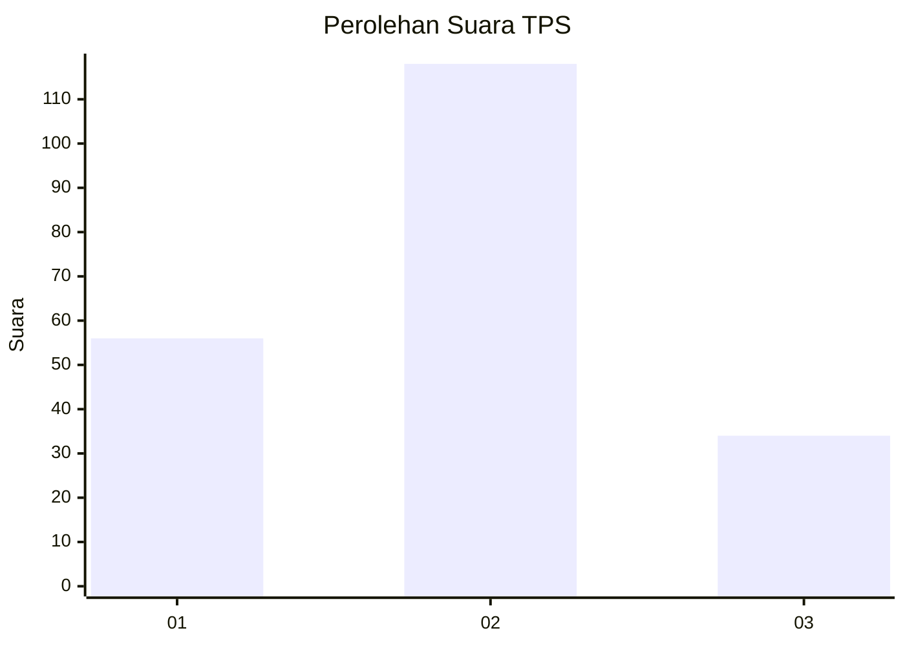
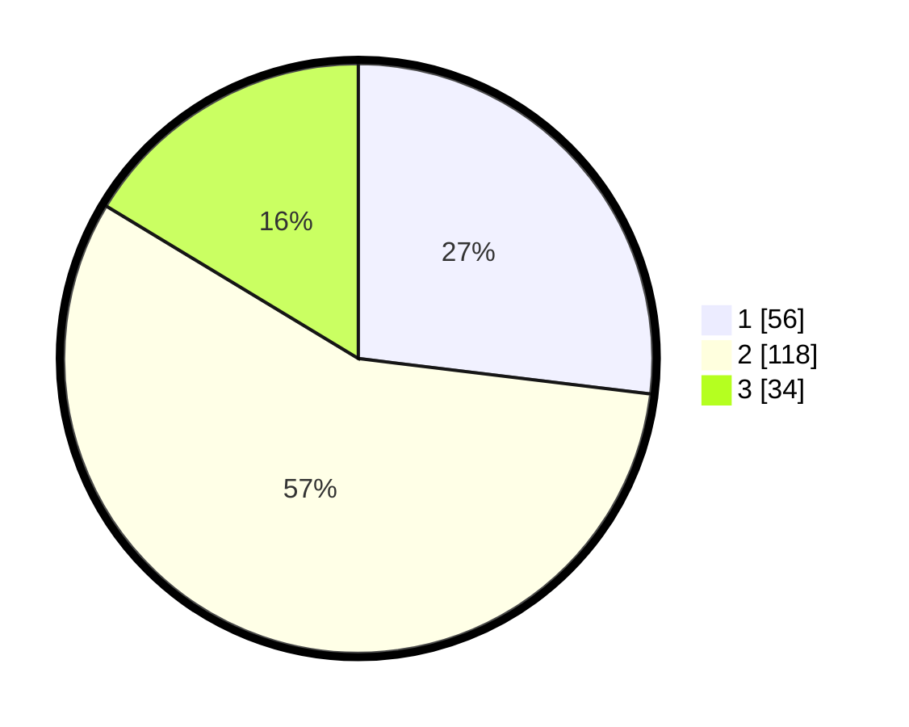

# Hasil

## Grafik

## Tabel

| No. | Nama Paslon    | Suara | Suara (raw) | Persentase |
|:--- |:-------------- | -----:| -----------:| ----------:|
| 1   | ANIES MUHAIMIN | 56    | [56][p-1]   | 26,92      |
| 2   | PRABOWO GIBRAN | 118   | [118][p-2]  | 56,73      |
| 3   | GANJAR MAHFUD  | 34    | [34][p-3]   | 16,35      |

[p-1]: https://github.com/gigit-pemilu/pemilu-2024/blob/main/pilpres/hitung-suara/sub/33-jawa-tengah/sub/14-sragen/sub/09-karangmalang/sub/2001-kedungwaduk/sub/001-tps/sub/paslon-1.txt
[p-2]: https://github.com/gigit-pemilu/pemilu-2024/blob/main/pilpres/hitung-suara/sub/33-jawa-tengah/sub/14-sragen/sub/09-karangmalang/sub/2001-kedungwaduk/sub/001-tps/sub/paslon-2.txt
[p-3]: https://github.com/gigit-pemilu/pemilu-2024/blob/main/pilpres/hitung-suara/sub/33-jawa-tengah/sub/14-sragen/sub/09-karangmalang/sub/2001-kedungwaduk/sub/001-tps/sub/paslon-3.txt

## Foto C Plano

https://sirekap-obj-formc.kpu.go.id/c1c9/pemilu/ppwp/33/14/09/20/01/3314092001001-20240215-000735--470b62df-01c3-4bbe-aafd-934507c7953a.jpg

https://sirekap-obj-formc.kpu.go.id/c1c9/pemilu/ppwp/33/14/09/20/01/3314092001001-20240214-141300--06258dcb-0274-403d-8c11-36fd5f9e11d3.jpg

https://sirekap-obj-formc.kpu.go.id/c1c9/pemilu/ppwp/33/14/09/20/01/3314092001001-20240214-215709--f4cee71b-8dfb-4dd5-bfcb-12d76dd130ef.jpg

## Metadata

| Key        | Value               |
| ---------- | ------------------- |
| Time Stamp | 2024-02-16 12:51:22 |

