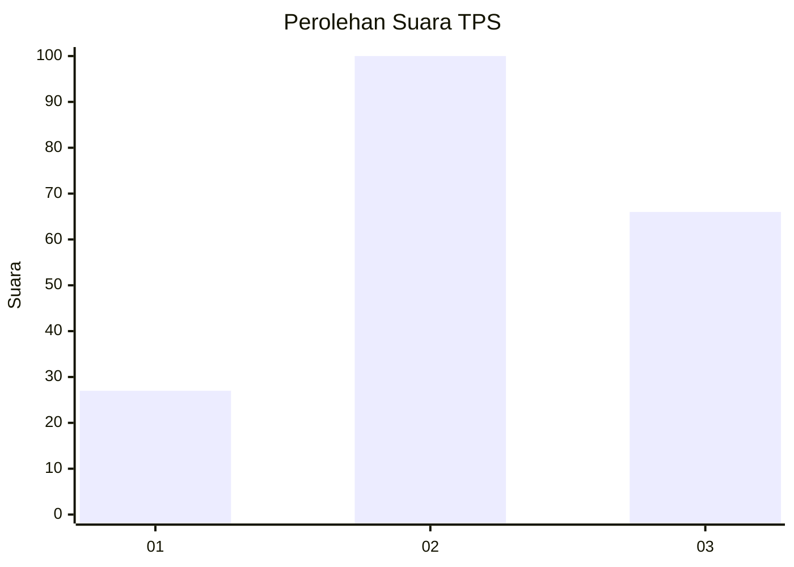
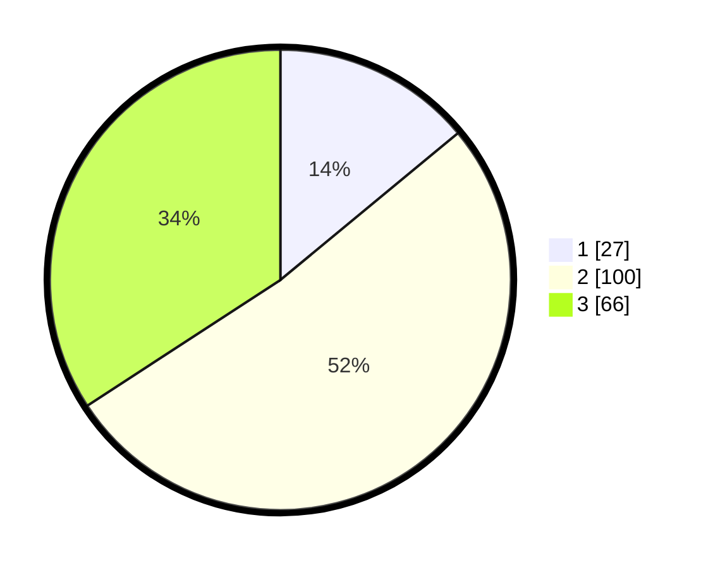

# Hasil

## Grafik

## Tabel

| No. | Nama Paslon    | Suara | Suara (raw) | Persentase |
|:--- |:-------------- | -----:| -----------:| ----------:|
| 1   | ANIES MUHAIMIN | 27    | [27][p-1]   | 13,99      |
| 2   | PRABOWO GIBRAN | 100   | [100][p-2]  | 51,81      |
| 3   | GANJAR MAHFUD  | 66    | [66][p-3]   | 34,20      |

[p-1]: https://github.com/gigit-pemilu/pemilu-2024/blob/main/pilpres/hitung-suara/sub/33-jawa-tengah/sub/14-sragen/sub/10-sragen/sub/1001-sine/sub/004-tps/sub/paslon-1.txt
[p-2]: https://github.com/gigit-pemilu/pemilu-2024/blob/main/pilpres/hitung-suara/sub/33-jawa-tengah/sub/14-sragen/sub/10-sragen/sub/1001-sine/sub/004-tps/sub/paslon-2.txt
[p-3]: https://github.com/gigit-pemilu/pemilu-2024/blob/main/pilpres/hitung-suara/sub/33-jawa-tengah/sub/14-sragen/sub/10-sragen/sub/1001-sine/sub/004-tps/sub/paslon-3.txt

## Foto C Plano

https://sirekap-obj-formc.kpu.go.id/211e/pemilu/ppwp/33/14/10/10/01/3314101001004-20240216-225037--a292bb89-35e8-414f-84c8-bdf422a18d45.jpg

https://sirekap-obj-formc.kpu.go.id/211e/pemilu/ppwp/33/14/10/10/01/3314101001004-20240214-220857--28df6b55-ccd5-4996-85bf-b1d0eecb921e.jpg

https://sirekap-obj-formc.kpu.go.id/211e/pemilu/ppwp/33/14/10/10/01/3314101001004-20240214-220935--5e5acd4d-febc-4048-b750-4ba142fb06f7.jpg

## Metadata

| Key        | Value               |
| ---------- | ------------------- |
| Time Stamp | 2024-02-17 11:00:02 |

