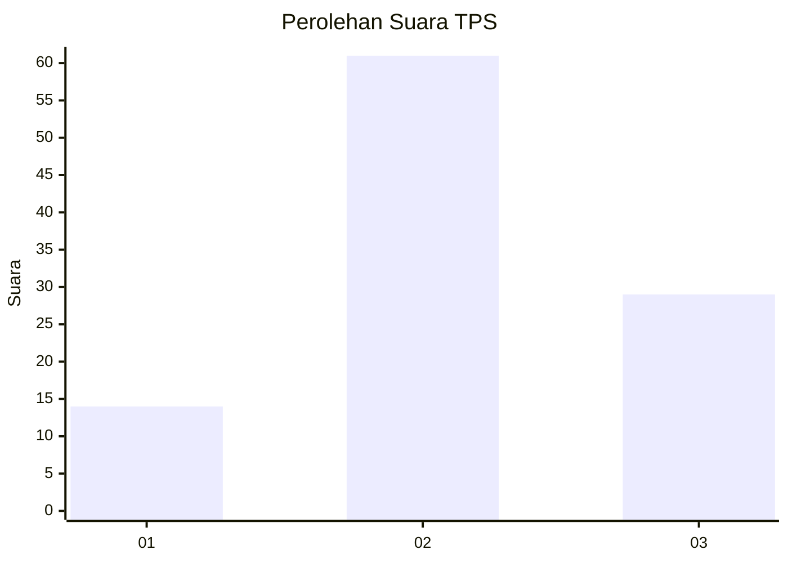
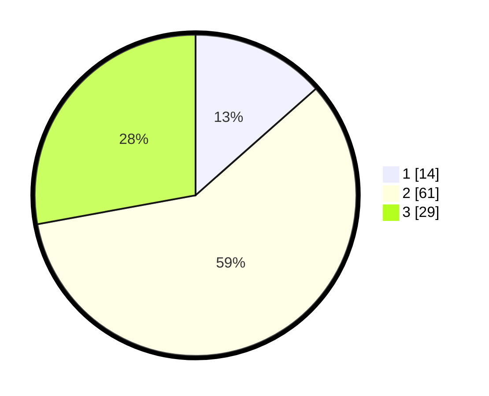

# Hasil

## Grafik

## Tabel

| No. | Nama Paslon    | Suara | Suara (raw) | Persentase |
|:--- |:-------------- | -----:| -----------:| ----------:|
| 1   | ANIES MUHAIMIN | 14    | [14][p-1]   | 13,46      |
| 2   | PRABOWO GIBRAN | 61    | [61][p-2]   | 58,65      |
| 3   | GANJAR MAHFUD  | 29    | [29][p-3]   | 27,88      |

[p-1]: https://github.com/gigit-pemilu/pemilu-2024-33-jawa-tengah/blob/main/pilpres/hitung-suara/sub/33-jawa-tengah/sub/14-sragen/sub/10-sragen/sub/1004-sragen-wetan/sub/050-tps/sub/paslon-1.txt
[p-2]: https://github.com/gigit-pemilu/pemilu-2024-33-jawa-tengah/blob/main/pilpres/hitung-suara/sub/33-jawa-tengah/sub/14-sragen/sub/10-sragen/sub/1004-sragen-wetan/sub/050-tps/sub/paslon-2.txt
[p-3]: https://github.com/gigit-pemilu/pemilu-2024-33-jawa-tengah/blob/main/pilpres/hitung-suara/sub/33-jawa-tengah/sub/14-sragen/sub/10-sragen/sub/1004-sragen-wetan/sub/050-tps/sub/paslon-3.txt

## Foto C Plano

https://sirekap-obj-formc.kpu.go.id/5e5e/pemilu/ppwp/33/14/10/10/04/3314101004050-20240214-141055--1630ab0b-cd0c-40fb-90cc-e82026ebd700.jpg

https://sirekap-obj-formc.kpu.go.id/5e5e/pemilu/ppwp/33/14/10/10/04/3314101004050-20240214-141725--403d5266-e22c-4f35-aded-48e4c10ddebb.jpg

https://sirekap-obj-formc.kpu.go.id/5e5e/pemilu/ppwp/33/14/10/10/04/3314101004050-20240214-210406--bfb60712-ec81-479d-ac3e-22e811d121fb.jpg

## Metadata

| Key        | Value               |
| ---------- | ------------------- |
| Time Stamp | 2024-02-14 21:46:01 |

