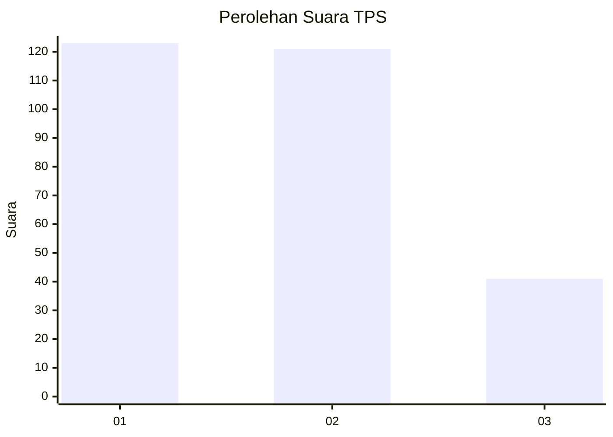
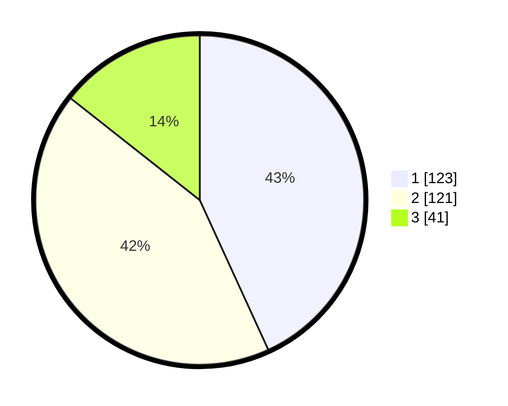

# Hasil

## Grafik

## Tabel

| No. | Nama Paslon    | Suara | Suara (raw) | Persentase |
|:--- |:-------------- | -----:| -----------:| ----------:|
| 1   | ANIES MUHAIMIN | 123   | [123][p-1]  | 43,16      |
| 2   | PRABOWO GIBRAN | 121   | [121][p-2]  | 42,46      |
| 3   | GANJAR MAHFUD  | 41    | [41][p-3]   | 14,39      |

[p-1]: https://github.com/gigit-pemilu/pemilu-2024/blob/main/pilpres/hitung-suara/sub/33-jawa-tengah/sub/14-sragen/sub/16-mondokan/sub/2008-gemantar/sub/007-tps/sub/paslon-1.txt
[p-2]: https://github.com/gigit-pemilu/pemilu-2024/blob/main/pilpres/hitung-suara/sub/33-jawa-tengah/sub/14-sragen/sub/16-mondokan/sub/2008-gemantar/sub/007-tps/sub/paslon-2.txt
[p-3]: https://github.com/gigit-pemilu/pemilu-2024/blob/main/pilpres/hitung-suara/sub/33-jawa-tengah/sub/14-sragen/sub/16-mondokan/sub/2008-gemantar/sub/007-tps/sub/paslon-3.txt

## Foto C Plano

https://sirekap-obj-formc.kpu.go.id/413a/pemilu/ppwp/33/14/16/20/08/3314162008007-20240220-135728--37782676-69f8-4f57-8ae8-62047e0198ac.jpg

https://sirekap-obj-formc.kpu.go.id/413a/pemilu/ppwp/33/14/16/20/08/3314162008007-20240220-135925--cfe1cc75-90fc-4824-8572-a0d90ed14019.jpg

https://sirekap-obj-formc.kpu.go.id/413a/pemilu/ppwp/33/14/16/20/08/3314162008007-20240220-140059--2cb1b8fb-67f5-4d7a-a2c2-459bde2cf21c.jpg

## Metadata

| Key        | Value               |
| ---------- | ------------------- |
| Time Stamp | 2024-02-20 15:00:00 |

