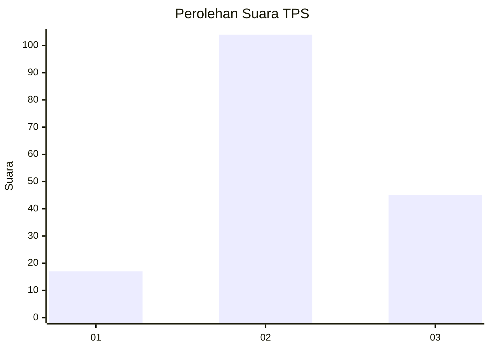
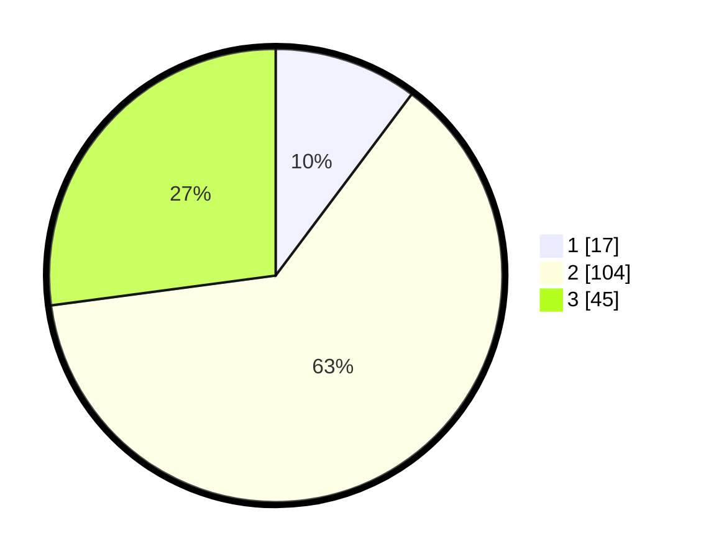

# Hasil

## Grafik

## Tabel

| No. | Nama Paslon    | Suara | Suara (raw) | Persentase |
|:--- |:-------------- | -----:| -----------:| ----------:|
| 1   | ANIES MUHAIMIN | 17    | [17][p-1]   | 10,24      |
| 2   | PRABOWO GIBRAN | 104   | [104][p-2]  | 62,65      |
| 3   | GANJAR MAHFUD  | 45    | [45][p-3]   | 27,11      |

[p-1]: https://github.com/gigit-pemilu/pemilu-2024-33-jawa-tengah/blob/main/pilpres/hitung-suara/sub/33-jawa-tengah/sub/14-sragen/sub/17-sukodono/sub/2001-newung/sub/001-tps/sub/paslon-1.txt
[p-2]: https://github.com/gigit-pemilu/pemilu-2024-33-jawa-tengah/blob/main/pilpres/hitung-suara/sub/33-jawa-tengah/sub/14-sragen/sub/17-sukodono/sub/2001-newung/sub/001-tps/sub/paslon-2.txt
[p-3]: https://github.com/gigit-pemilu/pemilu-2024-33-jawa-tengah/blob/main/pilpres/hitung-suara/sub/33-jawa-tengah/sub/14-sragen/sub/17-sukodono/sub/2001-newung/sub/001-tps/sub/paslon-3.txt

## Foto C Plano

https://sirekap-obj-formc.kpu.go.id/9e79/pemilu/ppwp/33/14/17/20/01/3314172001001-20240216-162730--6f636b69-f25f-49ee-8824-38f13d485ece.jpg

https://sirekap-obj-formc.kpu.go.id/9e79/pemilu/ppwp/33/14/17/20/01/3314172001001-20240216-162000--fd419c05-c65a-4faf-b2e3-60208b6e74bb.jpg

https://sirekap-obj-formc.kpu.go.id/9e79/pemilu/ppwp/33/14/17/20/01/3314172001001-20240216-162101--99e81f75-3107-41fa-955d-c0f59d92f85d.jpg

## Metadata

| Key        | Value               |
| ---------- | ------------------- |
| Time Stamp | 2024-02-25 11:00:00 |

