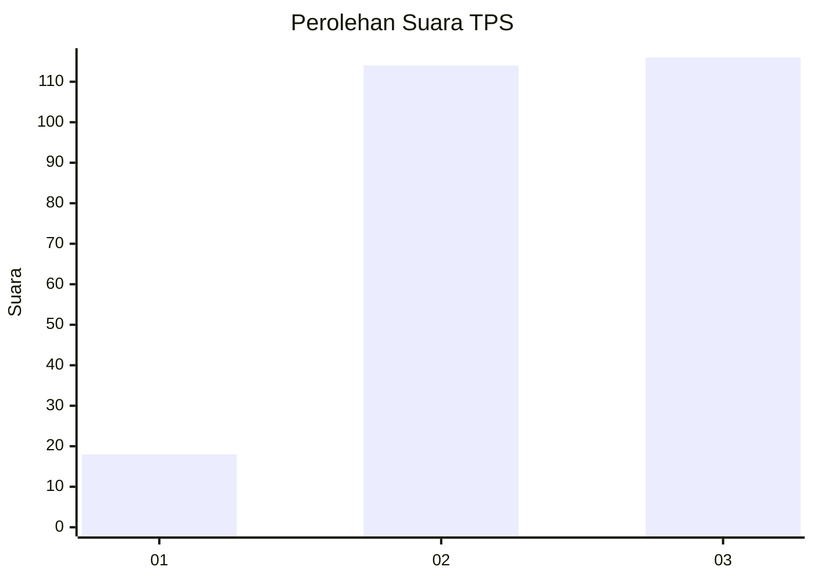
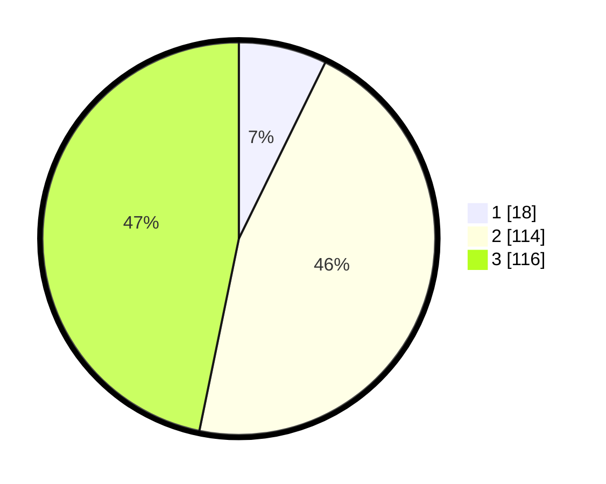

# Hasil

## Grafik

## Tabel

| No. | Nama Paslon    | Suara | Suara (raw) | Persentase |
|:--- |:-------------- | -----:| -----------:| ----------:|
| 1   | ANIES MUHAIMIN | 18    | [18][p-1]   | 7,26       |
| 2   | PRABOWO GIBRAN | 114   | [114][p-2]  | 45,97      |
| 3   | GANJAR MAHFUD  | 116   | [116][p-3]  | 46,77      |

[p-1]: https://github.com/gigit-pemilu/pemilu-2024-33-jawa-tengah/blob/main/pilpres/hitung-suara/sub/33-jawa-tengah/sub/14-sragen/sub/20-jenar/sub/2002-ngepringan/sub/004-tps/sub/paslon-1.txt
[p-2]: https://github.com/gigit-pemilu/pemilu-2024-33-jawa-tengah/blob/main/pilpres/hitung-suara/sub/33-jawa-tengah/sub/14-sragen/sub/20-jenar/sub/2002-ngepringan/sub/004-tps/sub/paslon-2.txt
[p-3]: https://github.com/gigit-pemilu/pemilu-2024-33-jawa-tengah/blob/main/pilpres/hitung-suara/sub/33-jawa-tengah/sub/14-sragen/sub/20-jenar/sub/2002-ngepringan/sub/004-tps/sub/paslon-3.txt

## Foto C Plano

https://sirekap-obj-formc.kpu.go.id/0215/pemilu/ppwp/33/14/20/20/02/3314202002004-20240315-132039--dd400462-29c1-4dcd-9386-da287e25eb7e.jpg

https://sirekap-obj-formc.kpu.go.id/0215/pemilu/ppwp/33/14/20/20/02/3314202002004-20240216-200936--dc8a2cba-f8dd-43aa-9910-282e1a037979.jpg

https://sirekap-obj-formc.kpu.go.id/0215/pemilu/ppwp/33/14/20/20/02/3314202002004-20240216-201011--a24205e3-fa24-481b-b8b0-9e203e49c7b5.jpg

## Metadata

| Key        | Value               |
| ---------- | ------------------- |
| Time Stamp | 2024-03-15 13:30:00 |

