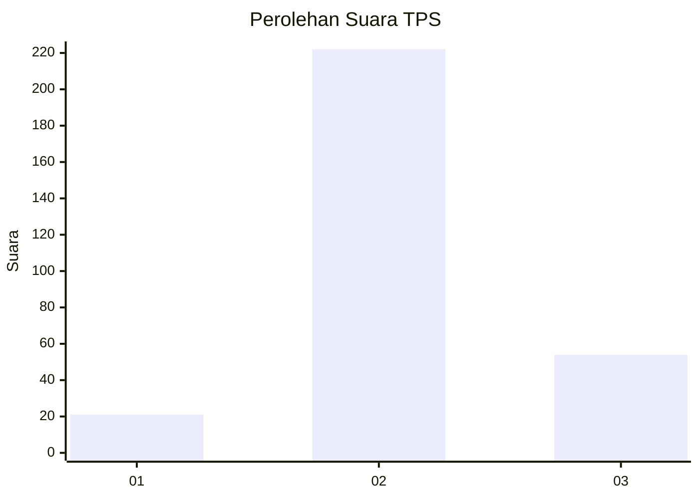

# Hasil

## Grafik

## Tabel

| No. | Nama Paslon    | Suara | Suara (raw) | Persentase |
|:--- |:-------------- | -----:| -----------:| ----------:|
| 1   | ANIES MUHAIMIN | 21    | [21][p-1]   | 7,07       |
| 2   | PRABOWO GIBRAN | 222   | [222][p-2]  | 74,75      |
| 3   | GANJAR MAHFUD  | 54    | [54][p-3]   | 18,18      |

[p-1]: https://github.com/gigit-pemilu/pemilu-2024-33-jawa-tengah/blob/main/pilpres/hitung-suara/sub/33-jawa-tengah/sub/14-sragen/sub/20-jenar/sub/2002-ngepringan/sub/008-tps/sub/paslon-1.txt
[p-2]: https://github.com/gigit-pemilu/pemilu-2024-33-jawa-tengah/blob/main/pilpres/hitung-suara/sub/33-jawa-tengah/sub/14-sragen/sub/20-jenar/sub/2002-ngepringan/sub/008-tps/sub/paslon-2.txt
[p-3]: https://github.com/gigit-pemilu/pemilu-2024-33-jawa-tengah/blob/main/pilpres/hitung-suara/sub/33-jawa-tengah/sub/14-sragen/sub/20-jenar/sub/2002-ngepringan/sub/008-tps/sub/paslon-3.txt

## Foto C Plano

https://sirekap-obj-formc.kpu.go.id/c44e/pemilu/ppwp/33/14/20/20/02/3314202002008-20240214-191116--023ce0b7-429d-47ea-9ee5-e4ff0b4e11db.jpg

https://sirekap-obj-formc.kpu.go.id/c44e/pemilu/ppwp/33/14/20/20/02/3314202002008-20240214-191230--828e2ab7-365a-4112-b128-921d0932f110.jpg

https://sirekap-obj-formc.kpu.go.id/c44e/pemilu/ppwp/33/14/20/20/02/3314202002008-20240214-192230--4200dc31-e736-4821-a472-4ab41146ab29.jpg

## Metadata

| Key        | Value               |
| ---------- | ------------------- |
| Time Stamp | 2024-02-16 21:01:00 |

