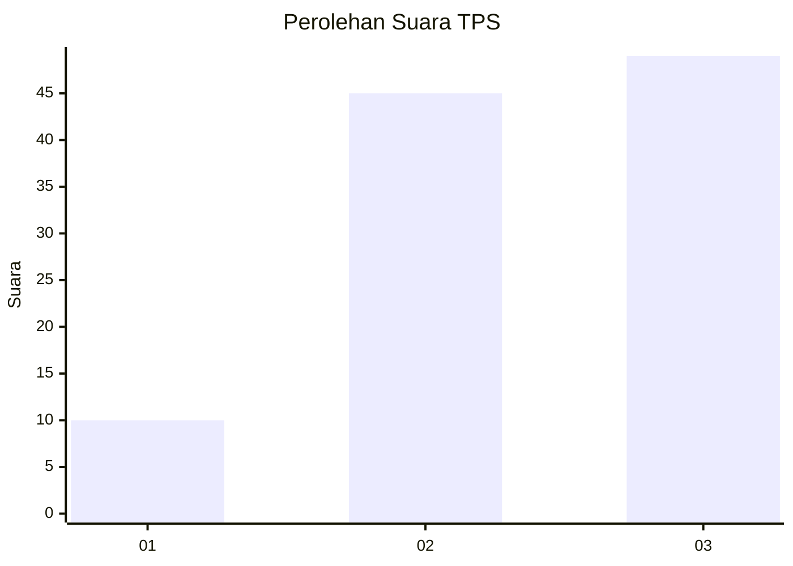
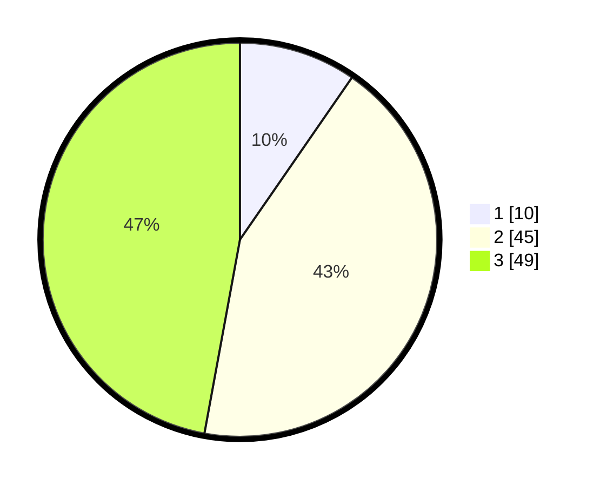

# Hasil

## Grafik

## Tabel

| No. | Nama Paslon    | Suara | Suara (raw) | Persentase |
|:--- |:-------------- | -----:| -----------:| ----------:|
| 1   | ANIES MUHAIMIN | 10    | [10][p-1]   | 9,62       |
| 2   | PRABOWO GIBRAN | 45    | [45][p-2]   | 43,27      |
| 3   | GANJAR MAHFUD  | 49    | [49][p-3]   | 47,12      |

[p-1]: https://github.com/gigit-pemilu/pemilu-2024/blob/main/pilpres/hitung-suara/sub/33-jawa-tengah/sub/14-sragen/sub/20-jenar/sub/2003-mlale/sub/013-tps/sub/paslon-1.txt
[p-2]: https://github.com/gigit-pemilu/pemilu-2024/blob/main/pilpres/hitung-suara/sub/33-jawa-tengah/sub/14-sragen/sub/20-jenar/sub/2003-mlale/sub/013-tps/sub/paslon-2.txt
[p-3]: https://github.com/gigit-pemilu/pemilu-2024/blob/main/pilpres/hitung-suara/sub/33-jawa-tengah/sub/14-sragen/sub/20-jenar/sub/2003-mlale/sub/013-tps/sub/paslon-3.txt

## Foto C Plano

https://sirekap-obj-formc.kpu.go.id/d90b/pemilu/ppwp/33/14/20/20/03/3314202003013-20240214-224427--048608e2-b23b-4a9c-84d0-6982c1c2f5b0.jpg

https://sirekap-obj-formc.kpu.go.id/d90b/pemilu/ppwp/33/14/20/20/03/3314202003013-20240214-224611--fe4c53a7-3f8a-463f-88df-16c00abbbb4a.jpg

https://sirekap-obj-formc.kpu.go.id/d90b/pemilu/ppwp/33/14/20/20/03/3314202003013-20240214-224724--c8170197-dcde-401a-8080-5a5980a1a408.jpg

## Metadata

| Key        | Value               |
| ---------- | ------------------- |
| Time Stamp | 2024-02-15 09:00:24 |

