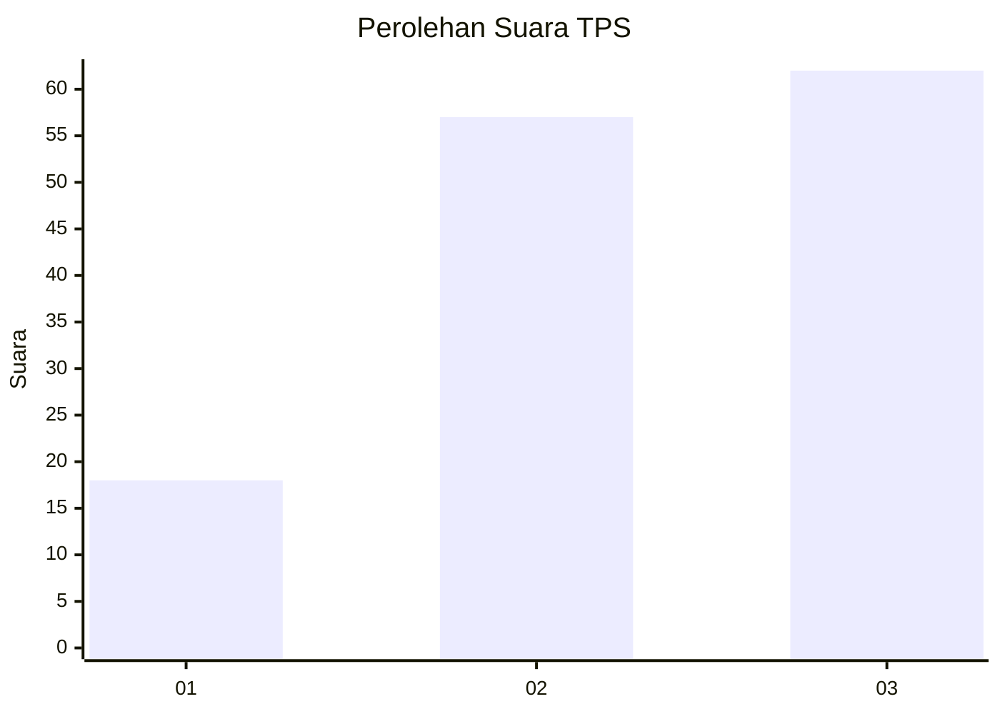
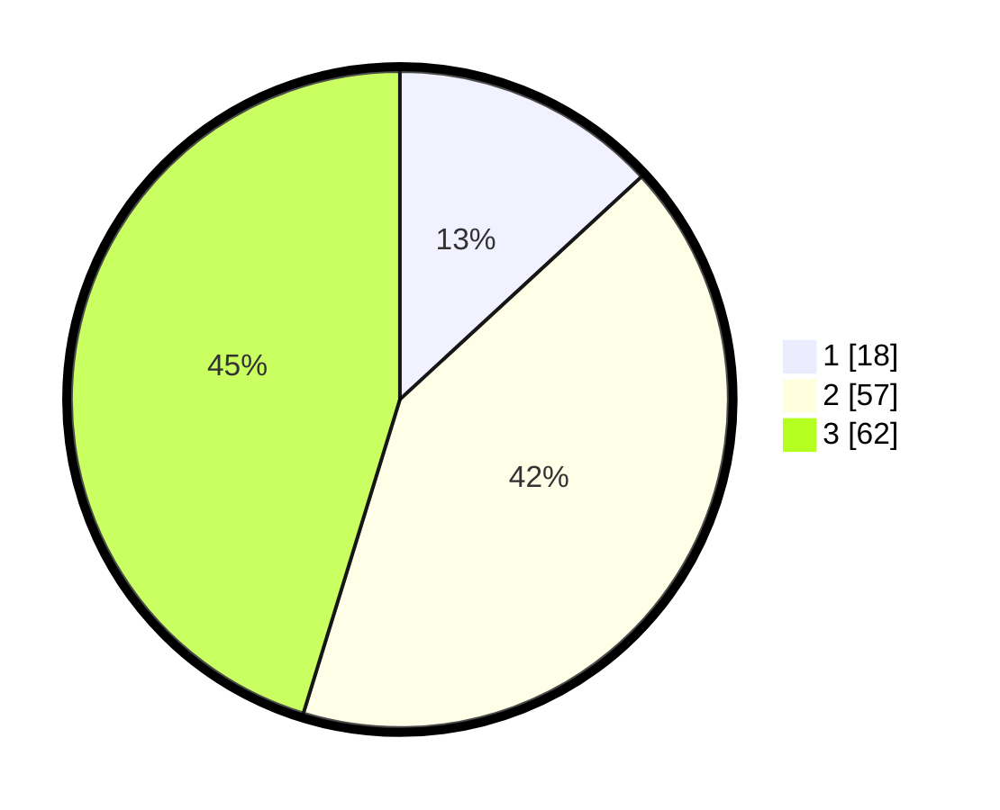

# Hasil

## Grafik

## Tabel

| No. | Nama Paslon    | Suara | Suara (raw) | Persentase |
|:--- |:-------------- | -----:| -----------:| ----------:|
| 1   | ANIES MUHAIMIN | 18    | [18][p-1]   | 13,14      |
| 2   | PRABOWO GIBRAN | 57    | [57][p-2]   | 41,61      |
| 3   | GANJAR MAHFUD  | 62    | [62][p-3]   | 45,26      |

[p-1]: https://github.com/gigit-pemilu/pemilu-2024/blob/main/pilpres/hitung-suara/sub/33-jawa-tengah/sub/15-grobogan/sub/01-kedungjati/sub/2001-karanglangu/sub/001-tps/sub/paslon-1.txt
[p-2]: https://github.com/gigit-pemilu/pemilu-2024/blob/main/pilpres/hitung-suara/sub/33-jawa-tengah/sub/15-grobogan/sub/01-kedungjati/sub/2001-karanglangu/sub/001-tps/sub/paslon-2.txt
[p-3]: https://github.com/gigit-pemilu/pemilu-2024/blob/main/pilpres/hitung-suara/sub/33-jawa-tengah/sub/15-grobogan/sub/01-kedungjati/sub/2001-karanglangu/sub/001-tps/sub/paslon-3.txt

## Foto C Plano

https://sirekap-obj-formc.kpu.go.id/f9df/pemilu/ppwp/33/15/01/20/01/3315012001001-20240216-061732--ccdacfa0-ac5d-4cd5-8b91-b26af5afb397.jpg

https://sirekap-obj-formc.kpu.go.id/f9df/pemilu/ppwp/33/15/01/20/01/3315012001001-20240216-121756--6cf3bafe-7d70-454e-8478-7fc5a2377da0.jpg

https://sirekap-obj-formc.kpu.go.id/f9df/pemilu/ppwp/33/15/01/20/01/3315012001001-20240216-122211--d5bc70a1-8daf-4e63-a336-aac1536ee8b4.jpg

## Metadata

| Key        | Value               |
| ---------- | ------------------- |
| Time Stamp | 2024-02-16 12:51:22 |

