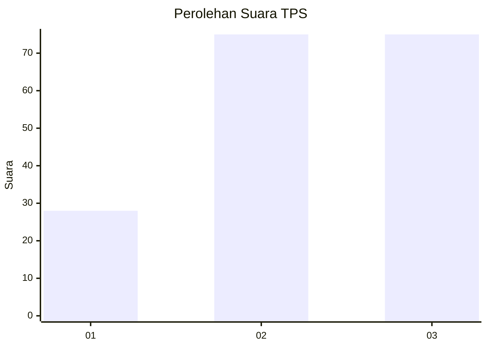
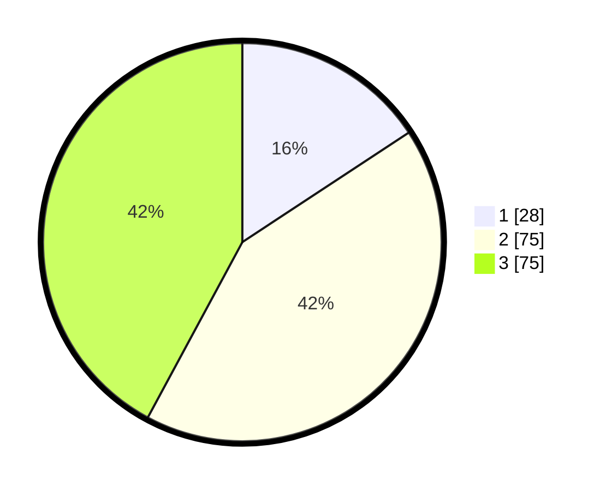

# Hasil

## Grafik

## Tabel

| No. | Nama Paslon    | Suara | Suara (raw) | Persentase |
|:--- |:-------------- | -----:| -----------:| ----------:|
| 1   | ANIES MUHAIMIN | 28    | [28][p-1]   | 15,73      |
| 2   | PRABOWO GIBRAN | 75    | [75][p-2]   | 42,13      |
| 3   | GANJAR MAHFUD  | 75    | [75][p-3]   | 42,13      |

[p-1]: https://github.com/gigit-pemilu/pemilu-2024/blob/main/pilpres/hitung-suara/sub/33-jawa-tengah/sub/15-grobogan/sub/01-kedungjati/sub/2001-karanglangu/sub/003-tps/sub/paslon-1.txt
[p-2]: https://github.com/gigit-pemilu/pemilu-2024/blob/main/pilpres/hitung-suara/sub/33-jawa-tengah/sub/15-grobogan/sub/01-kedungjati/sub/2001-karanglangu/sub/003-tps/sub/paslon-2.txt
[p-3]: https://github.com/gigit-pemilu/pemilu-2024/blob/main/pilpres/hitung-suara/sub/33-jawa-tengah/sub/15-grobogan/sub/01-kedungjati/sub/2001-karanglangu/sub/003-tps/sub/paslon-3.txt

## Foto C Plano

https://sirekap-obj-formc.kpu.go.id/e3f3/pemilu/ppwp/33/15/01/20/01/3315012001003-20240214-204307--ff429a8f-d51e-4c50-b07a-de6b6d1fe7ea.jpg

https://sirekap-obj-formc.kpu.go.id/e3f3/pemilu/ppwp/33/15/01/20/01/3315012001003-20240214-204602--1a0f9cbc-017d-4fbf-93e4-fd77ec36a25f.jpg

https://sirekap-obj-formc.kpu.go.id/e3f3/pemilu/ppwp/33/15/01/20/01/3315012001003-20240214-204821--115ecf57-11a5-44e8-9385-072cb4295e0d.jpg

## Metadata

| Key        | Value               |
| ---------- | ------------------- |
| Time Stamp | 2024-02-15 19:30:26 |

