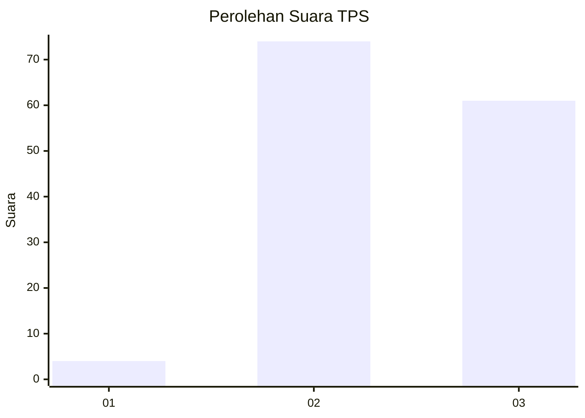
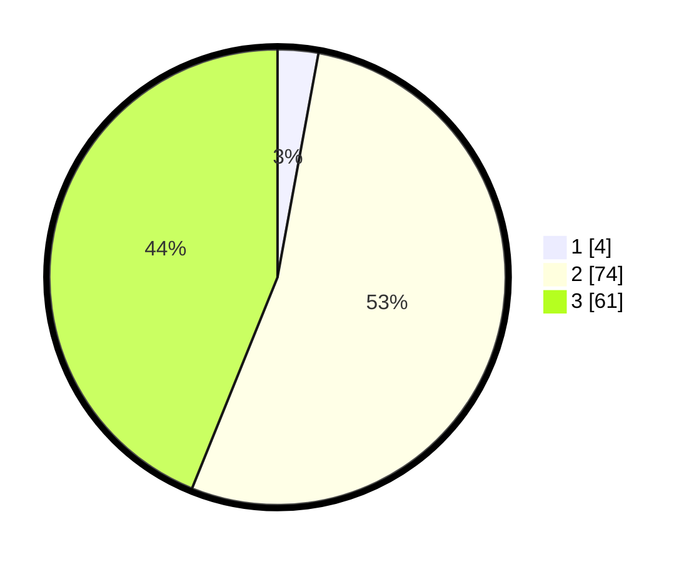

# Hasil

## Grafik

## Tabel

| No. | Nama Paslon    | Suara | Suara (raw) | Persentase |
|:--- |:-------------- | -----:| -----------:| ----------:|
| 1   | ANIES MUHAIMIN | 4     | [4][p-1]    | 2,88       |
| 2   | PRABOWO GIBRAN | 74    | [74][p-2]   | 53,24      |
| 3   | GANJAR MAHFUD  | 61    | [61][p-3]   | 43,88      |

[p-1]: https://github.com/gigit-pemilu/pemilu-2024/blob/main/pilpres/hitung-suara/sub/33-jawa-tengah/sub/15-grobogan/sub/01-kedungjati/sub/2003-deras/sub/008-tps/sub/paslon-1.txt
[p-2]: https://github.com/gigit-pemilu/pemilu-2024/blob/main/pilpres/hitung-suara/sub/33-jawa-tengah/sub/15-grobogan/sub/01-kedungjati/sub/2003-deras/sub/008-tps/sub/paslon-2.txt
[p-3]: https://github.com/gigit-pemilu/pemilu-2024/blob/main/pilpres/hitung-suara/sub/33-jawa-tengah/sub/15-grobogan/sub/01-kedungjati/sub/2003-deras/sub/008-tps/sub/paslon-3.txt

## Foto C Plano

https://sirekap-obj-formc.kpu.go.id/87ee/pemilu/ppwp/33/15/01/20/03/3315012003008-20240214-141132--4654043f-c3a0-4a65-a7c8-6433f1388bd1.jpg

https://sirekap-obj-formc.kpu.go.id/87ee/pemilu/ppwp/33/15/01/20/03/3315012003008-20240215-130857--e23b811e-4016-4eaf-970e-c2fe242b5a08.jpg

https://sirekap-obj-formc.kpu.go.id/87ee/pemilu/ppwp/33/15/01/20/03/3315012003008-20240214-160148--15633e21-c1a6-44a0-a9dc-0b0804b06648.jpg

## Metadata

| Key        | Value               |
| ---------- | ------------------- |
| Time Stamp | 2024-02-15 17:00:25 |

