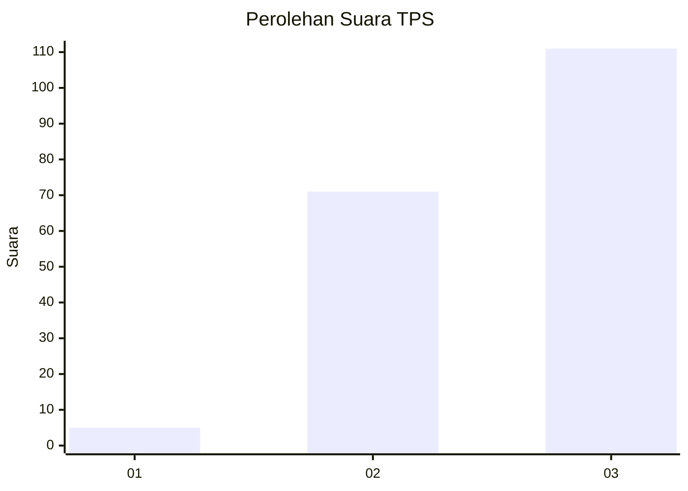
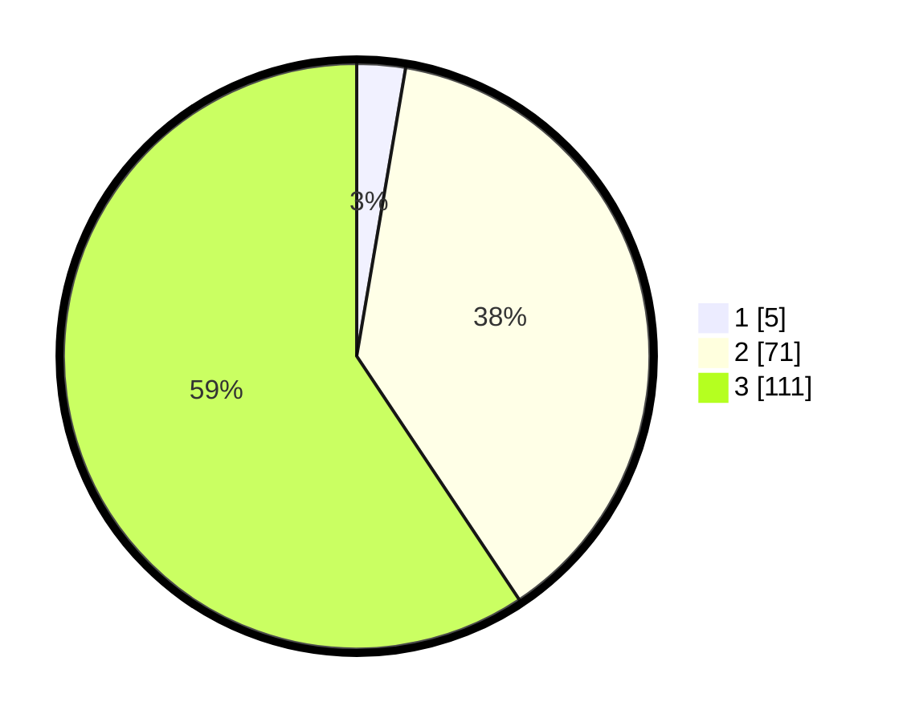

# Hasil

## Grafik

## Tabel

| No. | Nama Paslon    | Suara | Suara (raw) | Persentase |
|:--- |:-------------- | -----:| -----------:| ----------:|
| 1   | ANIES MUHAIMIN | 5     | [5][p-1]    | 2,67       |
| 2   | PRABOWO GIBRAN | 71    | [71][p-2]   | 37,97      |
| 3   | GANJAR MAHFUD  | 111   | [111][p-3]  | 59,36      |

[p-1]: https://github.com/gigit-pemilu/pemilu-2024/blob/main/pilpres/hitung-suara/sub/33-jawa-tengah/sub/15-grobogan/sub/01-kedungjati/sub/2010-kalimaro/sub/004-tps/sub/paslon-1.txt
[p-2]: https://github.com/gigit-pemilu/pemilu-2024/blob/main/pilpres/hitung-suara/sub/33-jawa-tengah/sub/15-grobogan/sub/01-kedungjati/sub/2010-kalimaro/sub/004-tps/sub/paslon-2.txt
[p-3]: https://github.com/gigit-pemilu/pemilu-2024/blob/main/pilpres/hitung-suara/sub/33-jawa-tengah/sub/15-grobogan/sub/01-kedungjati/sub/2010-kalimaro/sub/004-tps/sub/paslon-3.txt

## Foto C Plano

https://sirekap-obj-formc.kpu.go.id/c7b6/pemilu/ppwp/33/15/01/20/10/3315012010004-20240214-232753--80715365-bb5d-4d27-af74-819ac47f7909.jpg

https://sirekap-obj-formc.kpu.go.id/c7b6/pemilu/ppwp/33/15/01/20/10/3315012010004-20240214-232956--a5ff0cc2-ee0f-4b6a-8503-1ea7004717e4.jpg

https://sirekap-obj-formc.kpu.go.id/c7b6/pemilu/ppwp/33/15/01/20/10/3315012010004-20240214-231936--6802b82d-1047-4cfe-ac16-974a70f6bcce.jpg

## Metadata

| Key        | Value               |
| ---------- | ------------------- |
| Time Stamp | 2024-02-17 14:45:18 |

