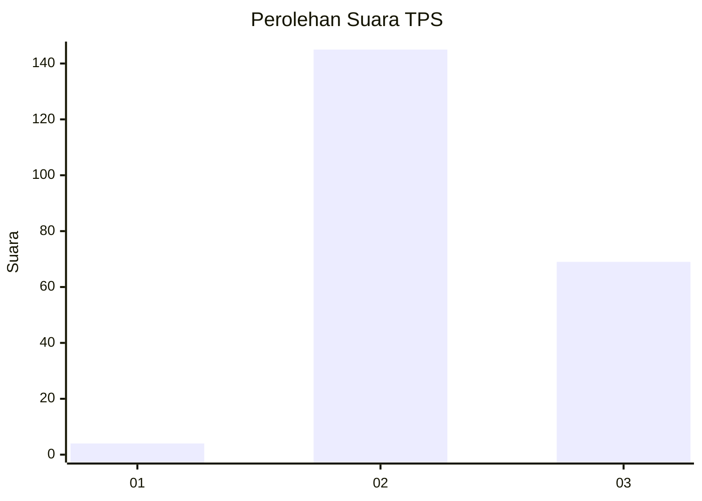
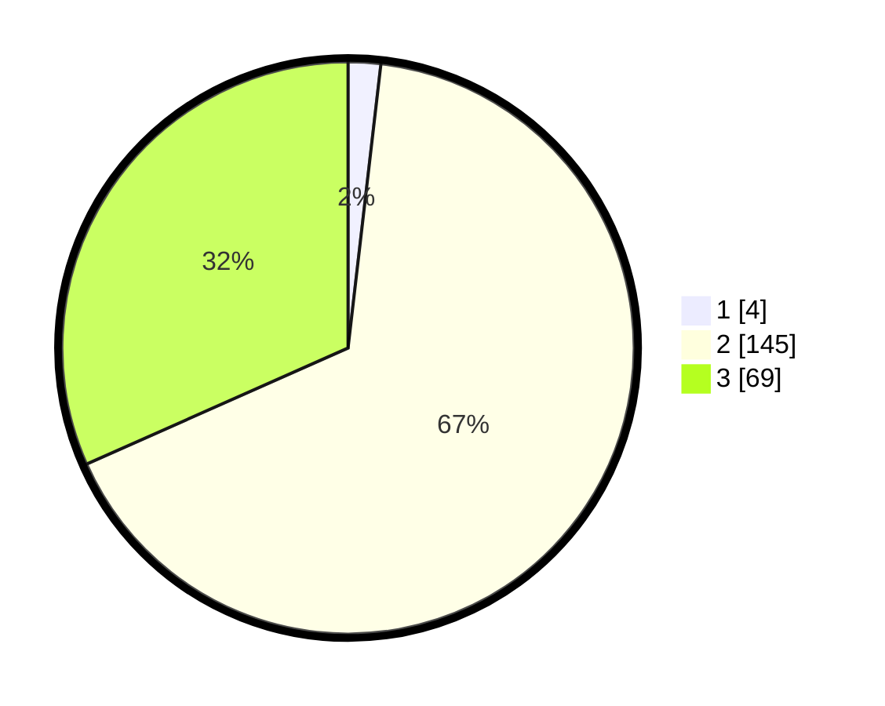

# Hasil

## Grafik

## Tabel

| No. | Nama Paslon    | Suara | Suara (raw) | Persentase |
|:--- |:-------------- | -----:| -----------:| ----------:|
| 1   | ANIES MUHAIMIN | 4     | [4][p-1]    | 1,83       |
| 2   | PRABOWO GIBRAN | 145   | [145][p-2]  | 66,51      |
| 3   | GANJAR MAHFUD  | 69    | [69][p-3]   | 31,65      |

[p-1]: https://github.com/gigit-pemilu/pemilu-2024-33-jawa-tengah/blob/main/pilpres/hitung-suara/sub/33-jawa-tengah/sub/15-grobogan/sub/02-karangrayung/sub/2001-nampu/sub/001-tps/sub/paslon-1.txt
[p-2]: https://github.com/gigit-pemilu/pemilu-2024-33-jawa-tengah/blob/main/pilpres/hitung-suara/sub/33-jawa-tengah/sub/15-grobogan/sub/02-karangrayung/sub/2001-nampu/sub/001-tps/sub/paslon-2.txt
[p-3]: https://github.com/gigit-pemilu/pemilu-2024-33-jawa-tengah/blob/main/pilpres/hitung-suara/sub/33-jawa-tengah/sub/15-grobogan/sub/02-karangrayung/sub/2001-nampu/sub/001-tps/sub/paslon-3.txt

## Foto C Plano

https://sirekap-obj-formc.kpu.go.id/763d/pemilu/ppwp/33/15/02/20/01/3315022001001-20240214-221633--692793e5-baa7-407f-a5b1-36a4e73e534d.jpg

https://sirekap-obj-formc.kpu.go.id/763d/pemilu/ppwp/33/15/02/20/01/3315022001001-20240214-221650--1b6181fa-c880-4fee-b5b7-91cb62cb7240.jpg

https://sirekap-obj-formc.kpu.go.id/763d/pemilu/ppwp/33/15/02/20/01/3315022001001-20240214-221707--3cc36621-4d0e-4e4e-9213-872e8fd91219.jpg

## Metadata

| Key        | Value               |
| ---------- | ------------------- |
| Time Stamp | 2024-02-15 15:00:29 |

