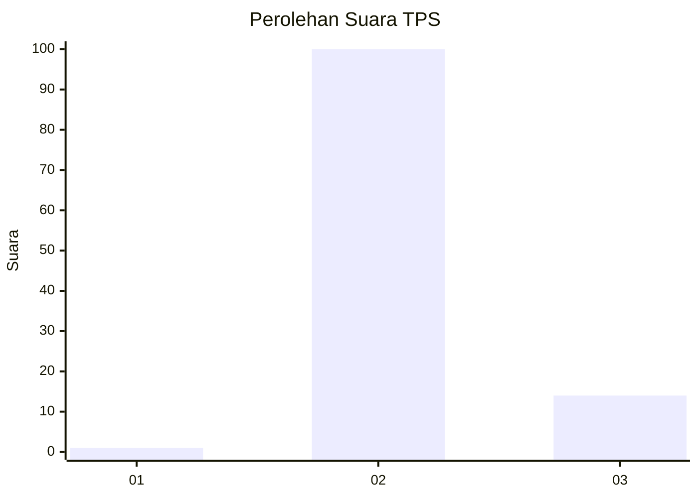
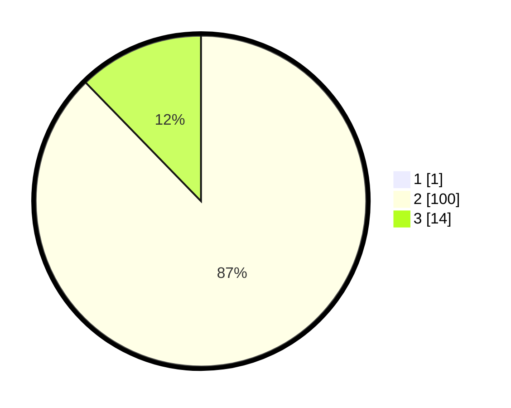

# Hasil

## Grafik

## Tabel

| No. | Nama Paslon    | Suara | Suara (raw) | Persentase |
|:--- |:-------------- | -----:| -----------:| ----------:|
| 1   | ANIES MUHAIMIN | 1     | [1][p-1]    | 0,87       |
| 2   | PRABOWO GIBRAN | 100   | [100][p-2]  | 86,96      |
| 3   | GANJAR MAHFUD  | 14    | [14][p-3]   | 12,17      |

[p-1]: https://github.com/gigit-pemilu/pemilu-2024-33-jawa-tengah/blob/main/pilpres/hitung-suara/sub/33-jawa-tengah/sub/15-grobogan/sub/02-karangrayung/sub/2002-karangsono/sub/005-tps/sub/paslon-1.txt
[p-2]: https://github.com/gigit-pemilu/pemilu-2024-33-jawa-tengah/blob/main/pilpres/hitung-suara/sub/33-jawa-tengah/sub/15-grobogan/sub/02-karangrayung/sub/2002-karangsono/sub/005-tps/sub/paslon-2.txt
[p-3]: https://github.com/gigit-pemilu/pemilu-2024-33-jawa-tengah/blob/main/pilpres/hitung-suara/sub/33-jawa-tengah/sub/15-grobogan/sub/02-karangrayung/sub/2002-karangsono/sub/005-tps/sub/paslon-3.txt

## Foto C Plano

https://sirekap-obj-formc.kpu.go.id/d8e5/pemilu/ppwp/33/15/02/20/02/3315022002005-20240215-004617--2524a955-f871-4241-a00d-e47fff773139.jpg

https://sirekap-obj-formc.kpu.go.id/d8e5/pemilu/ppwp/33/15/02/20/02/3315022002005-20240215-004709--5bc45f70-ff0e-4d8f-9ea6-8192015c6e45.jpg

https://sirekap-obj-formc.kpu.go.id/d8e5/pemilu/ppwp/33/15/02/20/02/3315022002005-20240215-004905--23db319c-3705-424a-b4d2-8f057d86bc7f.jpg

## Metadata

| Key        | Value               |
| ---------- | ------------------- |
| Time Stamp | 2024-02-15 12:00:28 |

