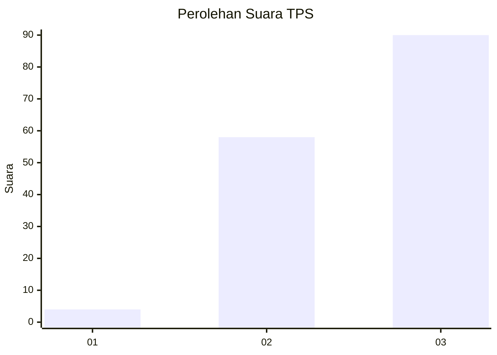
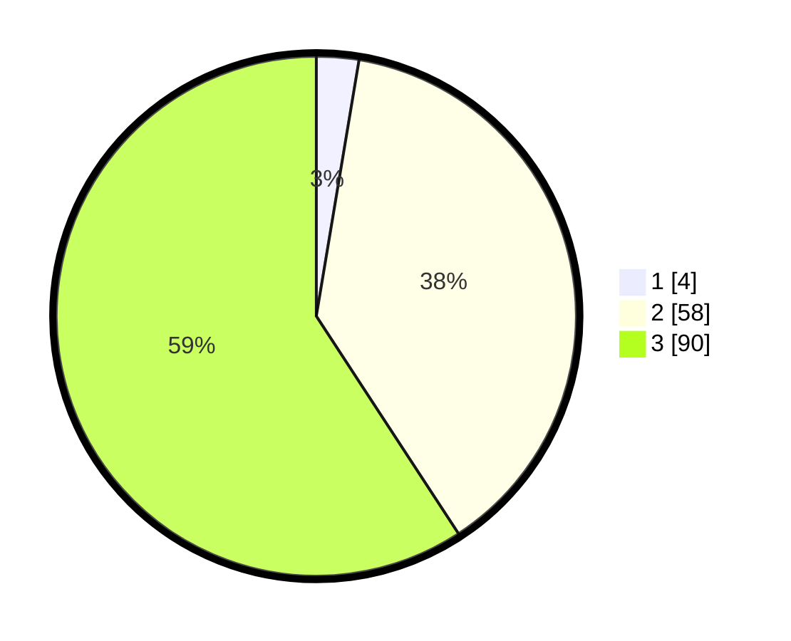

# Hasil

## Grafik

## Tabel

| No. | Nama Paslon    | Suara | Suara (raw) | Persentase |
|:--- |:-------------- | -----:| -----------:| ----------:|
| 1   | ANIES MUHAIMIN | 4     | [4][p-1]    | 2,63       |
| 2   | PRABOWO GIBRAN | 58    | [58][p-2]   | 38,16      |
| 3   | GANJAR MAHFUD  | 90    | [90][p-3]   | 59,21      |

[p-1]: https://github.com/gigit-pemilu/pemilu-2024-33-jawa-tengah/blob/main/pilpres/hitung-suara/sub/33-jawa-tengah/sub/15-grobogan/sub/02-karangrayung/sub/2002-karangsono/sub/007-tps/sub/paslon-1.txt
[p-2]: https://github.com/gigit-pemilu/pemilu-2024-33-jawa-tengah/blob/main/pilpres/hitung-suara/sub/33-jawa-tengah/sub/15-grobogan/sub/02-karangrayung/sub/2002-karangsono/sub/007-tps/sub/paslon-2.txt
[p-3]: https://github.com/gigit-pemilu/pemilu-2024-33-jawa-tengah/blob/main/pilpres/hitung-suara/sub/33-jawa-tengah/sub/15-grobogan/sub/02-karangrayung/sub/2002-karangsono/sub/007-tps/sub/paslon-3.txt

## Foto C Plano

https://sirekap-obj-formc.kpu.go.id/75c2/pemilu/ppwp/33/15/02/20/02/3315022002007-20240214-203557--9d7045ba-57f6-49b2-bc01-e13f41069381.jpg

https://sirekap-obj-formc.kpu.go.id/75c2/pemilu/ppwp/33/15/02/20/02/3315022002007-20240214-203855--8bfa3783-e122-4e9b-8693-047d004546dc.jpg

https://sirekap-obj-formc.kpu.go.id/75c2/pemilu/ppwp/33/15/02/20/02/3315022002007-20240214-203758--49b103d1-52de-4e62-9134-2ca13157cb0c.jpg

## Metadata

| Key        | Value               |
| ---------- | ------------------- |
| Time Stamp | 2024-02-15 18:30:25 |

