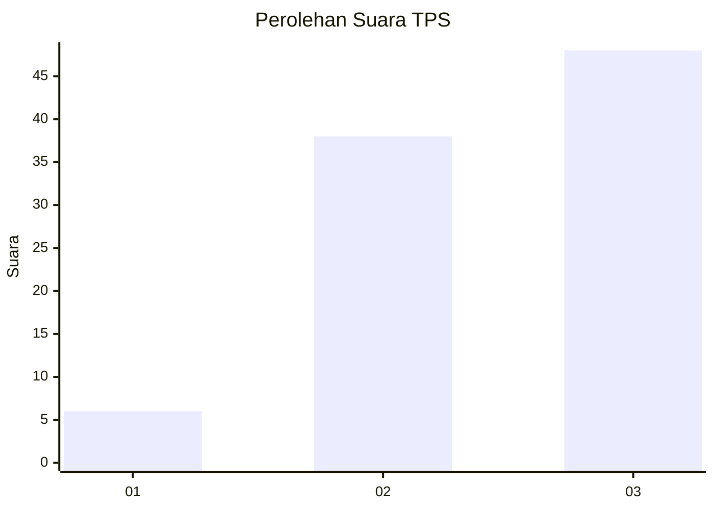
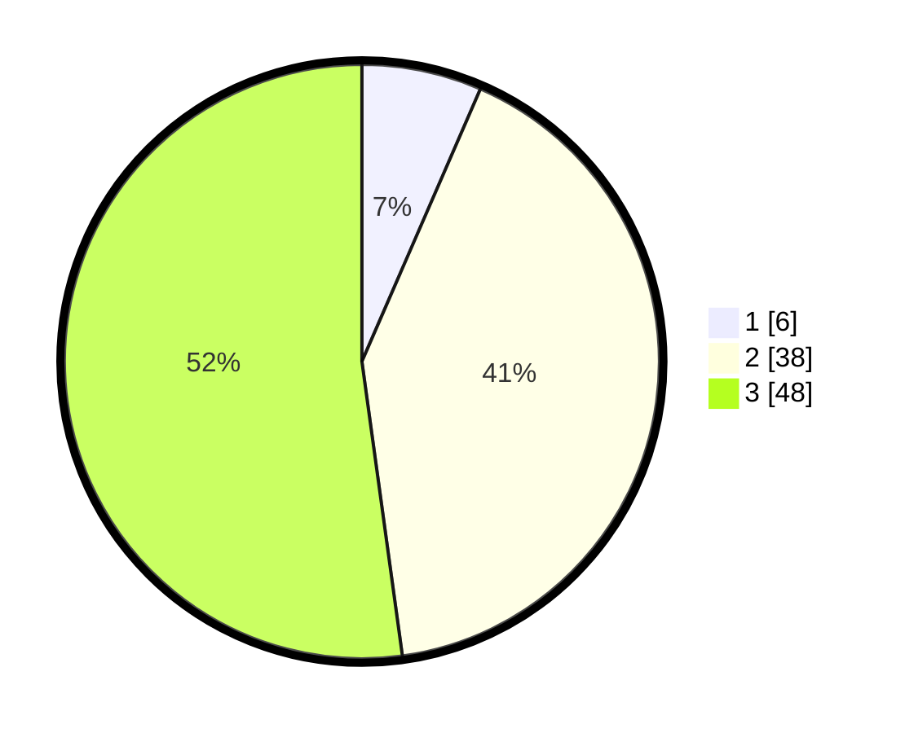

# Hasil

## Grafik

## Tabel

| No. | Nama Paslon    | Suara | Suara (raw) | Persentase |
|:--- |:-------------- | -----:| -----------:| ----------:|
| 1   | ANIES MUHAIMIN | 6     | [6][p-1]    | 6,52       |
| 2   | PRABOWO GIBRAN | 38    | [38][p-2]   | 41,30      |
| 3   | GANJAR MAHFUD  | 48    | [48][p-3]   | 52,17      |

[p-1]: https://github.com/gigit-pemilu/pemilu-2024-33-jawa-tengah/blob/main/pilpres/hitung-suara/sub/33-jawa-tengah/sub/15-grobogan/sub/02-karangrayung/sub/2002-karangsono/sub/010-tps/sub/paslon-1.txt
[p-2]: https://github.com/gigit-pemilu/pemilu-2024-33-jawa-tengah/blob/main/pilpres/hitung-suara/sub/33-jawa-tengah/sub/15-grobogan/sub/02-karangrayung/sub/2002-karangsono/sub/010-tps/sub/paslon-2.txt
[p-3]: https://github.com/gigit-pemilu/pemilu-2024-33-jawa-tengah/blob/main/pilpres/hitung-suara/sub/33-jawa-tengah/sub/15-grobogan/sub/02-karangrayung/sub/2002-karangsono/sub/010-tps/sub/paslon-3.txt

## Foto C Plano

https://sirekap-obj-formc.kpu.go.id/65f4/pemilu/ppwp/33/15/02/20/02/3315022002010-20240215-081552--ca16e9bc-35c2-4134-88e5-feeb81637946.jpg

https://sirekap-obj-formc.kpu.go.id/65f4/pemilu/ppwp/33/15/02/20/02/3315022002010-20240214-133355--362600d3-64cd-4683-af93-f6edf2ff5371.jpg

https://sirekap-obj-formc.kpu.go.id/65f4/pemilu/ppwp/33/15/02/20/02/3315022002010-20240214-133006--13a88365-bfa4-4abe-9b5e-68b3a9d075d0.jpg

## Metadata

| Key        | Value               |
| ---------- | ------------------- |
| Time Stamp | 2024-02-15 12:00:28 |

