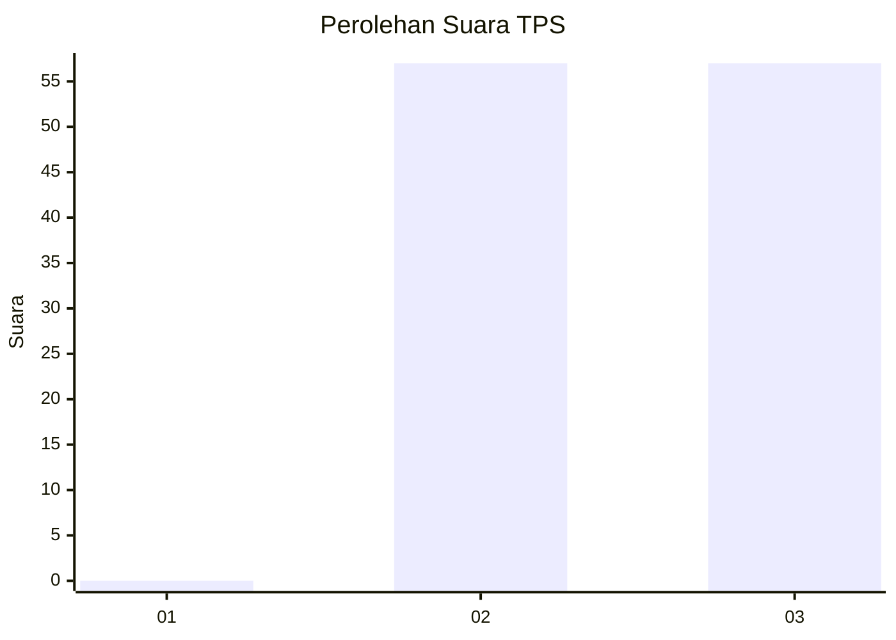
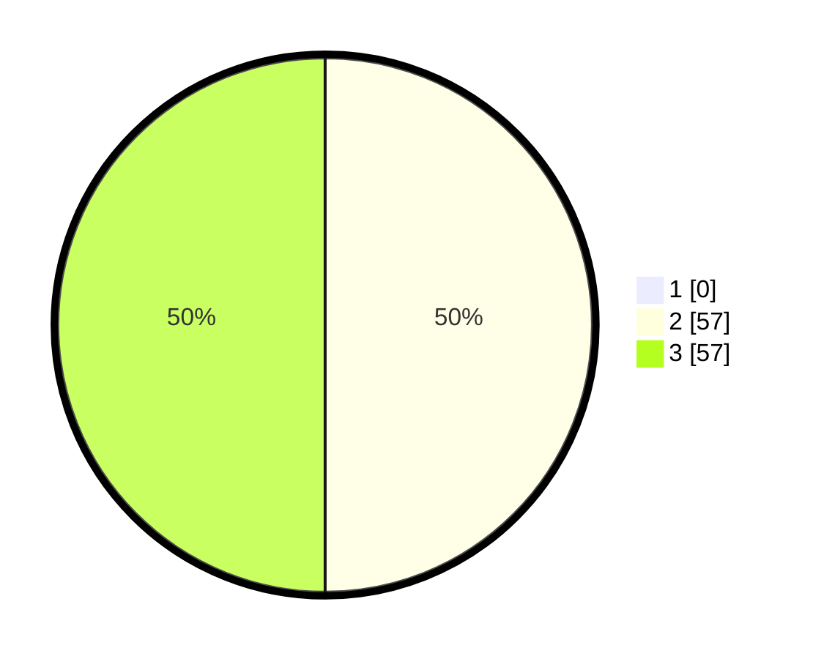

# Hasil

## Grafik

## Tabel

| No. | Nama Paslon    | Suara | Suara (raw) | Persentase |
|:--- |:-------------- | -----:| -----------:| ----------:|
| 1   | ANIES MUHAIMIN | 0     | [0][p-1]    | 0,00       |
| 2   | PRABOWO GIBRAN | 57    | [57][p-2]   | 50,00      |
| 3   | GANJAR MAHFUD  | 57    | [57][p-3]   | 50,00      |

[p-1]: https://github.com/gigit-pemilu/pemilu-2024-33-jawa-tengah/blob/main/pilpres/hitung-suara/sub/33-jawa-tengah/sub/15-grobogan/sub/02-karangrayung/sub/2002-karangsono/sub/012-tps/sub/paslon-1.txt
[p-2]: https://github.com/gigit-pemilu/pemilu-2024-33-jawa-tengah/blob/main/pilpres/hitung-suara/sub/33-jawa-tengah/sub/15-grobogan/sub/02-karangrayung/sub/2002-karangsono/sub/012-tps/sub/paslon-2.txt
[p-3]: https://github.com/gigit-pemilu/pemilu-2024-33-jawa-tengah/blob/main/pilpres/hitung-suara/sub/33-jawa-tengah/sub/15-grobogan/sub/02-karangrayung/sub/2002-karangsono/sub/012-tps/sub/paslon-3.txt

## Foto C Plano

https://sirekap-obj-formc.kpu.go.id/9db7/pemilu/ppwp/33/15/02/20/02/3315022002012-20240214-141619--0ae4c2a0-8170-49fb-8deb-595ccf11ce6d.jpg

https://sirekap-obj-formc.kpu.go.id/9db7/pemilu/ppwp/33/15/02/20/02/3315022002012-20240214-195814--66d36dbf-278f-4ee2-be9d-dd2a73e18b0d.jpg

https://sirekap-obj-formc.kpu.go.id/9db7/pemilu/ppwp/33/15/02/20/02/3315022002012-20240214-200722--69e06a51-c740-4b18-9425-d61ddccba3b4.jpg

## Metadata

| Key        | Value               |
| ---------- | ------------------- |
| Time Stamp | 2024-02-15 12:00:28 |

