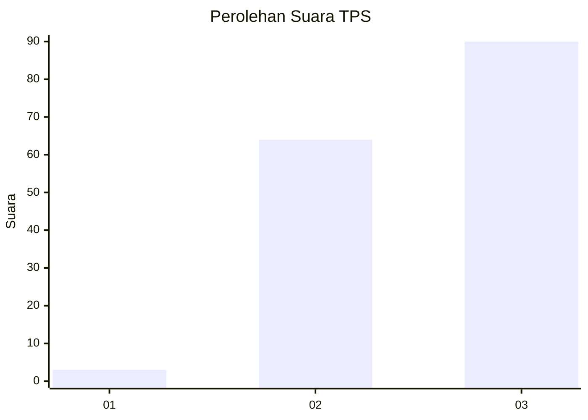
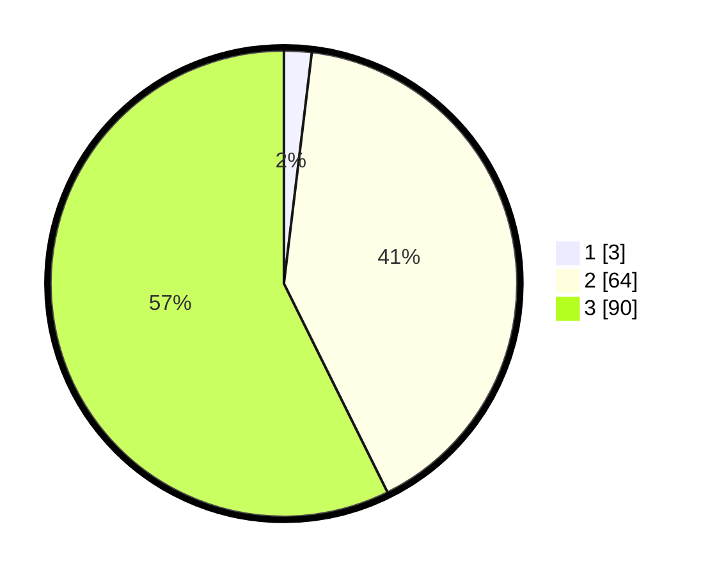

# Hasil

## Grafik

## Tabel

| No. | Nama Paslon    | Suara | Suara (raw) | Persentase |
|:--- |:-------------- | -----:| -----------:| ----------:|
| 1   | ANIES MUHAIMIN | 3     | [3][p-1]    | 1,91       |
| 2   | PRABOWO GIBRAN | 64    | [64][p-2]   | 40,76      |
| 3   | GANJAR MAHFUD  | 90    | [90][p-3]   | 57,32      |

[p-1]: https://github.com/gigit-pemilu/pemilu-2024-33-jawa-tengah/blob/main/pilpres/hitung-suara/sub/33-jawa-tengah/sub/15-grobogan/sub/02-karangrayung/sub/2006-cekel/sub/010-tps/sub/paslon-1.txt
[p-2]: https://github.com/gigit-pemilu/pemilu-2024-33-jawa-tengah/blob/main/pilpres/hitung-suara/sub/33-jawa-tengah/sub/15-grobogan/sub/02-karangrayung/sub/2006-cekel/sub/010-tps/sub/paslon-2.txt
[p-3]: https://github.com/gigit-pemilu/pemilu-2024-33-jawa-tengah/blob/main/pilpres/hitung-suara/sub/33-jawa-tengah/sub/15-grobogan/sub/02-karangrayung/sub/2006-cekel/sub/010-tps/sub/paslon-3.txt

## Foto C Plano

https://sirekap-obj-formc.kpu.go.id/3b70/pemilu/ppwp/33/15/02/20/06/3315022006010-20240216-133031--9601b59a-6e80-4fc7-9d74-cdd7cecd55ba.jpg

https://sirekap-obj-formc.kpu.go.id/3b70/pemilu/ppwp/33/15/02/20/06/3315022006010-20240217-063122--c7b56d0e-1fe4-453e-bc51-2a3486db2dfb.jpg

https://sirekap-obj-formc.kpu.go.id/3b70/pemilu/ppwp/33/15/02/20/06/3315022006010-20240216-133437--3716df5f-fd04-4876-a6bd-041234c28b53.jpg

## Metadata

| Key        | Value               |
| ---------- | ------------------- |
| Time Stamp | 2024-02-17 14:45:18 |

