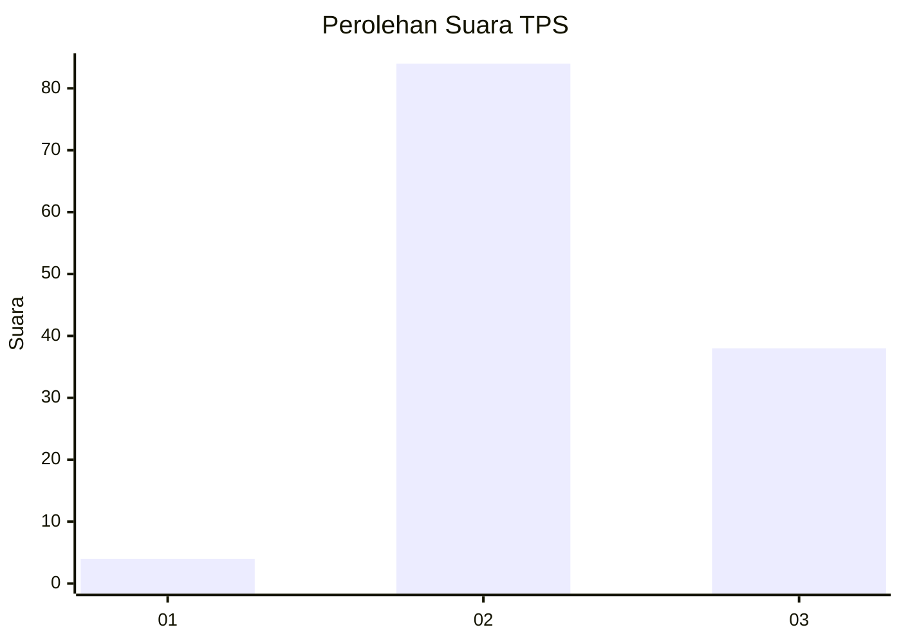
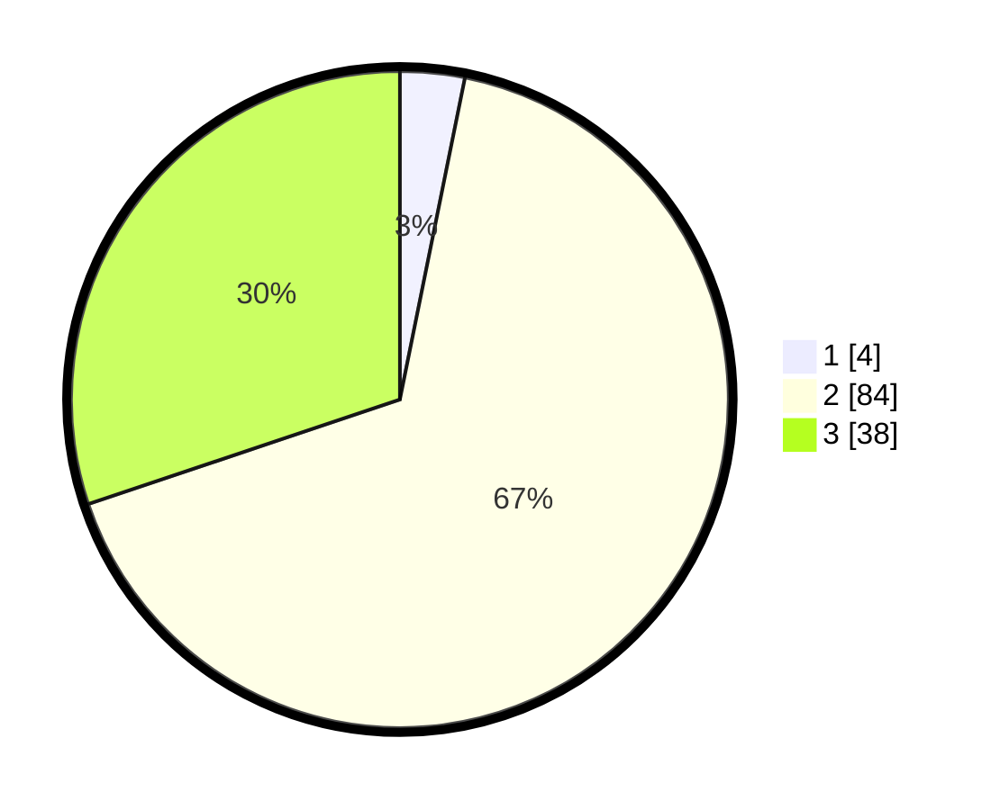

# Hasil

## Grafik

## Tabel

| No. | Nama Paslon    | Suara | Suara (raw) | Persentase |
|:--- |:-------------- | -----:| -----------:| ----------:|
| 1   | ANIES MUHAIMIN | 4     | [4][p-1]    | 3,17       |
| 2   | PRABOWO GIBRAN | 84    | [84][p-2]   | 66,67      |
| 3   | GANJAR MAHFUD  | 38    | [38][p-3]   | 30,16      |

[p-1]: https://github.com/gigit-pemilu/pemilu-2024-33-jawa-tengah/blob/main/pilpres/hitung-suara/sub/33-jawa-tengah/sub/15-grobogan/sub/02-karangrayung/sub/2010-sumberjosari/sub/005-tps/sub/paslon-1.txt
[p-2]: https://github.com/gigit-pemilu/pemilu-2024-33-jawa-tengah/blob/main/pilpres/hitung-suara/sub/33-jawa-tengah/sub/15-grobogan/sub/02-karangrayung/sub/2010-sumberjosari/sub/005-tps/sub/paslon-2.txt
[p-3]: https://github.com/gigit-pemilu/pemilu-2024-33-jawa-tengah/blob/main/pilpres/hitung-suara/sub/33-jawa-tengah/sub/15-grobogan/sub/02-karangrayung/sub/2010-sumberjosari/sub/005-tps/sub/paslon-3.txt

## Foto C Plano

https://sirekap-obj-formc.kpu.go.id/1af0/pemilu/ppwp/33/15/02/20/10/3315022010005-20240215-003118--4540d6e3-3642-4062-b1f4-949fac2f8111.jpg

https://sirekap-obj-formc.kpu.go.id/1af0/pemilu/ppwp/33/15/02/20/10/3315022010005-20240215-003235--91c9d7c9-2305-463b-88ec-2886439f425d.jpg

https://sirekap-obj-formc.kpu.go.id/1af0/pemilu/ppwp/33/15/02/20/10/3315022010005-20240215-003400--f30a9ee1-e276-44be-9b89-079a704166c7.jpg

## Metadata

| Key        | Value               |
| ---------- | ------------------- |
| Time Stamp | 2024-02-15 12:00:28 |

