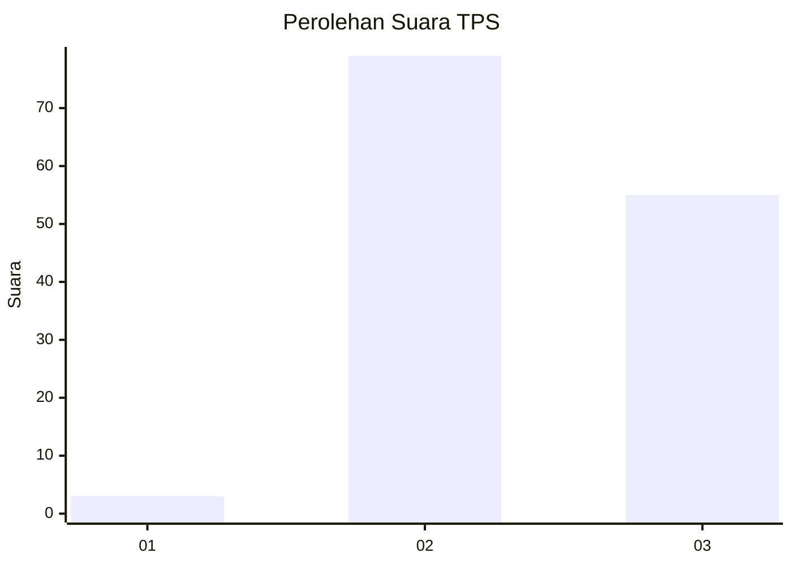
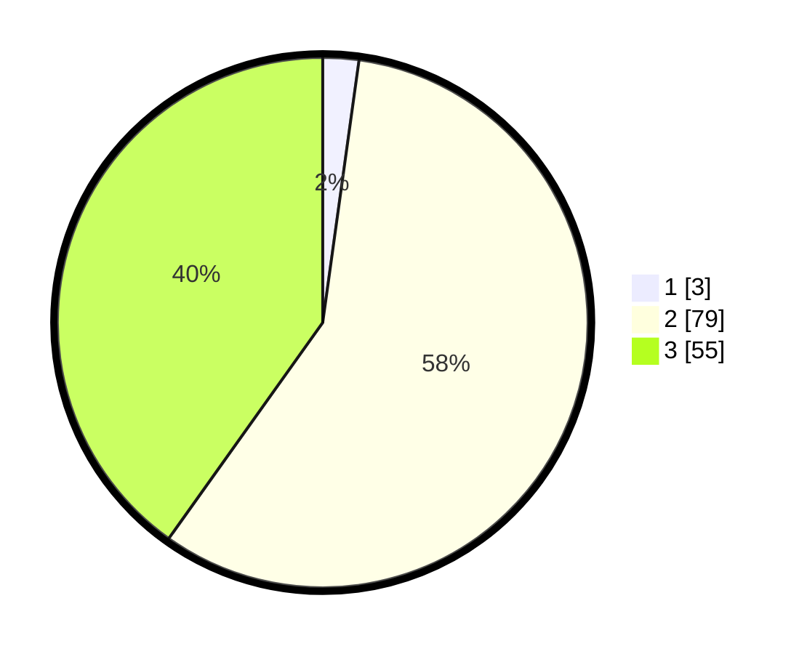

# Hasil

## Grafik

## Tabel

| No. | Nama Paslon    | Suara | Suara (raw) | Persentase |
|:--- |:-------------- | -----:| -----------:| ----------:|
| 1   | ANIES MUHAIMIN | 3     | [3][p-1]    | 2,19       |
| 2   | PRABOWO GIBRAN | 79    | [79][p-2]   | 57,66      |
| 3   | GANJAR MAHFUD  | 55    | [55][p-3]   | 40,15      |

[p-1]: https://github.com/gigit-pemilu/pemilu-2024-33-jawa-tengah/blob/main/pilpres/hitung-suara/sub/33-jawa-tengah/sub/15-grobogan/sub/02-karangrayung/sub/2010-sumberjosari/sub/036-tps/sub/paslon-1.txt
[p-2]: https://github.com/gigit-pemilu/pemilu-2024-33-jawa-tengah/blob/main/pilpres/hitung-suara/sub/33-jawa-tengah/sub/15-grobogan/sub/02-karangrayung/sub/2010-sumberjosari/sub/036-tps/sub/paslon-2.txt
[p-3]: https://github.com/gigit-pemilu/pemilu-2024-33-jawa-tengah/blob/main/pilpres/hitung-suara/sub/33-jawa-tengah/sub/15-grobogan/sub/02-karangrayung/sub/2010-sumberjosari/sub/036-tps/sub/paslon-3.txt

## Foto C Plano

https://sirekap-obj-formc.kpu.go.id/d9fb/pemilu/ppwp/33/15/02/20/10/3315022010036-20240214-234903--359f2126-0abb-4232-b919-7748f1b59d49.jpg

https://sirekap-obj-formc.kpu.go.id/d9fb/pemilu/ppwp/33/15/02/20/10/3315022010036-20240214-235030--336ba2ca-34b3-42ba-b228-51185faceb61.jpg

https://sirekap-obj-formc.kpu.go.id/d9fb/pemilu/ppwp/33/15/02/20/10/3315022010036-20240214-141703--2476c40f-0a5a-4e3e-a8f6-7609f8a7d75d.jpg

## Metadata

| Key        | Value               |
| ---------- | ------------------- |
| Time Stamp | 2024-02-15 12:00:28 |

