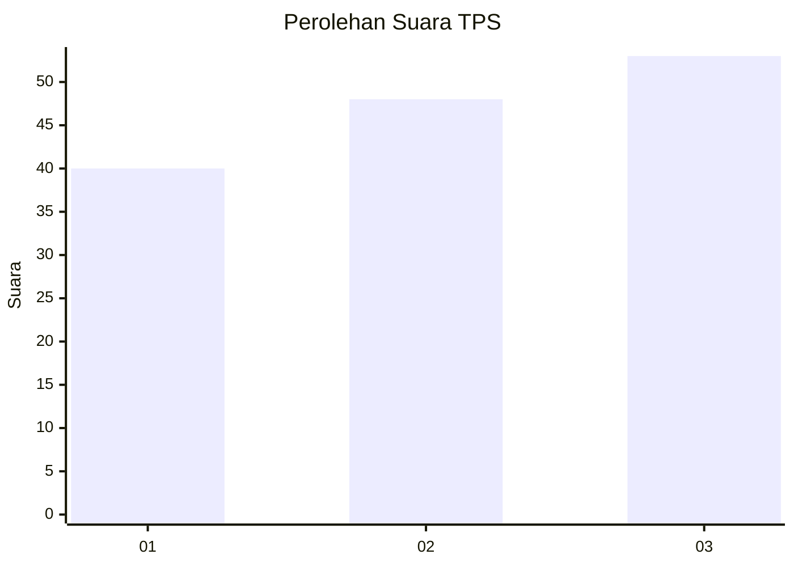
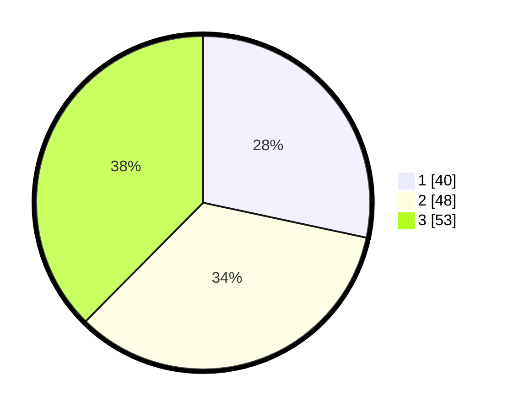

# Hasil

## Grafik

## Tabel

| No. | Nama Paslon    | Suara | Suara (raw) | Persentase |
|:--- |:-------------- | -----:| -----------:| ----------:|
| 1   | ANIES MUHAIMIN | 40    | [40][p-1]   | 28,37      |
| 2   | PRABOWO GIBRAN | 48    | [48][p-2]   | 34,04      |
| 3   | GANJAR MAHFUD  | 53    | [53][p-3]   | 37,59      |

[p-1]: https://github.com/gigit-pemilu/pemilu-2024-33-jawa-tengah/blob/main/pilpres/hitung-suara/sub/33-jawa-tengah/sub/15-grobogan/sub/02-karangrayung/sub/2012-gunungtumpeng/sub/005-tps/sub/paslon-1.txt
[p-2]: https://github.com/gigit-pemilu/pemilu-2024-33-jawa-tengah/blob/main/pilpres/hitung-suara/sub/33-jawa-tengah/sub/15-grobogan/sub/02-karangrayung/sub/2012-gunungtumpeng/sub/005-tps/sub/paslon-2.txt
[p-3]: https://github.com/gigit-pemilu/pemilu-2024-33-jawa-tengah/blob/main/pilpres/hitung-suara/sub/33-jawa-tengah/sub/15-grobogan/sub/02-karangrayung/sub/2012-gunungtumpeng/sub/005-tps/sub/paslon-3.txt

## Foto C Plano

https://sirekap-obj-formc.kpu.go.id/b80d/pemilu/ppwp/33/15/02/20/12/3315022012005-20240215-053458--db28420a-18b8-4fa9-96da-ef6a3dd37792.jpg

https://sirekap-obj-formc.kpu.go.id/b80d/pemilu/ppwp/33/15/02/20/12/3315022012005-20240215-022614--640adc46-8c8a-4d81-b45d-7c45d0e5edc6.jpg

https://sirekap-obj-formc.kpu.go.id/b80d/pemilu/ppwp/33/15/02/20/12/3315022012005-20240215-053148--1a7003c6-2da1-49dd-a507-f79a6257eb03.jpg

## Metadata

| Key        | Value               |
| ---------- | ------------------- |
| Time Stamp | 2024-02-15 15:00:29 |

