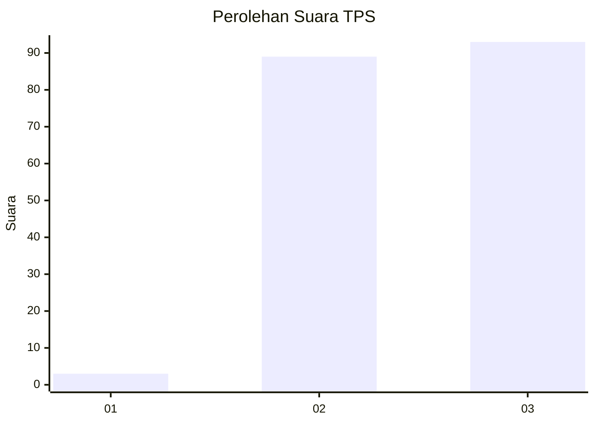
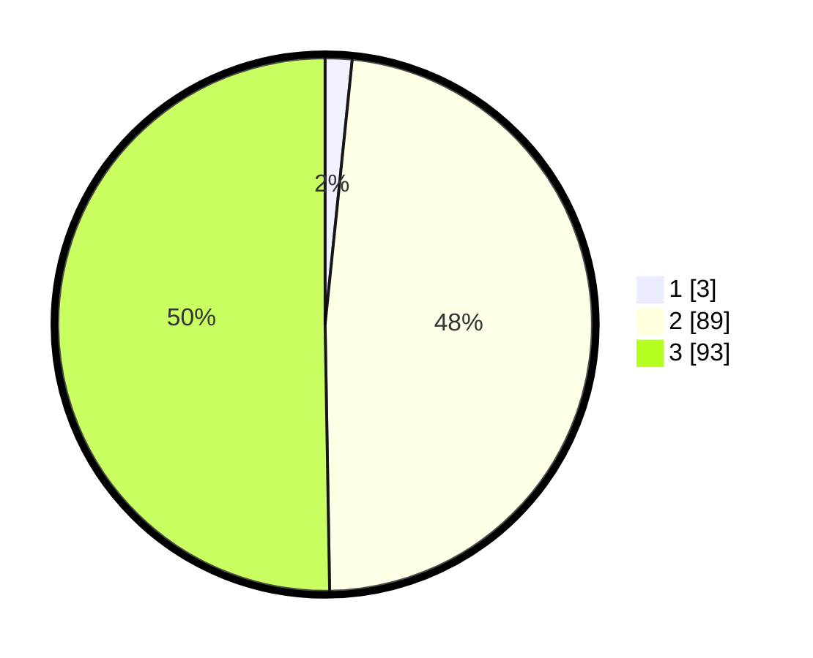

# Hasil

## Grafik

## Tabel

| No. | Nama Paslon    | Suara | Suara (raw) | Persentase |
|:--- |:-------------- | -----:| -----------:| ----------:|
| 1   | ANIES MUHAIMIN | 3     | [3][p-1]    | 1,62       |
| 2   | PRABOWO GIBRAN | 89    | [89][p-2]   | 48,11      |
| 3   | GANJAR MAHFUD  | 93    | [93][p-3]   | 50,27      |

[p-1]: https://github.com/gigit-pemilu/pemilu-2024/blob/main/pilpres/hitung-suara/sub/33-jawa-tengah/sub/15-grobogan/sub/02-karangrayung/sub/2016-dempel/sub/006-tps/sub/paslon-1.txt
[p-2]: https://github.com/gigit-pemilu/pemilu-2024/blob/main/pilpres/hitung-suara/sub/33-jawa-tengah/sub/15-grobogan/sub/02-karangrayung/sub/2016-dempel/sub/006-tps/sub/paslon-2.txt
[p-3]: https://github.com/gigit-pemilu/pemilu-2024/blob/main/pilpres/hitung-suara/sub/33-jawa-tengah/sub/15-grobogan/sub/02-karangrayung/sub/2016-dempel/sub/006-tps/sub/paslon-3.txt

## Foto C Plano

https://sirekap-obj-formc.kpu.go.id/aaba/pemilu/ppwp/33/15/02/20/16/3315022016006-20240215-000359--e28cfa31-c6fa-48b9-bc89-d4614837edf2.jpg

https://sirekap-obj-formc.kpu.go.id/aaba/pemilu/ppwp/33/15/02/20/16/3315022016006-20240214-234919--5d194741-333d-404e-bb8b-ab5229a41f8a.jpg

https://sirekap-obj-formc.kpu.go.id/aaba/pemilu/ppwp/33/15/02/20/16/3315022016006-20240214-235024--72bfad5c-5ee7-4d24-9b1d-dbfa01dc8c15.jpg

## Metadata

| Key        | Value               |
| ---------- | ------------------- |
| Time Stamp | 2024-02-16 11:00:29 |

