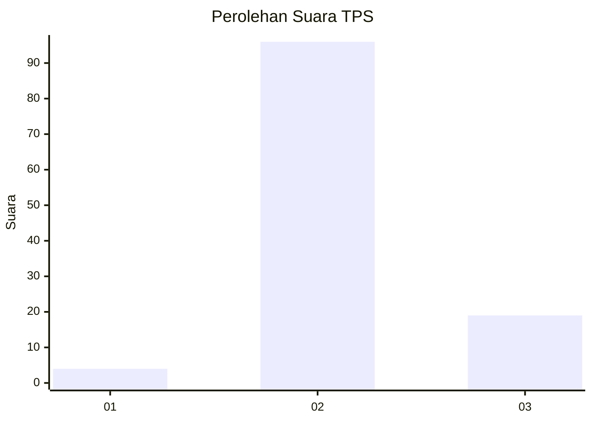
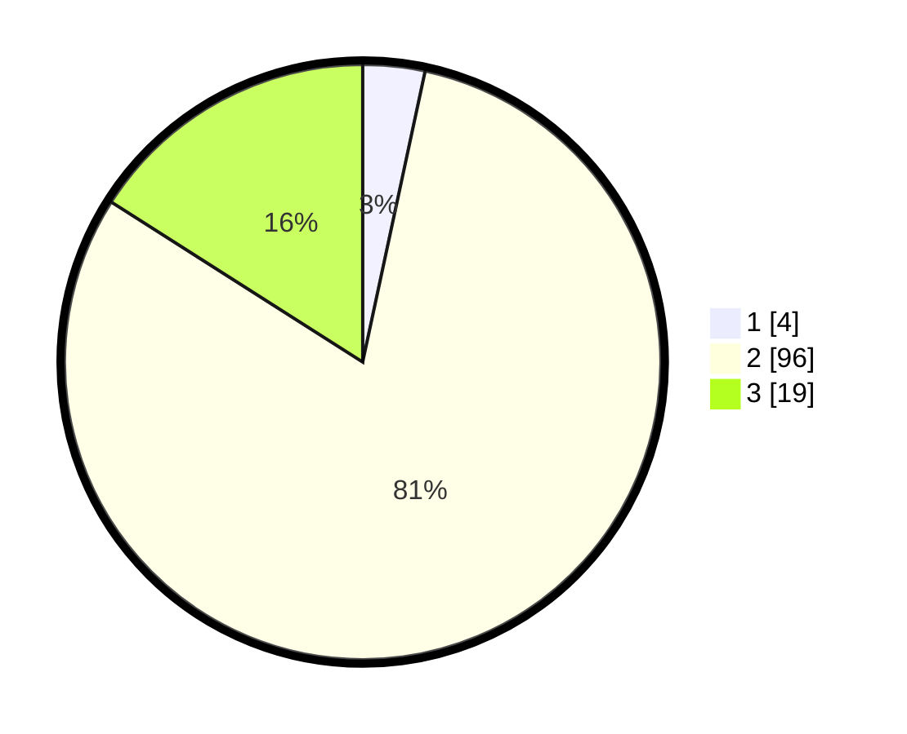

# Hasil

## Grafik

## Tabel

| No. | Nama Paslon    | Suara | Suara (raw) | Persentase |
|:--- |:-------------- | -----:| -----------:| ----------:|
| 1   | ANIES MUHAIMIN | 4     | [4][p-1]    | 3,36       |
| 2   | PRABOWO GIBRAN | 96    | [96][p-2]   | 80,67      |
| 3   | GANJAR MAHFUD  | 19    | [19][p-3]   | 15,97      |

[p-1]: https://github.com/gigit-pemilu/pemilu-2024-33-jawa-tengah/blob/main/pilpres/hitung-suara/sub/33-jawa-tengah/sub/15-grobogan/sub/03-penawangan/sub/2019-ngeluk/sub/001-tps/sub/paslon-1.txt
[p-2]: https://github.com/gigit-pemilu/pemilu-2024-33-jawa-tengah/blob/main/pilpres/hitung-suara/sub/33-jawa-tengah/sub/15-grobogan/sub/03-penawangan/sub/2019-ngeluk/sub/001-tps/sub/paslon-2.txt
[p-3]: https://github.com/gigit-pemilu/pemilu-2024-33-jawa-tengah/blob/main/pilpres/hitung-suara/sub/33-jawa-tengah/sub/15-grobogan/sub/03-penawangan/sub/2019-ngeluk/sub/001-tps/sub/paslon-3.txt

## Foto C Plano

https://sirekap-obj-formc.kpu.go.id/2224/pemilu/ppwp/33/15/03/20/19/3315032019001-20240219-141747--2f4dd66d-f680-450c-baec-859eae1c0653.jpg

https://sirekap-obj-formc.kpu.go.id/2224/pemilu/ppwp/33/15/03/20/19/3315032019001-20240219-141834--10d9154f-7dc8-47b6-bc5b-1bb3a50c37c5.jpg

https://sirekap-obj-formc.kpu.go.id/2224/pemilu/ppwp/33/15/03/20/19/3315032019001-20240219-142009--b26b40f0-87c3-44d7-b3d1-1f60f0f8fc9e.jpg

## Metadata

| Key        | Value               |
| ---------- | ------------------- |
| Time Stamp | 2024-02-19 19:00:00 |

