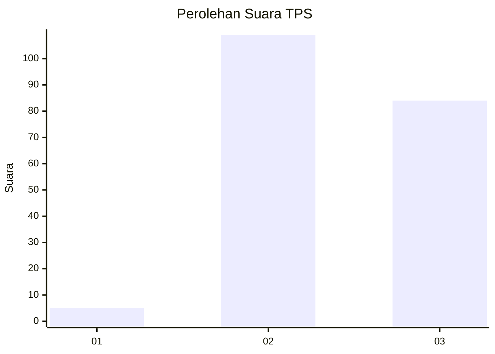
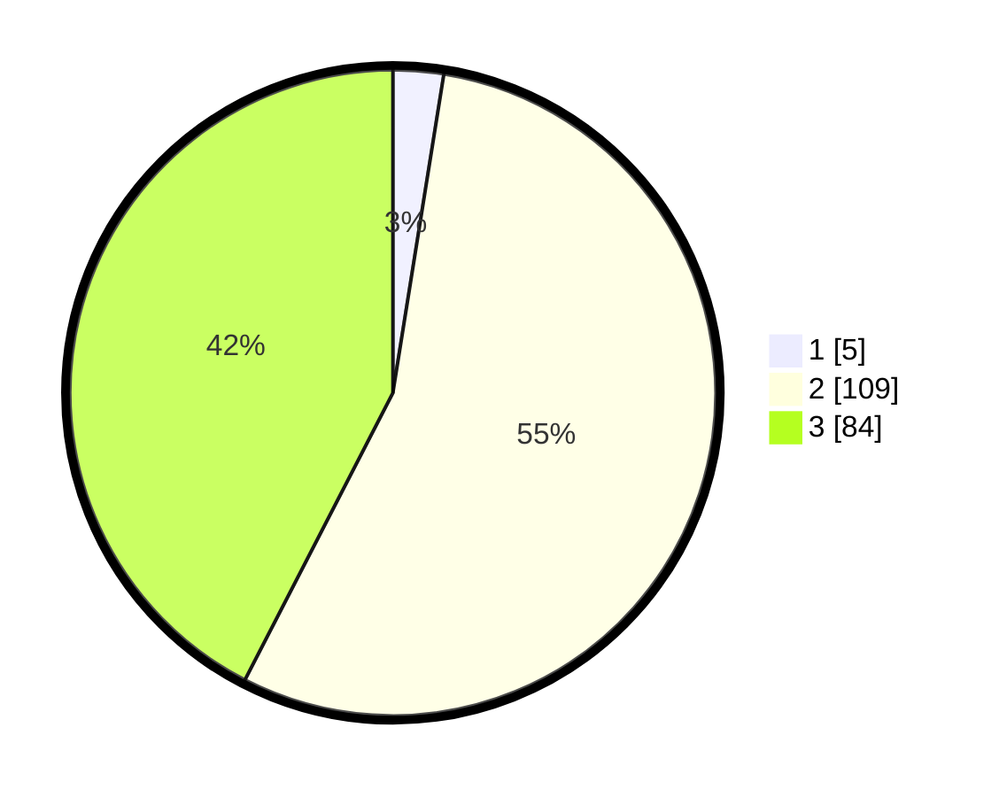

# Hasil

## Grafik

## Tabel

| No. | Nama Paslon    | Suara | Suara (raw) | Persentase |
|:--- |:-------------- | -----:| -----------:| ----------:|
| 1   | ANIES MUHAIMIN | 5     | [5][p-1]    | 2,53       |
| 2   | PRABOWO GIBRAN | 109   | [109][p-2]  | 55,05      |
| 3   | GANJAR MAHFUD  | 84    | [84][p-3]   | 42,42      |

[p-1]: https://github.com/gigit-pemilu/pemilu-2024/blob/main/pilpres/hitung-suara/sub/33-jawa-tengah/sub/15-grobogan/sub/04-toroh/sub/2001-ngrandah/sub/006-tps/sub/paslon-1.txt
[p-2]: https://github.com/gigit-pemilu/pemilu-2024/blob/main/pilpres/hitung-suara/sub/33-jawa-tengah/sub/15-grobogan/sub/04-toroh/sub/2001-ngrandah/sub/006-tps/sub/paslon-2.txt
[p-3]: https://github.com/gigit-pemilu/pemilu-2024/blob/main/pilpres/hitung-suara/sub/33-jawa-tengah/sub/15-grobogan/sub/04-toroh/sub/2001-ngrandah/sub/006-tps/sub/paslon-3.txt

## Foto C Plano

https://sirekap-obj-formc.kpu.go.id/e0ea/pemilu/ppwp/33/15/04/20/01/3315042001006-20240214-214603--2d7f4aa1-cdec-4661-b9c8-ec857e19c90c.jpg

https://sirekap-obj-formc.kpu.go.id/e0ea/pemilu/ppwp/33/15/04/20/01/3315042001006-20240214-141646--895ec22d-2504-4753-918d-ff12680e6930.jpg

https://sirekap-obj-formc.kpu.go.id/e0ea/pemilu/ppwp/33/15/04/20/01/3315042001006-20240214-141747--dc3b22b9-a1ed-4763-8347-9f46a0fb9219.jpg

## Metadata

| Key        | Value               |
| ---------- | ------------------- |
| Time Stamp | 2024-02-15 21:30:27 |

