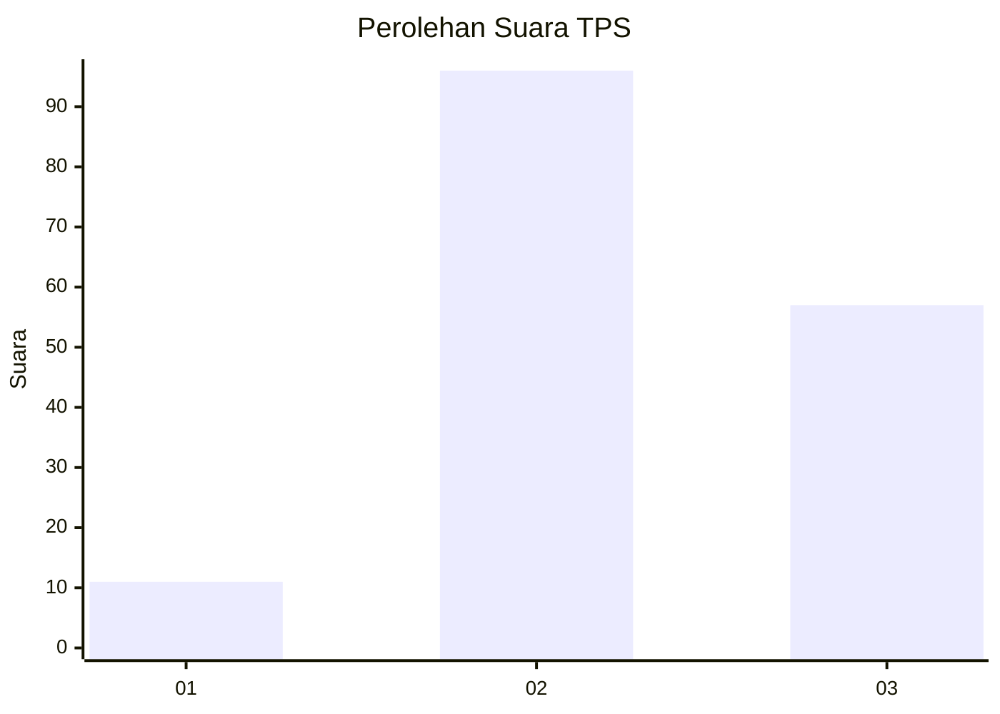
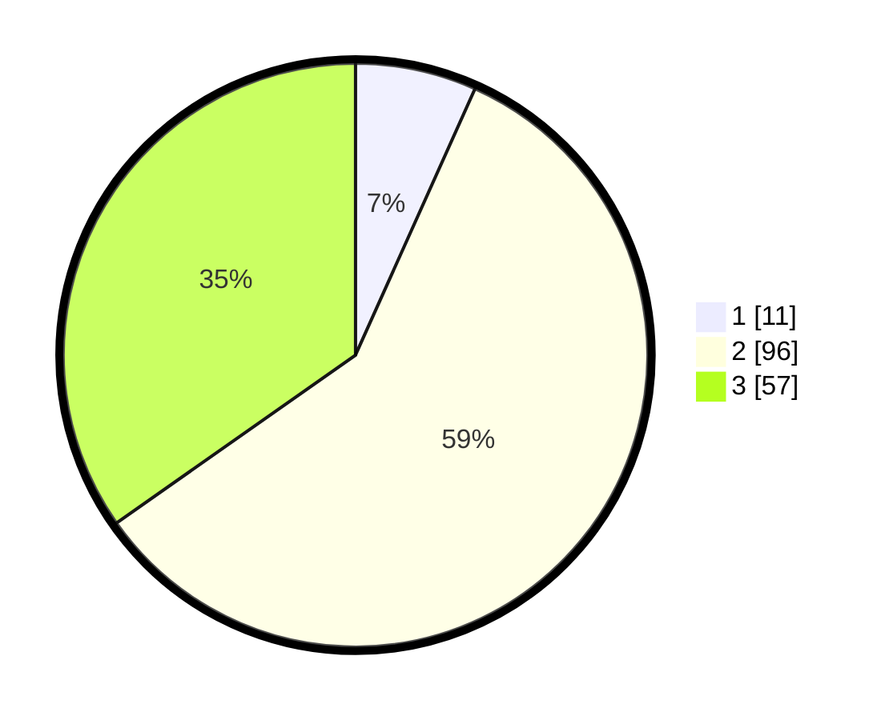

# Hasil

## Grafik

## Tabel

| No. | Nama Paslon    | Suara | Suara (raw) | Persentase |
|:--- |:-------------- | -----:| -----------:| ----------:|
| 1   | ANIES MUHAIMIN | 11    | [11][p-1]   | 6,71       |
| 2   | PRABOWO GIBRAN | 96    | [96][p-2]   | 58,54      |
| 3   | GANJAR MAHFUD  | 57    | [57][p-3]   | 34,76      |

[p-1]: https://github.com/gigit-pemilu/pemilu-2024/blob/main/pilpres/hitung-suara/sub/33-jawa-tengah/sub/15-grobogan/sub/04-toroh/sub/2001-ngrandah/sub/008-tps/sub/paslon-1.txt
[p-2]: https://github.com/gigit-pemilu/pemilu-2024/blob/main/pilpres/hitung-suara/sub/33-jawa-tengah/sub/15-grobogan/sub/04-toroh/sub/2001-ngrandah/sub/008-tps/sub/paslon-2.txt
[p-3]: https://github.com/gigit-pemilu/pemilu-2024/blob/main/pilpres/hitung-suara/sub/33-jawa-tengah/sub/15-grobogan/sub/04-toroh/sub/2001-ngrandah/sub/008-tps/sub/paslon-3.txt

## Foto C Plano

https://sirekap-obj-formc.kpu.go.id/290b/pemilu/ppwp/33/15/04/20/01/3315042001008-20240214-202138--df157e46-8c71-4d4a-9f73-6a7bc2682abb.jpg

https://sirekap-obj-formc.kpu.go.id/290b/pemilu/ppwp/33/15/04/20/01/3315042001008-20240214-202552--5bbf3c30-a8ae-4ed9-b515-f2156a6106a1.jpg

https://sirekap-obj-formc.kpu.go.id/290b/pemilu/ppwp/33/15/04/20/01/3315042001008-20240214-202631--503e462e-717c-4efd-8965-5837a9eaa879.jpg

## Metadata

| Key        | Value               |
| ---------- | ------------------- |
| Time Stamp | 2024-02-15 16:30:25 |

