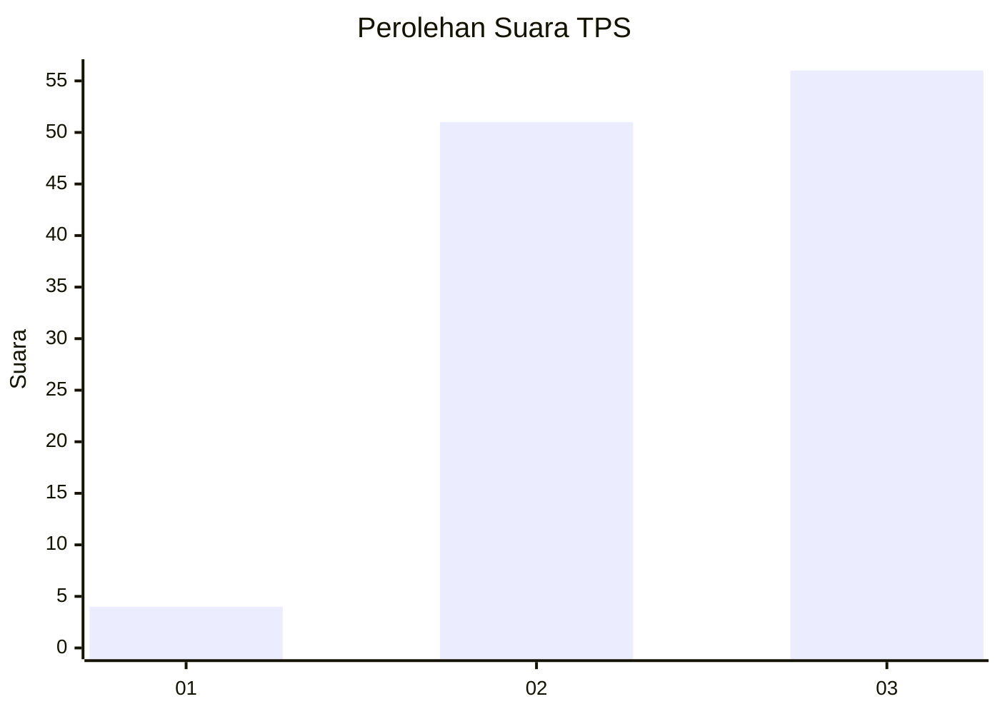
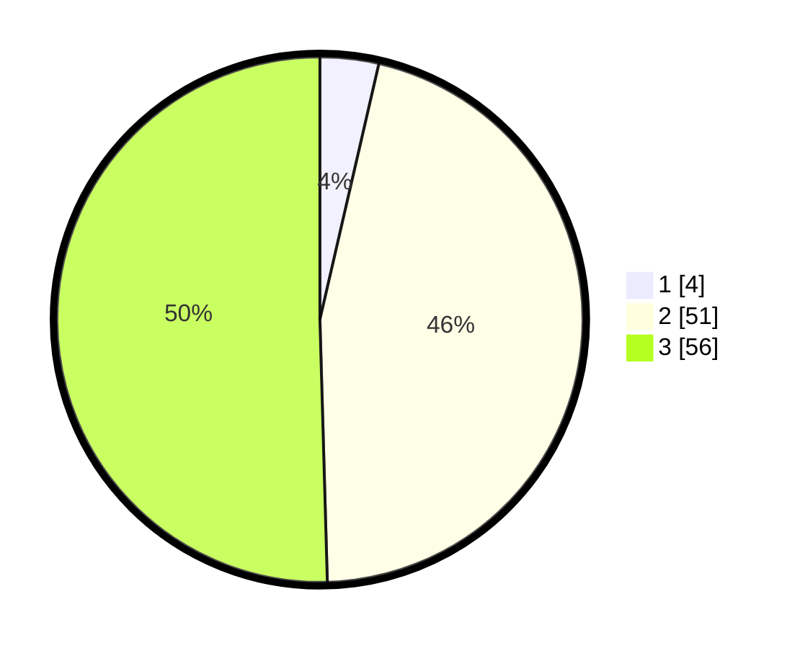

# Hasil

## Grafik

## Tabel

| No. | Nama Paslon    | Suara | Suara (raw) | Persentase |
|:--- |:-------------- | -----:| -----------:| ----------:|
| 1   | ANIES MUHAIMIN | 4     | [4][p-1]    | 3,60       |
| 2   | PRABOWO GIBRAN | 51    | [51][p-2]   | 45,95      |
| 3   | GANJAR MAHFUD  | 56    | [56][p-3]   | 50,45      |

[p-1]: https://github.com/gigit-pemilu/pemilu-2024/blob/main/pilpres/hitung-suara/sub/33-jawa-tengah/sub/15-grobogan/sub/04-toroh/sub/2001-ngrandah/sub/014-tps/sub/paslon-1.txt
[p-2]: https://github.com/gigit-pemilu/pemilu-2024/blob/main/pilpres/hitung-suara/sub/33-jawa-tengah/sub/15-grobogan/sub/04-toroh/sub/2001-ngrandah/sub/014-tps/sub/paslon-2.txt
[p-3]: https://github.com/gigit-pemilu/pemilu-2024/blob/main/pilpres/hitung-suara/sub/33-jawa-tengah/sub/15-grobogan/sub/04-toroh/sub/2001-ngrandah/sub/014-tps/sub/paslon-3.txt

## Foto C Plano

https://sirekap-obj-formc.kpu.go.id/7c65/pemilu/ppwp/33/15/04/20/01/3315042001014-20240214-101530--671366cc-33a8-40a7-b7f8-41de00860ec0.jpg

https://sirekap-obj-formc.kpu.go.id/7c65/pemilu/ppwp/33/15/04/20/01/3315042001014-20240214-141124--b370c859-d2e3-4b4d-aa86-c82a8f585c6a.jpg

https://sirekap-obj-formc.kpu.go.id/7c65/pemilu/ppwp/33/15/04/20/01/3315042001014-20240214-141209--52b64c9a-9572-4217-8cfe-6d2cfecffa78.jpg

## Metadata

| Key        | Value               |
| ---------- | ------------------- |
| Time Stamp | 2024-02-19 06:16:00 |

