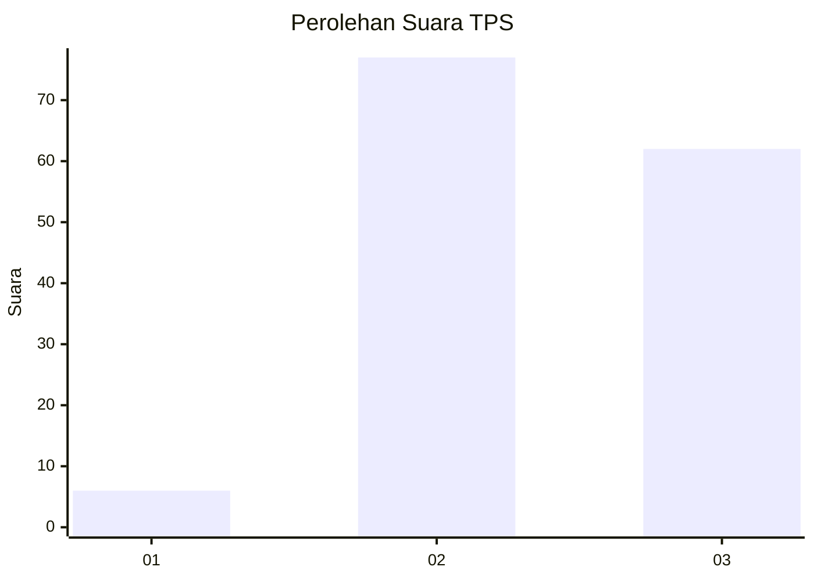
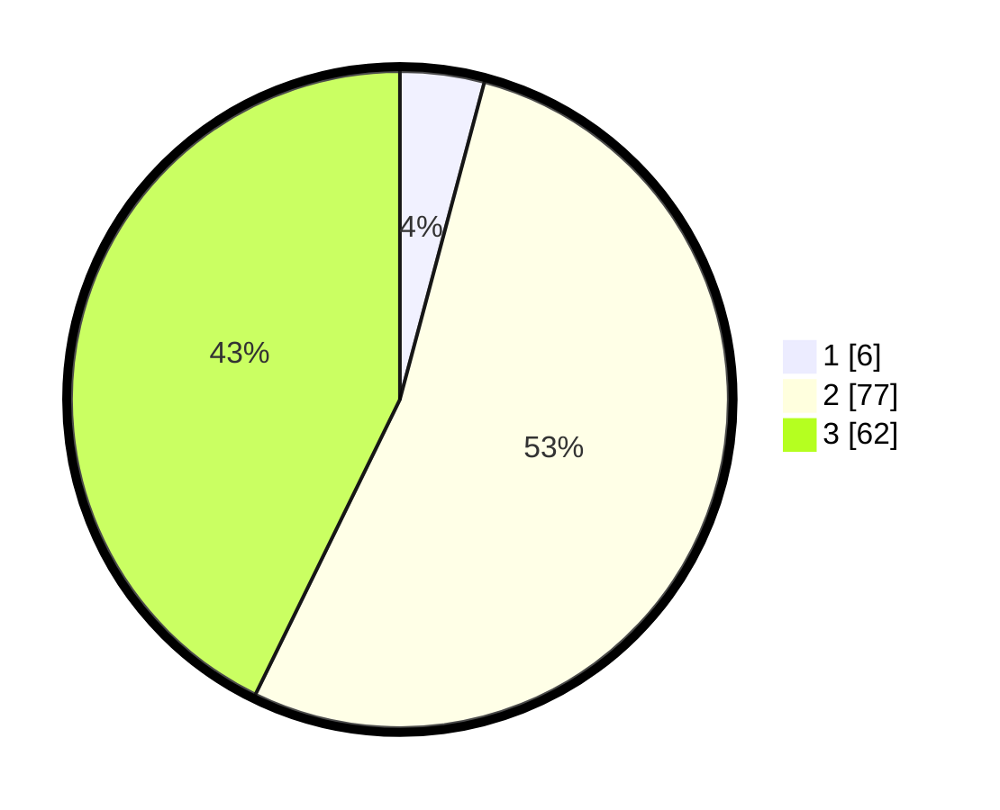

# Hasil

## Grafik

## Tabel

| No. | Nama Paslon    | Suara | Suara (raw) | Persentase |
|:--- |:-------------- | -----:| -----------:| ----------:|
| 1   | ANIES MUHAIMIN | 6     | [6][p-1]    | 4,14       |
| 2   | PRABOWO GIBRAN | 77    | [77][p-2]   | 53,10      |
| 3   | GANJAR MAHFUD  | 62    | [62][p-3]   | 42,76      |

[p-1]: https://github.com/gigit-pemilu/pemilu-2024/blob/main/pilpres/hitung-suara/sub/33-jawa-tengah/sub/15-grobogan/sub/04-toroh/sub/2002-kenteng/sub/004-tps/sub/paslon-1.txt
[p-2]: https://github.com/gigit-pemilu/pemilu-2024/blob/main/pilpres/hitung-suara/sub/33-jawa-tengah/sub/15-grobogan/sub/04-toroh/sub/2002-kenteng/sub/004-tps/sub/paslon-2.txt
[p-3]: https://github.com/gigit-pemilu/pemilu-2024/blob/main/pilpres/hitung-suara/sub/33-jawa-tengah/sub/15-grobogan/sub/04-toroh/sub/2002-kenteng/sub/004-tps/sub/paslon-3.txt

## Foto C Plano

https://sirekap-obj-formc.kpu.go.id/52f7/pemilu/ppwp/33/15/04/20/02/3315042002004-20240215-000524--8efea466-0901-428f-b808-652b1660a816.jpg

https://sirekap-obj-formc.kpu.go.id/52f7/pemilu/ppwp/33/15/04/20/02/3315042002004-20240215-000604--f8c14e21-101e-4f6b-b556-d9c738a69910.jpg

https://sirekap-obj-formc.kpu.go.id/52f7/pemilu/ppwp/33/15/04/20/02/3315042002004-20240215-000638--e474b6ba-fcba-47fa-b5d3-a26934d2488f.jpg

## Metadata

| Key        | Value               |
| ---------- | ------------------- |
| Time Stamp | 2024-02-15 15:00:29 |

