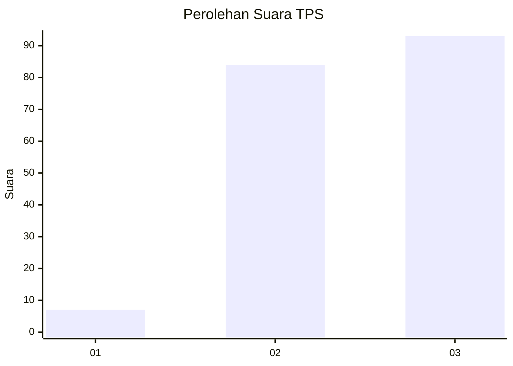
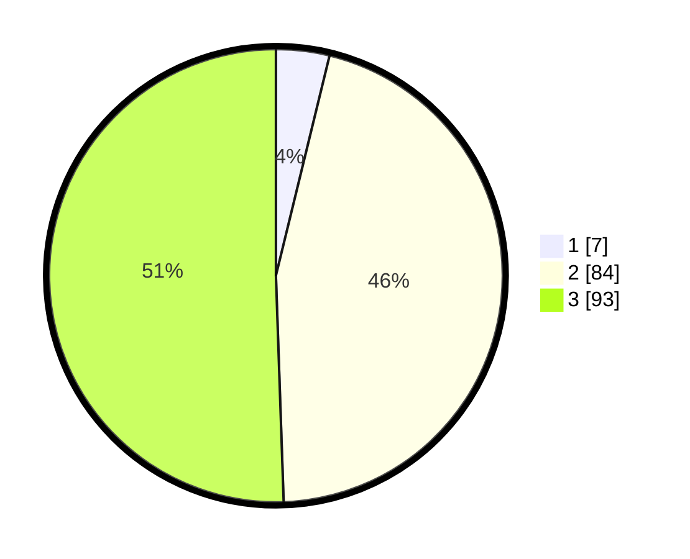

# Hasil

## Grafik

## Tabel

| No. | Nama Paslon    | Suara | Suara (raw) | Persentase |
|:--- |:-------------- | -----:| -----------:| ----------:|
| 1   | ANIES MUHAIMIN | 7     | [7][p-1]    | 3,80       |
| 2   | PRABOWO GIBRAN | 84    | [84][p-2]   | 45,65      |
| 3   | GANJAR MAHFUD  | 93    | [93][p-3]   | 50,54      |

[p-1]: https://github.com/gigit-pemilu/pemilu-2024-33-jawa-tengah/blob/main/pilpres/hitung-suara/sub/33-jawa-tengah/sub/15-grobogan/sub/04-toroh/sub/2002-kenteng/sub/011-tps/sub/paslon-1.txt
[p-2]: https://github.com/gigit-pemilu/pemilu-2024-33-jawa-tengah/blob/main/pilpres/hitung-suara/sub/33-jawa-tengah/sub/15-grobogan/sub/04-toroh/sub/2002-kenteng/sub/011-tps/sub/paslon-2.txt
[p-3]: https://github.com/gigit-pemilu/pemilu-2024-33-jawa-tengah/blob/main/pilpres/hitung-suara/sub/33-jawa-tengah/sub/15-grobogan/sub/04-toroh/sub/2002-kenteng/sub/011-tps/sub/paslon-3.txt

## Foto C Plano

https://sirekap-obj-formc.kpu.go.id/b147/pemilu/ppwp/33/15/04/20/02/3315042002011-20240218-101306--5ddabfde-1e9d-4bae-85bd-eb35b62ccd91.jpg

https://sirekap-obj-formc.kpu.go.id/b147/pemilu/ppwp/33/15/04/20/02/3315042002011-20240218-101337--192458de-2f13-405f-838c-39837a4989bc.jpg

https://sirekap-obj-formc.kpu.go.id/b147/pemilu/ppwp/33/15/04/20/02/3315042002011-20240218-101756--d3edc96d-12cd-4f42-a5e6-e559938ba511.jpg

## Metadata

| Key        | Value               |
| ---------- | ------------------- |
| Time Stamp | 2024-02-19 06:16:00 |

## DATA PEMILIH TETAP

Jumlah pemilih dalam DPT: **0**.
 * L: **0**.
 * P: **0**.

## DATA PENGGUNA HAK PILIH

Jumlah pengguna hak pilih dalam DPT: **0**.
 * L: **200**.
 * P: **0**.

Jumlah pengguna hak pilih dalam DPTb: **411**.
 * L: **318**.
 * P: **944**.

Jumlah pengguna hak pilih dalam DPK: **0**.
 * L: **444**.
 * P: **400**.

Jumlah pengguna hak pilih: **0**.
 * L: **444**.
 * P: **400**.

## JUMLAH SUARA SAH DAN TIDAK SAH

JUMLAH SELURUH SUARA SAH: **184**.

JUMLAH SUARA TIDAK SAH: **5**.

JUMLAH SELURUH SUARA SAH DAN SUARA TIDAK SAH: **189**.

