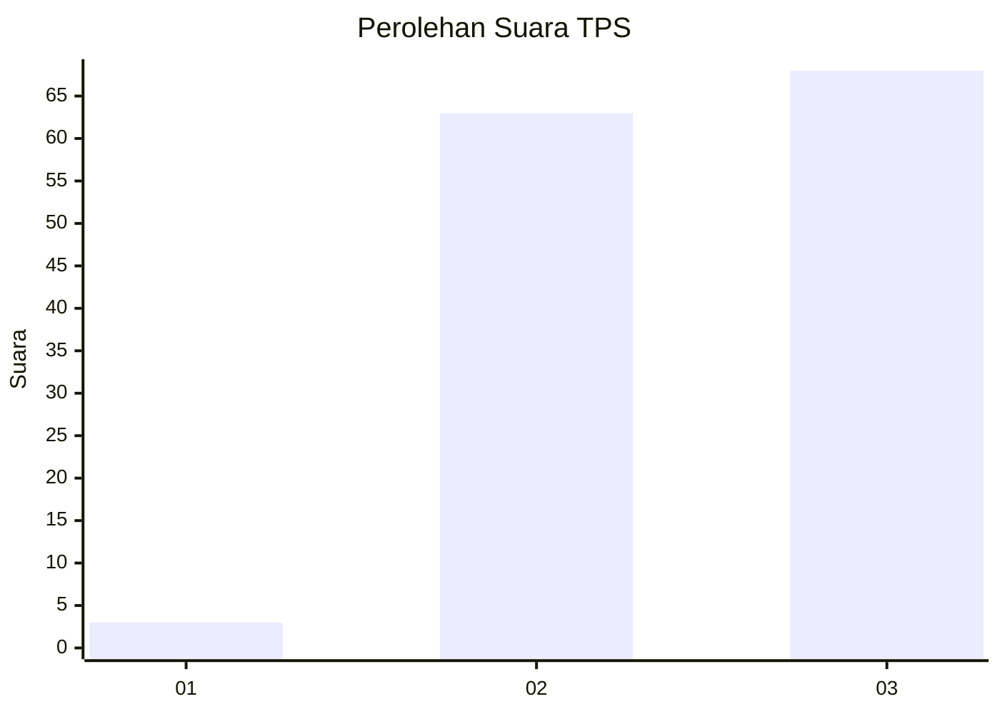
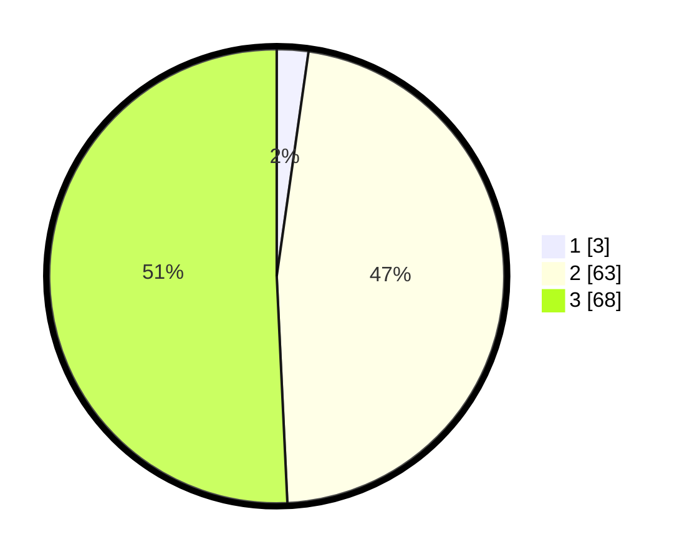

# Hasil

## Grafik

## Tabel

| No. | Nama Paslon    | Suara | Suara (raw) | Persentase |
|:--- |:-------------- | -----:| -----------:| ----------:|
| 1   | ANIES MUHAIMIN | 3     | [3][p-1]    | 2,24       |
| 2   | PRABOWO GIBRAN | 63    | [63][p-2]   | 47,01      |
| 3   | GANJAR MAHFUD  | 68    | [68][p-3]   | 50,75      |

[p-1]: https://github.com/gigit-pemilu/pemilu-2024/blob/main/pilpres/hitung-suara/sub/33-jawa-tengah/sub/15-grobogan/sub/04-toroh/sub/2004-bandungharjo/sub/011-tps/sub/paslon-1.txt
[p-2]: https://github.com/gigit-pemilu/pemilu-2024/blob/main/pilpres/hitung-suara/sub/33-jawa-tengah/sub/15-grobogan/sub/04-toroh/sub/2004-bandungharjo/sub/011-tps/sub/paslon-2.txt
[p-3]: https://github.com/gigit-pemilu/pemilu-2024/blob/main/pilpres/hitung-suara/sub/33-jawa-tengah/sub/15-grobogan/sub/04-toroh/sub/2004-bandungharjo/sub/011-tps/sub/paslon-3.txt

## Foto C Plano

https://sirekap-obj-formc.kpu.go.id/04cd/pemilu/ppwp/33/15/04/20/04/3315042004011-20240214-185535--35a626c3-7b91-4a23-85b8-89080d8b1572.jpg

https://sirekap-obj-formc.kpu.go.id/04cd/pemilu/ppwp/33/15/04/20/04/3315042004011-20240214-185531--ab21ad2a-371a-4baa-8d5b-7eb01d7571ee.jpg

https://sirekap-obj-formc.kpu.go.id/04cd/pemilu/ppwp/33/15/04/20/04/3315042004011-20240214-185526--5fd5279b-a26c-45fb-9264-7afa5be93f5e.jpg

## Metadata

| Key        | Value               |
| ---------- | ------------------- |
| Time Stamp | 2024-02-14 21:46:01 |

