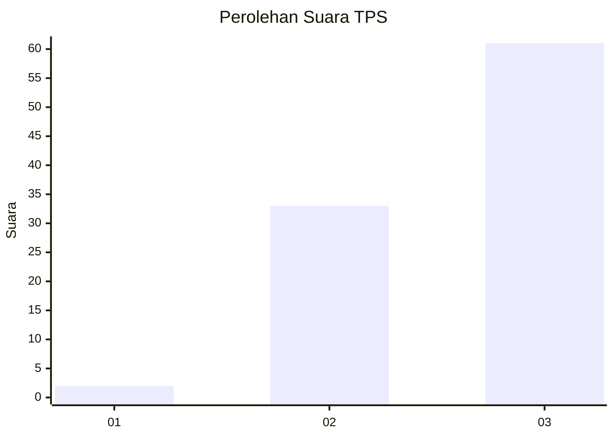
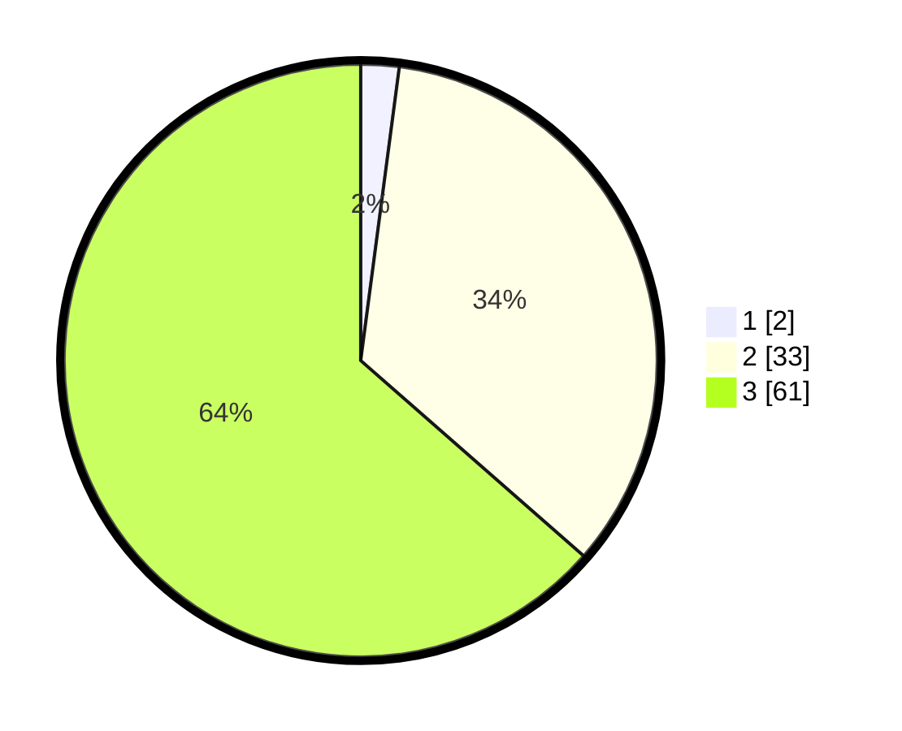

# Hasil

## Grafik

## Tabel

| No. | Nama Paslon    | Suara | Suara (raw) | Persentase |
|:--- |:-------------- | -----:| -----------:| ----------:|
| 1   | ANIES MUHAIMIN | 2     | [2][p-1]    | 2,08       |
| 2   | PRABOWO GIBRAN | 33    | [33][p-2]   | 34,38      |
| 3   | GANJAR MAHFUD  | 61    | [61][p-3]   | 63,54      |

[p-1]: https://github.com/gigit-pemilu/pemilu-2024/blob/main/pilpres/hitung-suara/sub/33-jawa-tengah/sub/15-grobogan/sub/04-toroh/sub/2004-bandungharjo/sub/021-tps/sub/paslon-1.txt
[p-2]: https://github.com/gigit-pemilu/pemilu-2024/blob/main/pilpres/hitung-suara/sub/33-jawa-tengah/sub/15-grobogan/sub/04-toroh/sub/2004-bandungharjo/sub/021-tps/sub/paslon-2.txt
[p-3]: https://github.com/gigit-pemilu/pemilu-2024/blob/main/pilpres/hitung-suara/sub/33-jawa-tengah/sub/15-grobogan/sub/04-toroh/sub/2004-bandungharjo/sub/021-tps/sub/paslon-3.txt

## Foto C Plano

https://sirekap-obj-formc.kpu.go.id/c0c1/pemilu/ppwp/33/15/04/20/04/3315042004021-20240215-104925--1bcbfff3-bc70-4382-b72a-f9b8924f556d.jpg

https://sirekap-obj-formc.kpu.go.id/c0c1/pemilu/ppwp/33/15/04/20/04/3315042004021-20240215-105147--7512a41a-5162-4eae-b68c-03ea36d866a5.jpg

https://sirekap-obj-formc.kpu.go.id/c0c1/pemilu/ppwp/33/15/04/20/04/3315042004021-20240214-141011--fc310535-efaf-4e41-8eb1-dca5c0208843.jpg

## Metadata

| Key        | Value               |
| ---------- | ------------------- |
| Time Stamp | 2024-02-15 23:29:50 |

