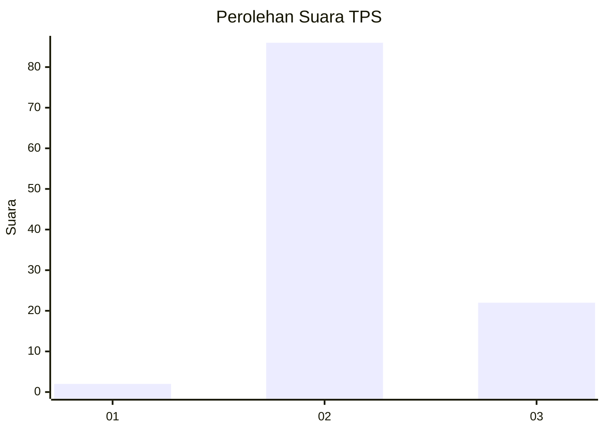
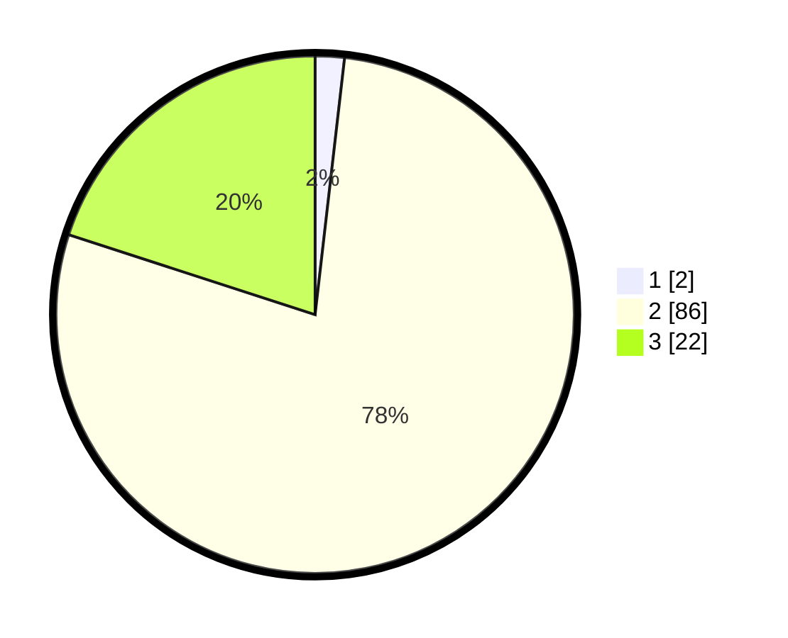

# Hasil

## Grafik

## Tabel

| No. | Nama Paslon    | Suara | Suara (raw) | Persentase |
|:--- |:-------------- | -----:| -----------:| ----------:|
| 1   | ANIES MUHAIMIN | 2     | [2][p-1]    | 1,82       |
| 2   | PRABOWO GIBRAN | 86    | [86][p-2]   | 78,18      |
| 3   | GANJAR MAHFUD  | 22    | [22][p-3]   | 20,00      |

[p-1]: https://github.com/gigit-pemilu/pemilu-2024-33-jawa-tengah/blob/main/pilpres/hitung-suara/sub/33-jawa-tengah/sub/15-grobogan/sub/04-toroh/sub/2005-sindurejo/sub/012-tps/sub/paslon-1.txt
[p-2]: https://github.com/gigit-pemilu/pemilu-2024-33-jawa-tengah/blob/main/pilpres/hitung-suara/sub/33-jawa-tengah/sub/15-grobogan/sub/04-toroh/sub/2005-sindurejo/sub/012-tps/sub/paslon-2.txt
[p-3]: https://github.com/gigit-pemilu/pemilu-2024-33-jawa-tengah/blob/main/pilpres/hitung-suara/sub/33-jawa-tengah/sub/15-grobogan/sub/04-toroh/sub/2005-sindurejo/sub/012-tps/sub/paslon-3.txt

## Foto C Plano

https://sirekap-obj-formc.kpu.go.id/b70f/pemilu/ppwp/33/15/04/20/05/3315042005012-20240214-141228--c3c52728-450b-4a5c-98f3-a790fcf2857b.jpg

https://sirekap-obj-formc.kpu.go.id/b70f/pemilu/ppwp/33/15/04/20/05/3315042005012-20240214-141201--92f9217f-f902-4dc8-98ef-83cb709d5ab7.jpg

https://sirekap-obj-formc.kpu.go.id/b70f/pemilu/ppwp/33/15/04/20/05/3315042005012-20240214-223620--e41b730c-1b2c-40e5-ad6e-150d4ce97a92.jpg

## Metadata

| Key        | Value               |
| ---------- | ------------------- |
| Time Stamp | 2024-02-15 01:47:43 |

