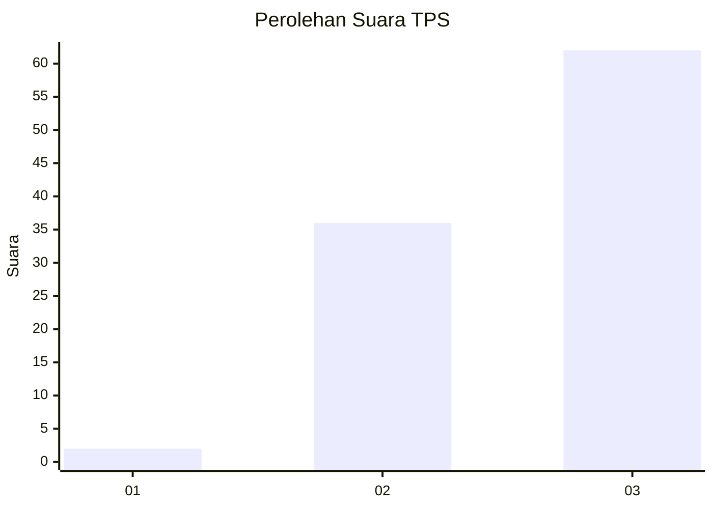
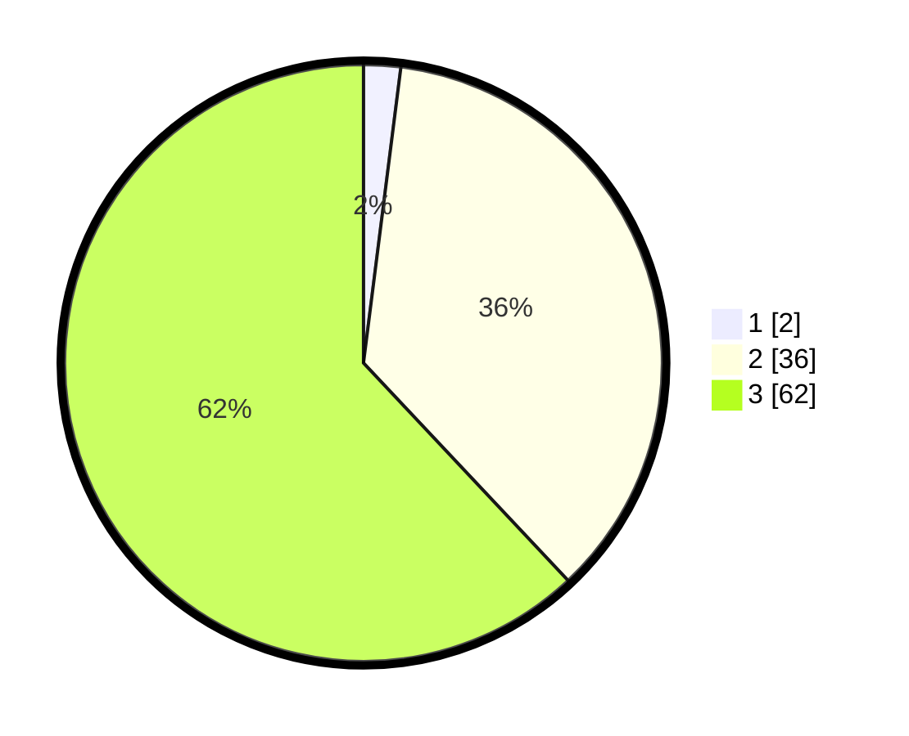

# Hasil

## Grafik

## Tabel

| No. | Nama Paslon    | Suara | Suara (raw) | Persentase |
|:--- |:-------------- | -----:| -----------:| ----------:|
| 1   | ANIES MUHAIMIN | 2     | [2][p-1]    | 2,00       |
| 2   | PRABOWO GIBRAN | 36    | [36][p-2]   | 36,00      |
| 3   | GANJAR MAHFUD  | 62    | [62][p-3]   | 62,00      |

[p-1]: https://github.com/gigit-pemilu/pemilu-2024-33-jawa-tengah/blob/main/pilpres/hitung-suara/sub/33-jawa-tengah/sub/15-grobogan/sub/04-toroh/sub/2005-sindurejo/sub/028-tps/sub/paslon-1.txt
[p-2]: https://github.com/gigit-pemilu/pemilu-2024-33-jawa-tengah/blob/main/pilpres/hitung-suara/sub/33-jawa-tengah/sub/15-grobogan/sub/04-toroh/sub/2005-sindurejo/sub/028-tps/sub/paslon-2.txt
[p-3]: https://github.com/gigit-pemilu/pemilu-2024-33-jawa-tengah/blob/main/pilpres/hitung-suara/sub/33-jawa-tengah/sub/15-grobogan/sub/04-toroh/sub/2005-sindurejo/sub/028-tps/sub/paslon-3.txt

## Foto C Plano

https://sirekap-obj-formc.kpu.go.id/da35/pemilu/ppwp/33/15/04/20/05/3315042005028-20240215-104102--04ea040b-dd3c-4c67-9034-365bfb5b6a60.jpg

https://sirekap-obj-formc.kpu.go.id/da35/pemilu/ppwp/33/15/04/20/05/3315042005028-20240215-104243--f54879bc-bb08-4c8e-8ab8-d2fb11da0b1f.jpg

https://sirekap-obj-formc.kpu.go.id/da35/pemilu/ppwp/33/15/04/20/05/3315042005028-20240214-200405--98ac5168-d32b-4524-97ea-ff6e00d21be7.jpg

## Metadata

| Key        | Value               |
| ---------- | ------------------- |
| Time Stamp | 2024-02-15 23:29:50 |

