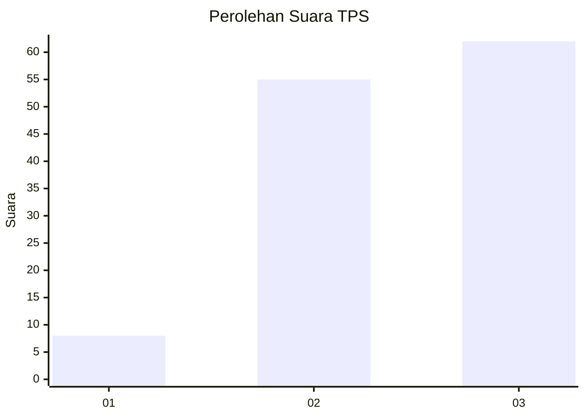
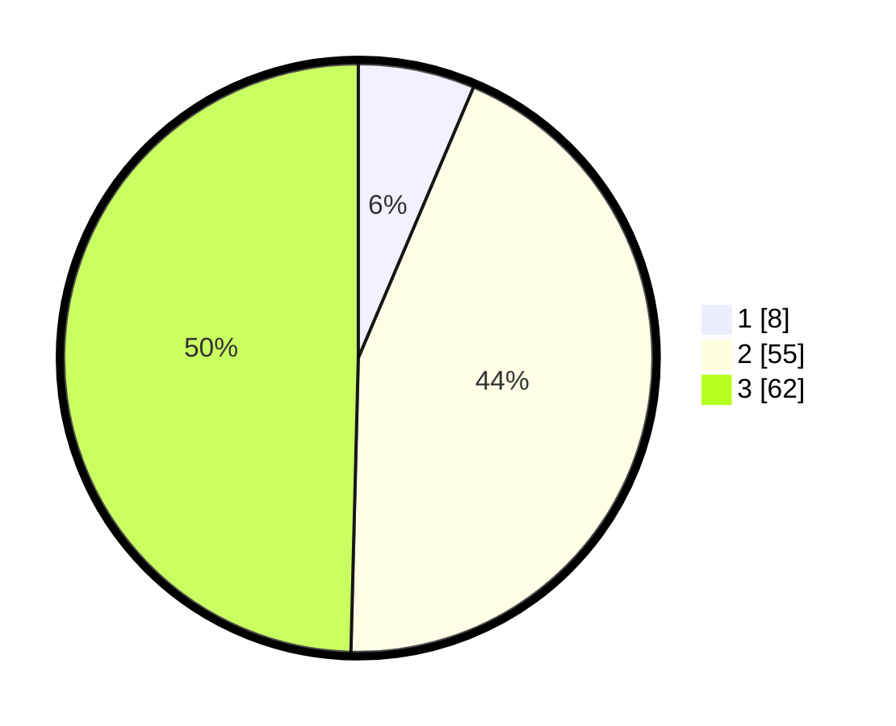

# Hasil

## Grafik

## Tabel

| No. | Nama Paslon    | Suara | Suara (raw) | Persentase |
|:--- |:-------------- | -----:| -----------:| ----------:|
| 1   | ANIES MUHAIMIN | 8     | [8][p-1]    | 6,40       |
| 2   | PRABOWO GIBRAN | 55    | [55][p-2]   | 44,00      |
| 3   | GANJAR MAHFUD  | 62    | [62][p-3]   | 49,60      |

[p-1]: https://github.com/gigit-pemilu/pemilu-2024-33-jawa-tengah/blob/main/pilpres/hitung-suara/sub/33-jawa-tengah/sub/15-grobogan/sub/04-toroh/sub/2005-sindurejo/sub/029-tps/sub/paslon-1.txt
[p-2]: https://github.com/gigit-pemilu/pemilu-2024-33-jawa-tengah/blob/main/pilpres/hitung-suara/sub/33-jawa-tengah/sub/15-grobogan/sub/04-toroh/sub/2005-sindurejo/sub/029-tps/sub/paslon-2.txt
[p-3]: https://github.com/gigit-pemilu/pemilu-2024-33-jawa-tengah/blob/main/pilpres/hitung-suara/sub/33-jawa-tengah/sub/15-grobogan/sub/04-toroh/sub/2005-sindurejo/sub/029-tps/sub/paslon-3.txt

## Foto C Plano

https://sirekap-obj-formc.kpu.go.id/d825/pemilu/ppwp/33/15/04/20/05/3315042005029-20240214-224417--60bcbb67-e568-49b1-b773-9fef4bc87778.jpg

https://sirekap-obj-formc.kpu.go.id/d825/pemilu/ppwp/33/15/04/20/05/3315042005029-20240214-224635--317165b1-25be-4653-9b8b-62b968c0425e.jpg

https://sirekap-obj-formc.kpu.go.id/d825/pemilu/ppwp/33/15/04/20/05/3315042005029-20240214-224800--1257acee-2c7c-4faa-b0c0-c1d03f923471.jpg

## Metadata

| Key        | Value               |
| ---------- | ------------------- |
| Time Stamp | 2024-02-15 15:30:25 |

