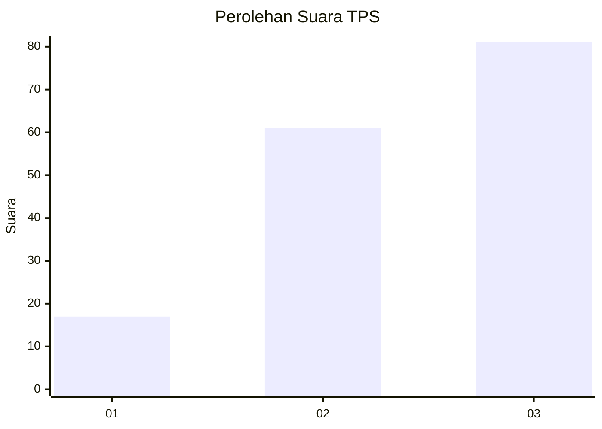
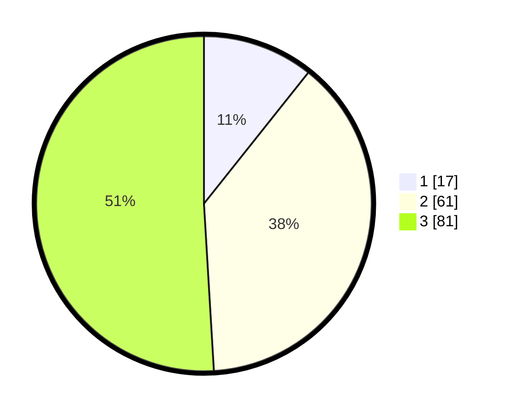

# Hasil

## Grafik

## Tabel

| No. | Nama Paslon    | Suara | Suara (raw) | Persentase |
|:--- |:-------------- | -----:| -----------:| ----------:|
| 1   | ANIES MUHAIMIN | 17    | [17][p-1]   | 10,69      |
| 2   | PRABOWO GIBRAN | 61    | [61][p-2]   | 38,36      |
| 3   | GANJAR MAHFUD  | 81    | [81][p-3]   | 50,94      |

[p-1]: https://github.com/gigit-pemilu/pemilu-2024/blob/main/pilpres/hitung-suara/sub/33-jawa-tengah/sub/15-grobogan/sub/04-toroh/sub/2007-dimoro/sub/024-tps/sub/paslon-1.txt
[p-2]: https://github.com/gigit-pemilu/pemilu-2024/blob/main/pilpres/hitung-suara/sub/33-jawa-tengah/sub/15-grobogan/sub/04-toroh/sub/2007-dimoro/sub/024-tps/sub/paslon-2.txt
[p-3]: https://github.com/gigit-pemilu/pemilu-2024/blob/main/pilpres/hitung-suara/sub/33-jawa-tengah/sub/15-grobogan/sub/04-toroh/sub/2007-dimoro/sub/024-tps/sub/paslon-3.txt

## Foto C Plano

https://sirekap-obj-formc.kpu.go.id/b386/pemilu/ppwp/33/15/04/20/07/3315042007024-20240214-230843--83e8232e-60a1-45fd-b948-9d4c315e6961.jpg

https://sirekap-obj-formc.kpu.go.id/b386/pemilu/ppwp/33/15/04/20/07/3315042007024-20240215-020655--afc0ef1f-e0d3-4c35-9ec7-fcb4de66eb9f.jpg

https://sirekap-obj-formc.kpu.go.id/b386/pemilu/ppwp/33/15/04/20/07/3315042007024-20240215-021031--9fa62602-8bcd-4e8d-a3ba-ccf8776c6c71.jpg

## Metadata

| Key        | Value               |
| ---------- | ------------------- |
| Time Stamp | 2024-02-15 23:29:50 |

