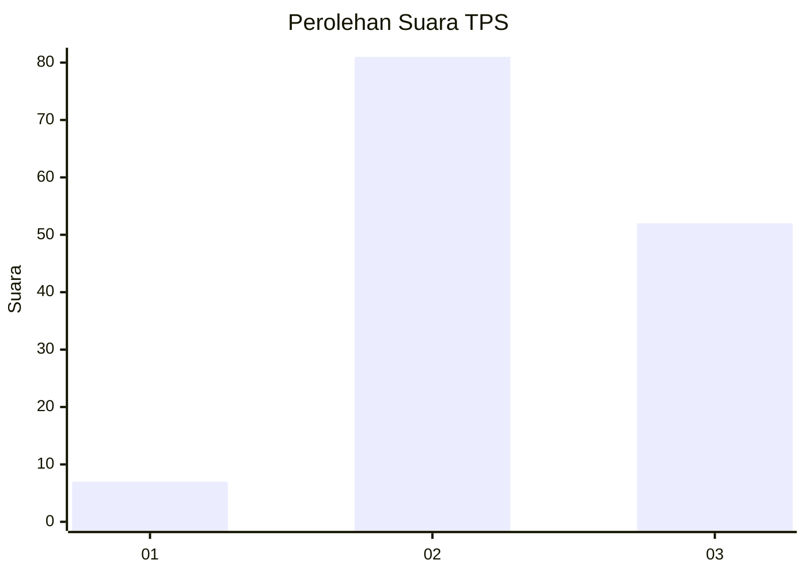
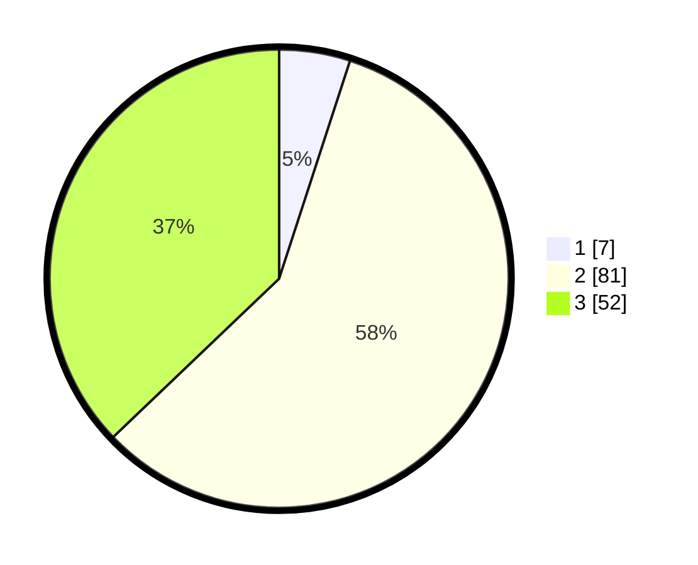

# Hasil

## Grafik

## Tabel

| No. | Nama Paslon    | Suara | Suara (raw) | Persentase |
|:--- |:-------------- | -----:| -----------:| ----------:|
| 1   | ANIES MUHAIMIN | 7     | [7][p-1]    | 5,00       |
| 2   | PRABOWO GIBRAN | 81    | [81][p-2]   | 57,86      |
| 3   | GANJAR MAHFUD  | 52    | [52][p-3]   | 37,14      |

[p-1]: https://github.com/gigit-pemilu/pemilu-2024-33-jawa-tengah/blob/main/pilpres/hitung-suara/sub/33-jawa-tengah/sub/15-grobogan/sub/04-toroh/sub/2009-pilangpayung/sub/008-tps/sub/paslon-1.txt
[p-2]: https://github.com/gigit-pemilu/pemilu-2024-33-jawa-tengah/blob/main/pilpres/hitung-suara/sub/33-jawa-tengah/sub/15-grobogan/sub/04-toroh/sub/2009-pilangpayung/sub/008-tps/sub/paslon-2.txt
[p-3]: https://github.com/gigit-pemilu/pemilu-2024-33-jawa-tengah/blob/main/pilpres/hitung-suara/sub/33-jawa-tengah/sub/15-grobogan/sub/04-toroh/sub/2009-pilangpayung/sub/008-tps/sub/paslon-3.txt

## Foto C Plano

https://sirekap-obj-formc.kpu.go.id/71e4/pemilu/ppwp/33/15/04/20/09/3315042009008-20240214-141552--c8a33eca-3ea4-436f-a8f4-c2b2a6cca44d.jpg

https://sirekap-obj-formc.kpu.go.id/71e4/pemilu/ppwp/33/15/04/20/09/3315042009008-20240214-141634--5366a206-798a-46ce-bd84-a709975a7e45.jpg

https://sirekap-obj-formc.kpu.go.id/71e4/pemilu/ppwp/33/15/04/20/09/3315042009008-20240214-141658--d64caf35-48a9-4a08-ae10-91f85941b258.jpg

## Metadata

| Key        | Value               |
| ---------- | ------------------- |
| Time Stamp | 2024-02-14 21:46:01 |

