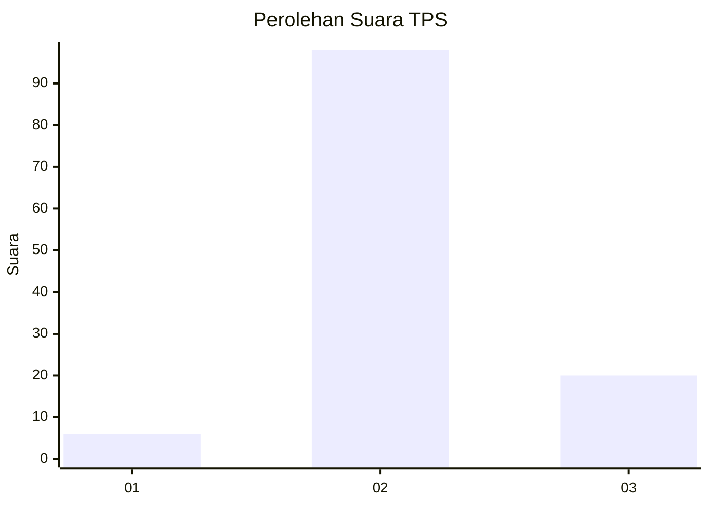
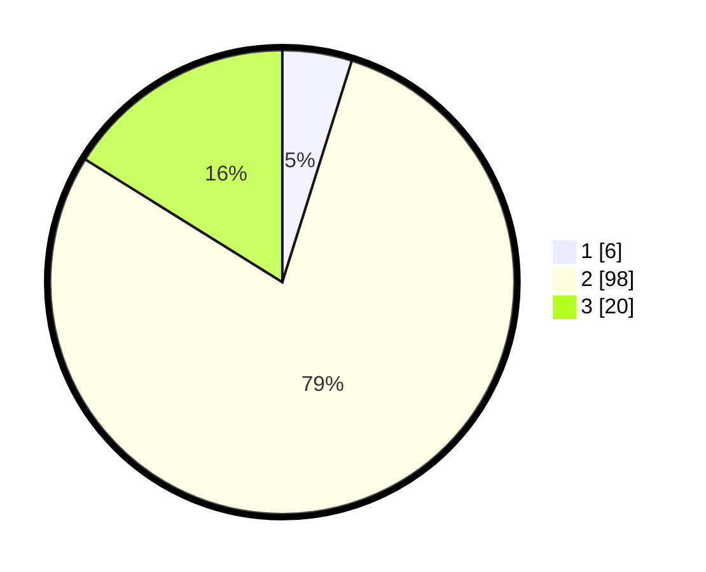

# Hasil

## Grafik

## Tabel

| No. | Nama Paslon    | Suara | Suara (raw) | Persentase |
|:--- |:-------------- | -----:| -----------:| ----------:|
| 1   | ANIES MUHAIMIN | 6     | [6][p-1]    | 4,84       |
| 2   | PRABOWO GIBRAN | 98    | [98][p-2]   | 79,03      |
| 3   | GANJAR MAHFUD  | 20    | [20][p-3]   | 16,13      |

[p-1]: https://github.com/gigit-pemilu/pemilu-2024/blob/main/pilpres/hitung-suara/sub/33-jawa-tengah/sub/15-grobogan/sub/04-toroh/sub/2011-krangganharjo/sub/005-tps/sub/paslon-1.txt
[p-2]: https://github.com/gigit-pemilu/pemilu-2024/blob/main/pilpres/hitung-suara/sub/33-jawa-tengah/sub/15-grobogan/sub/04-toroh/sub/2011-krangganharjo/sub/005-tps/sub/paslon-2.txt
[p-3]: https://github.com/gigit-pemilu/pemilu-2024/blob/main/pilpres/hitung-suara/sub/33-jawa-tengah/sub/15-grobogan/sub/04-toroh/sub/2011-krangganharjo/sub/005-tps/sub/paslon-3.txt

## Foto C Plano

https://sirekap-obj-formc.kpu.go.id/0ae5/pemilu/ppwp/33/15/04/20/11/3315042011005-20240214-192038--eceda9d8-009b-4642-80c4-e3fde45f0de9.jpg

https://sirekap-obj-formc.kpu.go.id/0ae5/pemilu/ppwp/33/15/04/20/11/3315042011005-20240214-192125--fd12ca51-083f-4ed4-a399-262bd9073579.jpg

https://sirekap-obj-formc.kpu.go.id/0ae5/pemilu/ppwp/33/15/04/20/11/3315042011005-20240214-192259--9f6c4575-2612-467f-b170-436c68eea0b8.jpg

## Metadata

| Key        | Value               |
| ---------- | ------------------- |
| Time Stamp | 2024-02-14 21:46:01 |

