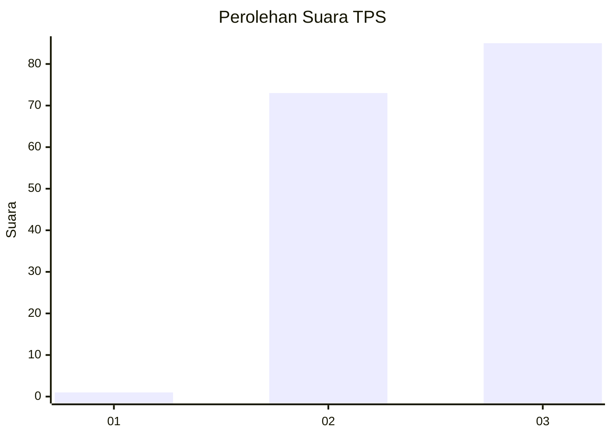
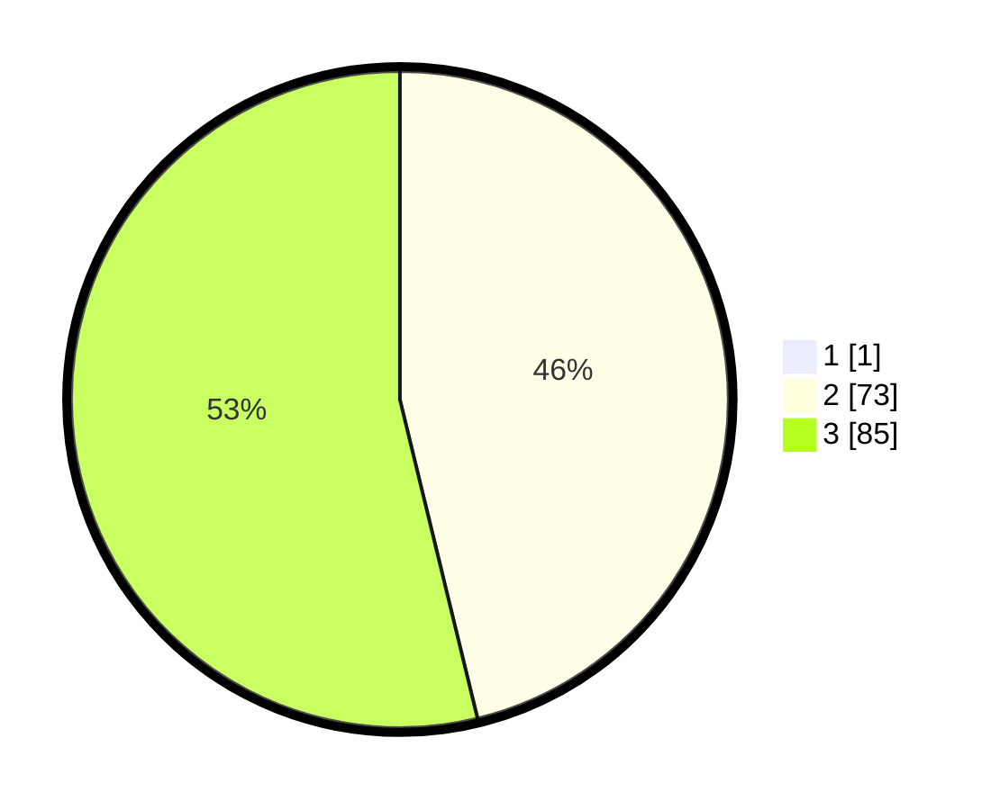

# Hasil

## Grafik

## Tabel

| No. | Nama Paslon    | Suara | Suara (raw) | Persentase |
|:--- |:-------------- | -----:| -----------:| ----------:|
| 1   | ANIES MUHAIMIN | 1     | [1][p-1]    | 0,63       |
| 2   | PRABOWO GIBRAN | 73    | [73][p-2]   | 45,91      |
| 3   | GANJAR MAHFUD  | 85    | [85][p-3]   | 53,46      |

[p-1]: https://github.com/gigit-pemilu/pemilu-2024/blob/main/pilpres/hitung-suara/sub/33-jawa-tengah/sub/15-grobogan/sub/04-toroh/sub/2014-plosoharjo/sub/005-tps/sub/paslon-1.txt
[p-2]: https://github.com/gigit-pemilu/pemilu-2024/blob/main/pilpres/hitung-suara/sub/33-jawa-tengah/sub/15-grobogan/sub/04-toroh/sub/2014-plosoharjo/sub/005-tps/sub/paslon-2.txt
[p-3]: https://github.com/gigit-pemilu/pemilu-2024/blob/main/pilpres/hitung-suara/sub/33-jawa-tengah/sub/15-grobogan/sub/04-toroh/sub/2014-plosoharjo/sub/005-tps/sub/paslon-3.txt

## Foto C Plano

https://sirekap-obj-formc.kpu.go.id/e32a/pemilu/ppwp/33/15/04/20/14/3315042014005-20240214-213347--3def06fd-df66-4ea3-8067-8679cfa5554c.jpg

https://sirekap-obj-formc.kpu.go.id/e32a/pemilu/ppwp/33/15/04/20/14/3315042014005-20240214-220028--268a42ee-3eab-45c0-bc27-07daa229b140.jpg

https://sirekap-obj-formc.kpu.go.id/e32a/pemilu/ppwp/33/15/04/20/14/3315042014005-20240215-001556--3ab47a28-0ffc-4013-9a8d-3cdd91826727.jpg

## Metadata

| Key        | Value               |
| ---------- | ------------------- |
| Time Stamp | 2024-02-15 12:00:28 |

