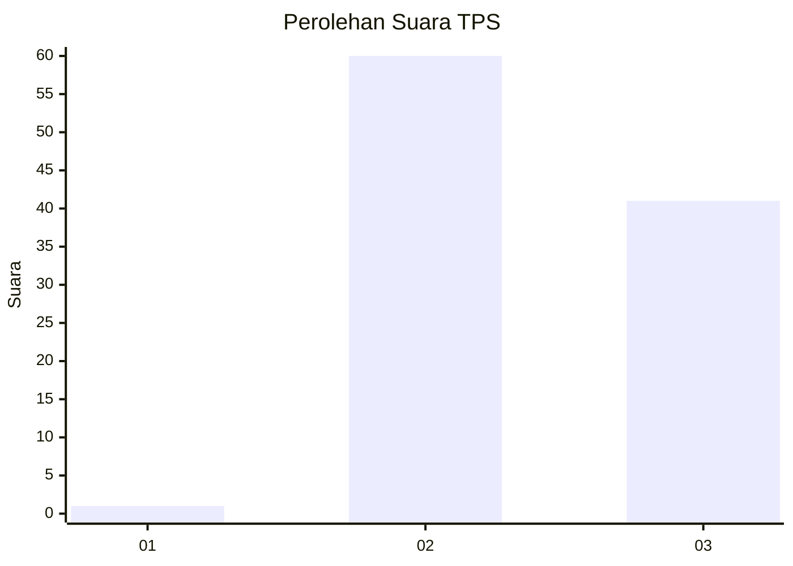
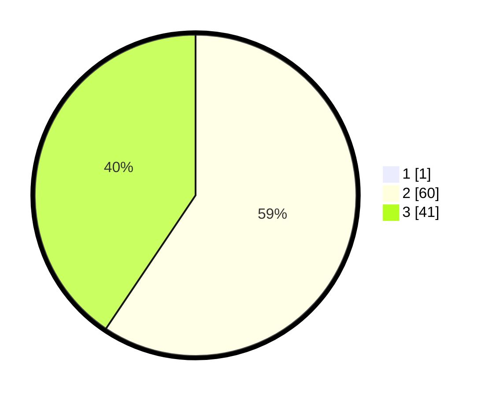

# Hasil

## Grafik

## Tabel

| No. | Nama Paslon    | Suara | Suara (raw) | Persentase |
|:--- |:-------------- | -----:| -----------:| ----------:|
| 1   | ANIES MUHAIMIN | 1     | [1][p-1]    | 0,98       |
| 2   | PRABOWO GIBRAN | 60    | [60][p-2]   | 58,82      |
| 3   | GANJAR MAHFUD  | 41    | [41][p-3]   | 40,20      |

[p-1]: https://github.com/gigit-pemilu/pemilu-2024/blob/main/pilpres/hitung-suara/sub/33-jawa-tengah/sub/15-grobogan/sub/04-toroh/sub/2014-plosoharjo/sub/009-tps/sub/paslon-1.txt
[p-2]: https://github.com/gigit-pemilu/pemilu-2024/blob/main/pilpres/hitung-suara/sub/33-jawa-tengah/sub/15-grobogan/sub/04-toroh/sub/2014-plosoharjo/sub/009-tps/sub/paslon-2.txt
[p-3]: https://github.com/gigit-pemilu/pemilu-2024/blob/main/pilpres/hitung-suara/sub/33-jawa-tengah/sub/15-grobogan/sub/04-toroh/sub/2014-plosoharjo/sub/009-tps/sub/paslon-3.txt

## Foto C Plano

https://sirekap-obj-formc.kpu.go.id/5c19/pemilu/ppwp/33/15/04/20/14/3315042014009-20240214-141639--d24612f8-9920-40db-869e-0d14bcd99ecb.jpg

https://sirekap-obj-formc.kpu.go.id/5c19/pemilu/ppwp/33/15/04/20/14/3315042014009-20240214-141736--00ce73cb-8b51-44cf-85ff-108bfa89fd19.jpg

https://sirekap-obj-formc.kpu.go.id/5c19/pemilu/ppwp/33/15/04/20/14/3315042014009-20240214-141809--b134e7d7-fbdf-40e9-aee9-89197b80ffcd.jpg

## Metadata

| Key        | Value               |
| ---------- | ------------------- |
| Time Stamp | 2024-02-14 21:46:01 |

