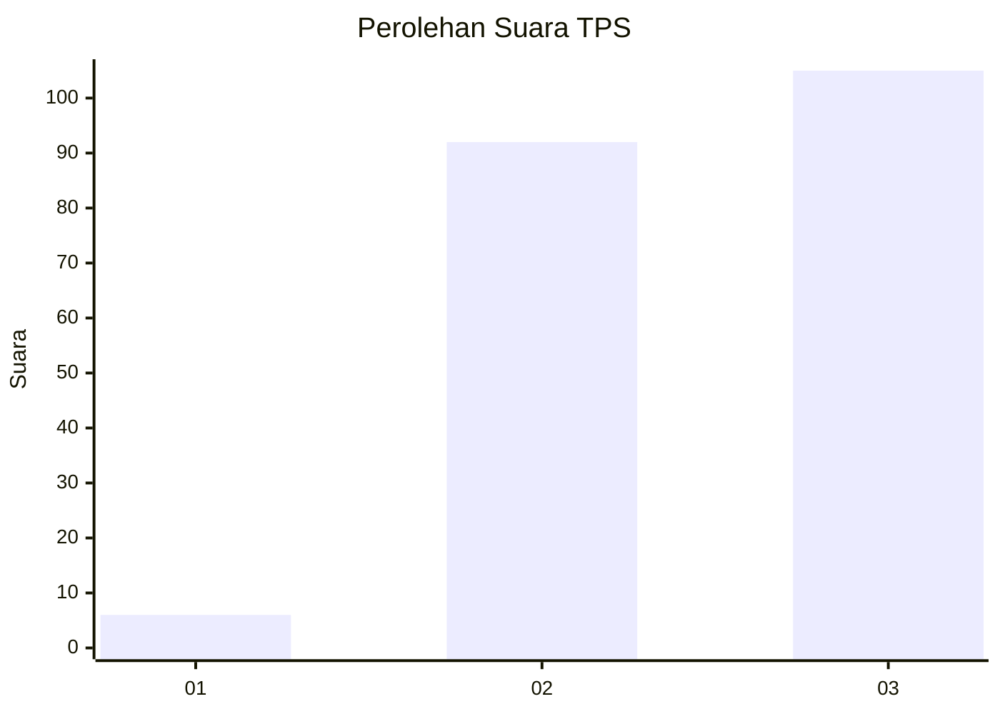
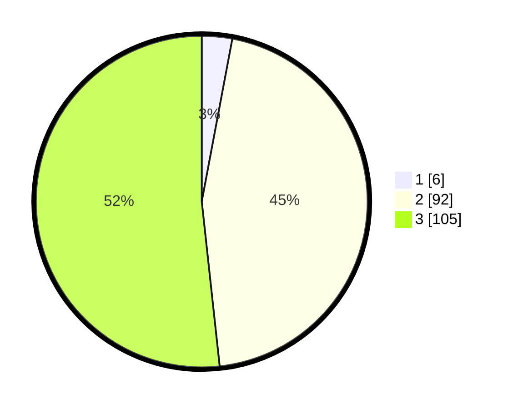

# Hasil

## Grafik

## Tabel

| No. | Nama Paslon    | Suara | Suara (raw) | Persentase |
|:--- |:-------------- | -----:| -----------:| ----------:|
| 1   | ANIES MUHAIMIN | 6     | [6][p-1]    | 2,96       |
| 2   | PRABOWO GIBRAN | 92    | [92][p-2]   | 45,32      |
| 3   | GANJAR MAHFUD  | 105   | [105][p-3]  | 51,72      |

[p-1]: https://github.com/gigit-pemilu/pemilu-2024/blob/main/pilpres/hitung-suara/sub/33-jawa-tengah/sub/15-grobogan/sub/05-geyer/sub/2003-juworo/sub/002-tps/sub/paslon-1.txt
[p-2]: https://github.com/gigit-pemilu/pemilu-2024/blob/main/pilpres/hitung-suara/sub/33-jawa-tengah/sub/15-grobogan/sub/05-geyer/sub/2003-juworo/sub/002-tps/sub/paslon-2.txt
[p-3]: https://github.com/gigit-pemilu/pemilu-2024/blob/main/pilpres/hitung-suara/sub/33-jawa-tengah/sub/15-grobogan/sub/05-geyer/sub/2003-juworo/sub/002-tps/sub/paslon-3.txt

## Foto C Plano

https://sirekap-obj-formc.kpu.go.id/60f0/pemilu/ppwp/33/15/05/20/03/3315052003002-20240215-001404--104d629d-d87b-4f7b-a4c2-6991f147147a.jpg

https://sirekap-obj-formc.kpu.go.id/60f0/pemilu/ppwp/33/15/05/20/03/3315052003002-20240215-001444--8ac5ab6f-5f01-49bc-b91e-044e7873f686.jpg

https://sirekap-obj-formc.kpu.go.id/60f0/pemilu/ppwp/33/15/05/20/03/3315052003002-20240215-001512--cd3e6ef3-82c2-4d51-ab82-947fd7ce30de.jpg

## Metadata

| Key        | Value               |
| ---------- | ------------------- |
| Time Stamp | 2024-02-19 06:16:00 |

