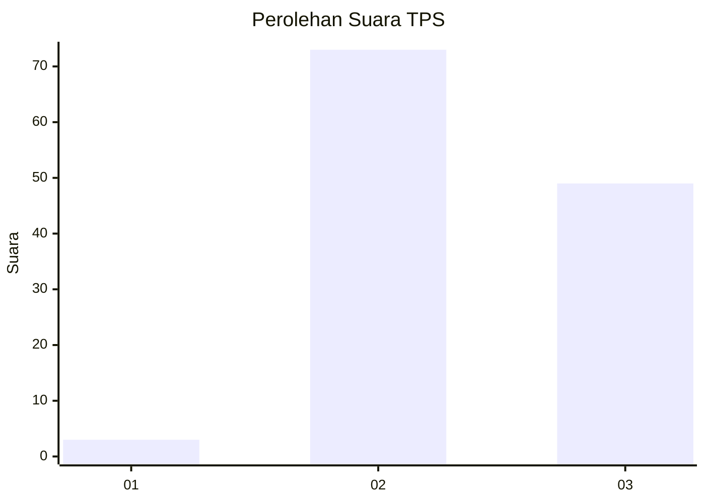
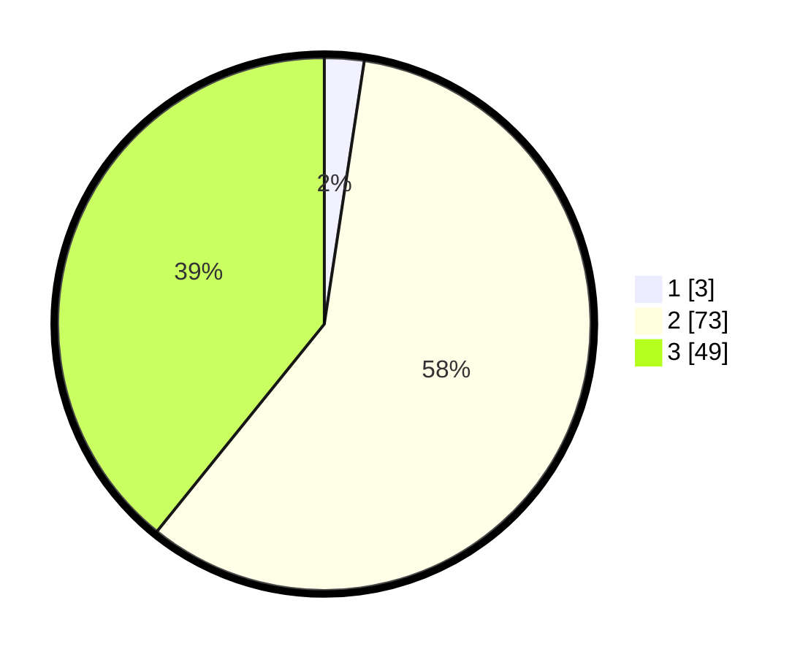

# Hasil

## Grafik

## Tabel

| No. | Nama Paslon    | Suara | Suara (raw) | Persentase |
|:--- |:-------------- | -----:| -----------:| ----------:|
| 1   | ANIES MUHAIMIN | 3     | [3][p-1]    | 2,40       |
| 2   | PRABOWO GIBRAN | 73    | [73][p-2]   | 58,40      |
| 3   | GANJAR MAHFUD  | 49    | [49][p-3]   | 39,20      |

[p-1]: https://github.com/gigit-pemilu/pemilu-2024/blob/main/pilpres/hitung-suara/sub/33-jawa-tengah/sub/15-grobogan/sub/05-geyer/sub/2003-juworo/sub/004-tps/sub/paslon-1.txt
[p-2]: https://github.com/gigit-pemilu/pemilu-2024/blob/main/pilpres/hitung-suara/sub/33-jawa-tengah/sub/15-grobogan/sub/05-geyer/sub/2003-juworo/sub/004-tps/sub/paslon-2.txt
[p-3]: https://github.com/gigit-pemilu/pemilu-2024/blob/main/pilpres/hitung-suara/sub/33-jawa-tengah/sub/15-grobogan/sub/05-geyer/sub/2003-juworo/sub/004-tps/sub/paslon-3.txt

## Foto C Plano

https://sirekap-obj-formc.kpu.go.id/8c9a/pemilu/ppwp/33/15/05/20/03/3315052003004-20240215-102839--ca5a7028-c59c-4ef9-a598-dac0280a0271.jpg

https://sirekap-obj-formc.kpu.go.id/8c9a/pemilu/ppwp/33/15/05/20/03/3315052003004-20240215-103024--096e858d-a145-4969-8a1e-c15f7c3818ea.jpg

https://sirekap-obj-formc.kpu.go.id/8c9a/pemilu/ppwp/33/15/05/20/03/3315052003004-20240215-103204--6123120a-03d8-4979-8316-b5732ed22126.jpg

## Metadata

| Key        | Value               |
| ---------- | ------------------- |
| Time Stamp | 2024-02-15 20:00:44 |

