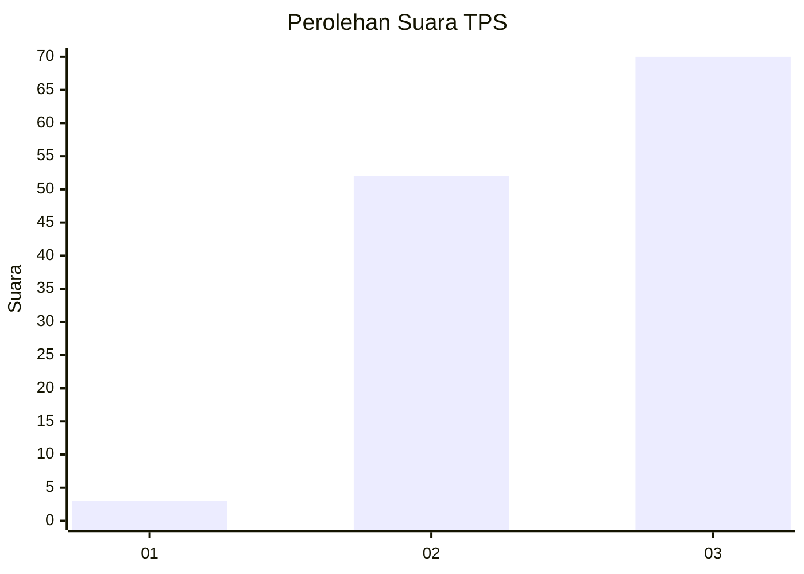
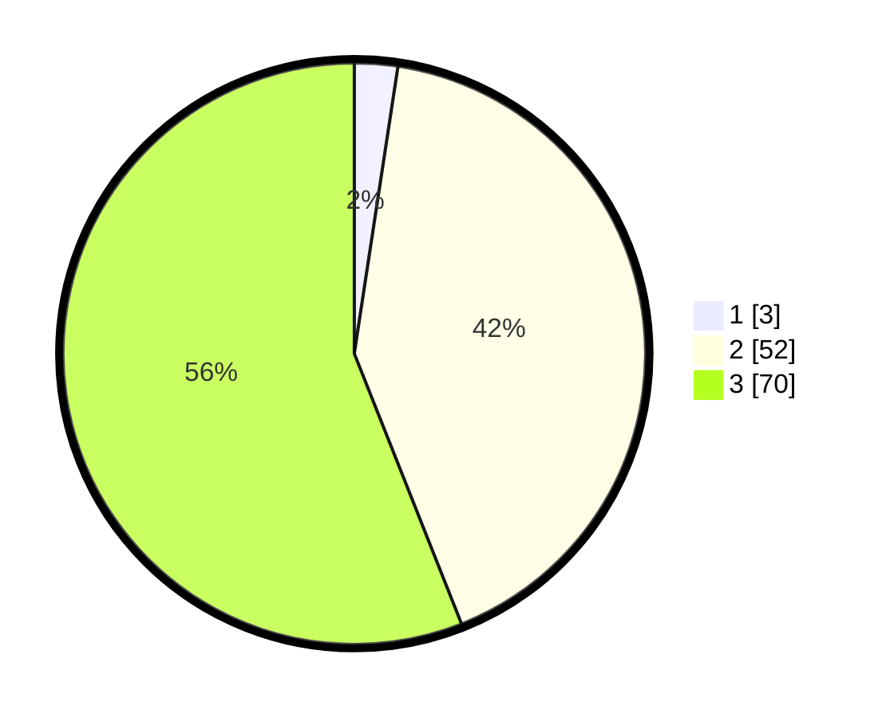

# Hasil

## Grafik

## Tabel

| No. | Nama Paslon    | Suara | Suara (raw) | Persentase |
|:--- |:-------------- | -----:| -----------:| ----------:|
| 1   | ANIES MUHAIMIN | 3     | [3][p-1]    | 2,40       |
| 2   | PRABOWO GIBRAN | 52    | [52][p-2]   | 41,60      |
| 3   | GANJAR MAHFUD  | 70    | [70][p-3]   | 56,00      |

[p-1]: https://github.com/gigit-pemilu/pemilu-2024/blob/main/pilpres/hitung-suara/sub/33-jawa-tengah/sub/15-grobogan/sub/05-geyer/sub/2005-ngrandu/sub/018-tps/sub/paslon-1.txt
[p-2]: https://github.com/gigit-pemilu/pemilu-2024/blob/main/pilpres/hitung-suara/sub/33-jawa-tengah/sub/15-grobogan/sub/05-geyer/sub/2005-ngrandu/sub/018-tps/sub/paslon-2.txt
[p-3]: https://github.com/gigit-pemilu/pemilu-2024/blob/main/pilpres/hitung-suara/sub/33-jawa-tengah/sub/15-grobogan/sub/05-geyer/sub/2005-ngrandu/sub/018-tps/sub/paslon-3.txt

## Foto C Plano

https://sirekap-obj-formc.kpu.go.id/c60d/pemilu/ppwp/33/15/05/20/05/3315052005018-20240215-000527--e495c744-a165-42d6-a19b-be2ecdeb3f09.jpg

https://sirekap-obj-formc.kpu.go.id/c60d/pemilu/ppwp/33/15/05/20/05/3315052005018-20240215-000908--fd7b98f7-31cf-4d2c-be15-6b4fae719070.jpg

https://sirekap-obj-formc.kpu.go.id/c60d/pemilu/ppwp/33/15/05/20/05/3315052005018-20240215-001058--26477f11-cee6-4240-a06a-c07ff60f4a42.jpg

## Metadata

| Key        | Value               |
| ---------- | ------------------- |
| Time Stamp | 2024-02-16 00:30:27 |

