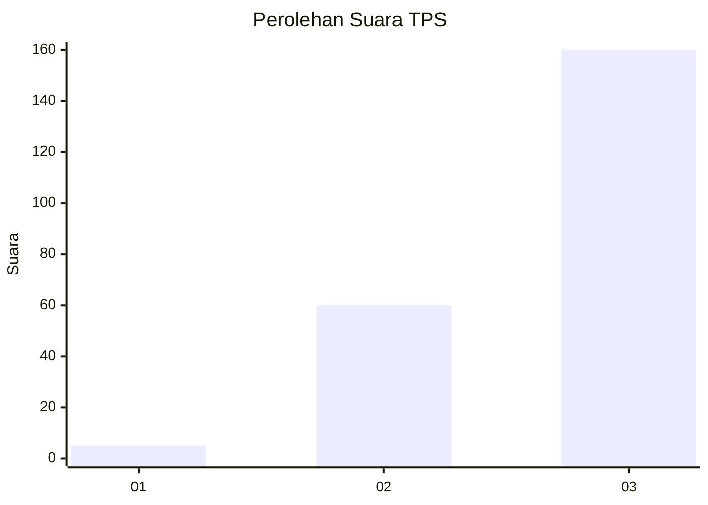
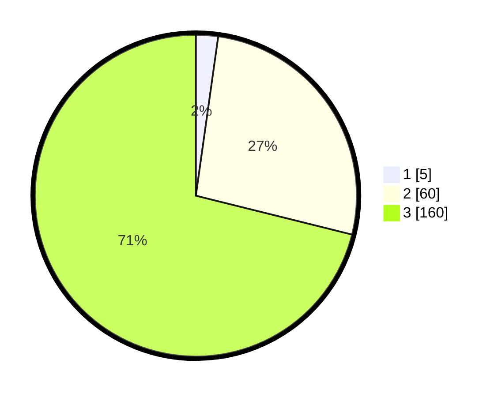

# Hasil

## Grafik

## Tabel

| No. | Nama Paslon    | Suara | Suara (raw) | Persentase |
|:--- |:-------------- | -----:| -----------:| ----------:|
| 1   | ANIES MUHAIMIN | 5     | [5][p-1]    | 2,22       |
| 2   | PRABOWO GIBRAN | 60    | [60][p-2]   | 26,67      |
| 3   | GANJAR MAHFUD  | 160   | [160][p-3]  | 71,11      |

[p-1]: https://github.com/gigit-pemilu/pemilu-2024/blob/main/pilpres/hitung-suara/sub/33-jawa-tengah/sub/15-grobogan/sub/05-geyer/sub/2006-bangsri/sub/010-tps/sub/paslon-1.txt
[p-2]: https://github.com/gigit-pemilu/pemilu-2024/blob/main/pilpres/hitung-suara/sub/33-jawa-tengah/sub/15-grobogan/sub/05-geyer/sub/2006-bangsri/sub/010-tps/sub/paslon-2.txt
[p-3]: https://github.com/gigit-pemilu/pemilu-2024/blob/main/pilpres/hitung-suara/sub/33-jawa-tengah/sub/15-grobogan/sub/05-geyer/sub/2006-bangsri/sub/010-tps/sub/paslon-3.txt

## Foto C Plano

https://sirekap-obj-formc.kpu.go.id/b552/pemilu/ppwp/33/15/05/20/06/3315052006010-20240214-230704--cda082ec-caf0-42c7-b441-9ed59776ba2a.jpg

https://sirekap-obj-formc.kpu.go.id/b552/pemilu/ppwp/33/15/05/20/06/3315052006010-20240214-230846--52443a4e-3515-4b21-8c60-21f5233d90e7.jpg

https://sirekap-obj-formc.kpu.go.id/b552/pemilu/ppwp/33/15/05/20/06/3315052006010-20240214-231023--a2188bc7-90f1-433d-82f2-4112bc935665.jpg

## Metadata

| Key        | Value               |
| ---------- | ------------------- |
| Time Stamp | 2024-02-15 12:00:28 |

