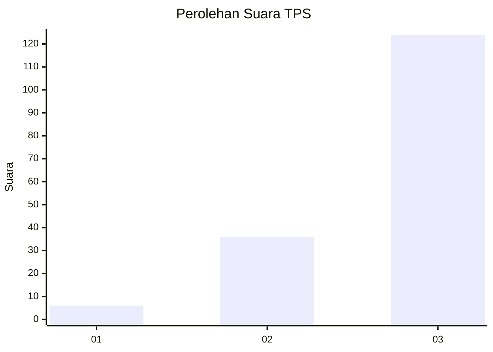
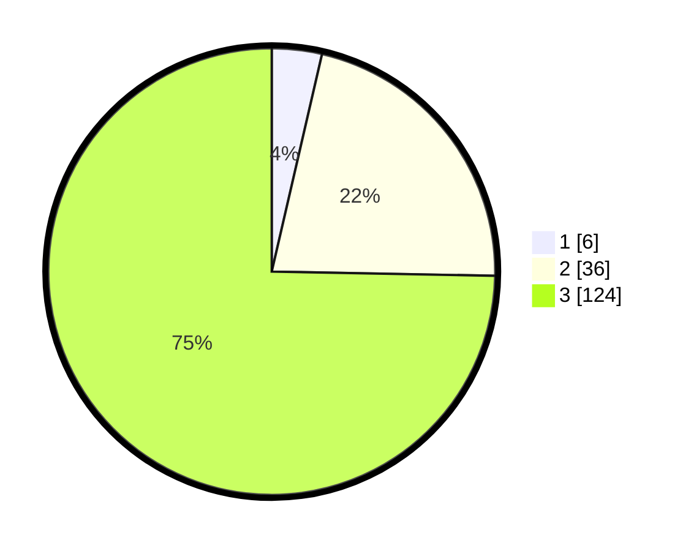

# Hasil

## Grafik

## Tabel

| No. | Nama Paslon    | Suara | Suara (raw) | Persentase |
|:--- |:-------------- | -----:| -----------:| ----------:|
| 1   | ANIES MUHAIMIN | 6     | [6][p-1]    | 3,61       |
| 2   | PRABOWO GIBRAN | 36    | [36][p-2]   | 21,69      |
| 3   | GANJAR MAHFUD  | 124   | [124][p-3]  | 74,70      |

[p-1]: https://github.com/gigit-pemilu/pemilu-2024/blob/main/pilpres/hitung-suara/sub/33-jawa-tengah/sub/15-grobogan/sub/05-geyer/sub/2009-jambangan/sub/010-tps/sub/paslon-1.txt
[p-2]: https://github.com/gigit-pemilu/pemilu-2024/blob/main/pilpres/hitung-suara/sub/33-jawa-tengah/sub/15-grobogan/sub/05-geyer/sub/2009-jambangan/sub/010-tps/sub/paslon-2.txt
[p-3]: https://github.com/gigit-pemilu/pemilu-2024/blob/main/pilpres/hitung-suara/sub/33-jawa-tengah/sub/15-grobogan/sub/05-geyer/sub/2009-jambangan/sub/010-tps/sub/paslon-3.txt

## Foto C Plano

https://sirekap-obj-formc.kpu.go.id/fec7/pemilu/ppwp/33/15/05/20/09/3315052009010-20240214-224514--079d1720-a606-411f-9ab5-27cef4e4bf04.jpg

https://sirekap-obj-formc.kpu.go.id/fec7/pemilu/ppwp/33/15/05/20/09/3315052009010-20240214-225108--01b4f5a4-e7bf-48ce-a5f6-9396ef4689a7.jpg

https://sirekap-obj-formc.kpu.go.id/fec7/pemilu/ppwp/33/15/05/20/09/3315052009010-20240214-224908--103e26d4-e0ad-4de0-95fd-44bfdba0944a.jpg

## Metadata

| Key        | Value               |
| ---------- | ------------------- |
| Time Stamp | 2024-02-16 00:30:27 |

