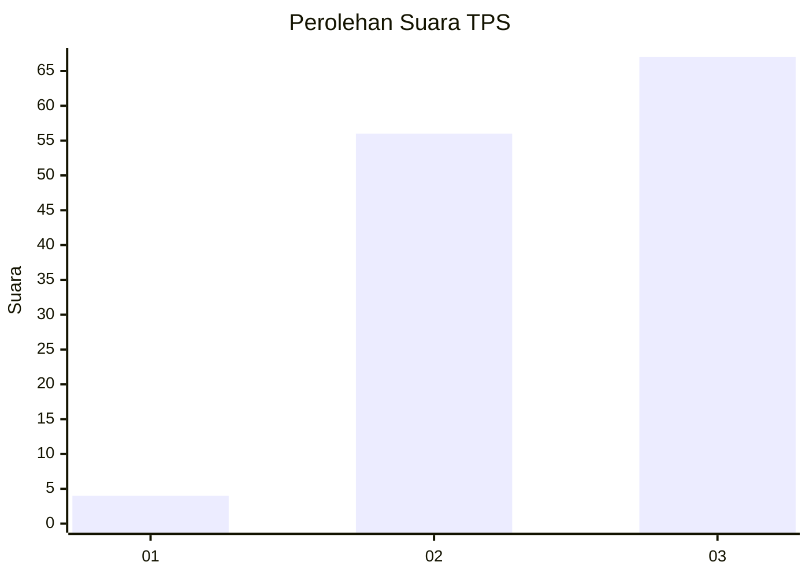
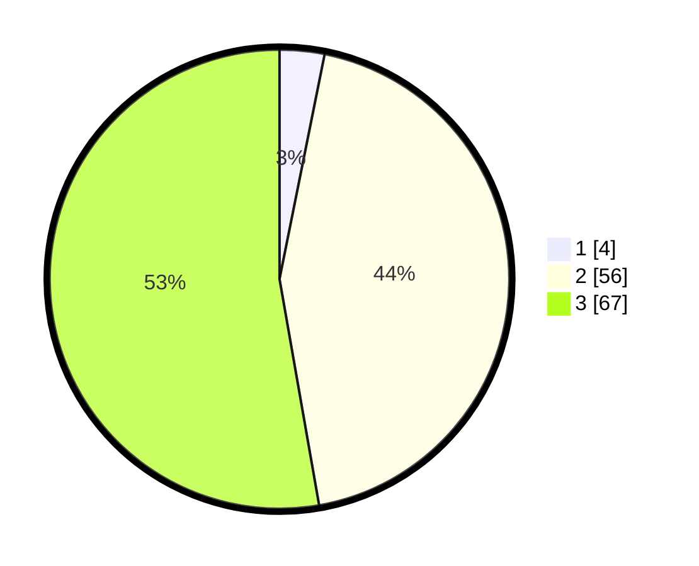

# Hasil

## Grafik

## Tabel

| No. | Nama Paslon    | Suara | Suara (raw) | Persentase |
|:--- |:-------------- | -----:| -----------:| ----------:|
| 1   | ANIES MUHAIMIN | 4     | [4][p-1]    | 3,15       |
| 2   | PRABOWO GIBRAN | 56    | [56][p-2]   | 44,09      |
| 3   | GANJAR MAHFUD  | 67    | [67][p-3]   | 52,76      |

[p-1]: https://github.com/gigit-pemilu/pemilu-2024-33-jawa-tengah/blob/main/pilpres/hitung-suara/sub/33-jawa-tengah/sub/15-grobogan/sub/05-geyer/sub/2010-geyer/sub/009-tps/sub/paslon-1.txt
[p-2]: https://github.com/gigit-pemilu/pemilu-2024-33-jawa-tengah/blob/main/pilpres/hitung-suara/sub/33-jawa-tengah/sub/15-grobogan/sub/05-geyer/sub/2010-geyer/sub/009-tps/sub/paslon-2.txt
[p-3]: https://github.com/gigit-pemilu/pemilu-2024-33-jawa-tengah/blob/main/pilpres/hitung-suara/sub/33-jawa-tengah/sub/15-grobogan/sub/05-geyer/sub/2010-geyer/sub/009-tps/sub/paslon-3.txt

## Foto C Plano

https://sirekap-obj-formc.kpu.go.id/90a1/pemilu/ppwp/33/15/05/20/10/3315052010009-20240215-005716--86aab6cb-cc21-4f29-a39f-1252b11f660c.jpg

https://sirekap-obj-formc.kpu.go.id/90a1/pemilu/ppwp/33/15/05/20/10/3315052010009-20240215-005832--70f25234-fdd9-4db5-bf56-d517429b5b70.jpg

https://sirekap-obj-formc.kpu.go.id/90a1/pemilu/ppwp/33/15/05/20/10/3315052010009-20240215-005950--f0e3e6f9-8d48-472c-a101-1fa323957c97.jpg

## Metadata

| Key        | Value               |
| ---------- | ------------------- |
| Time Stamp | 2024-02-15 16:00:26 |

