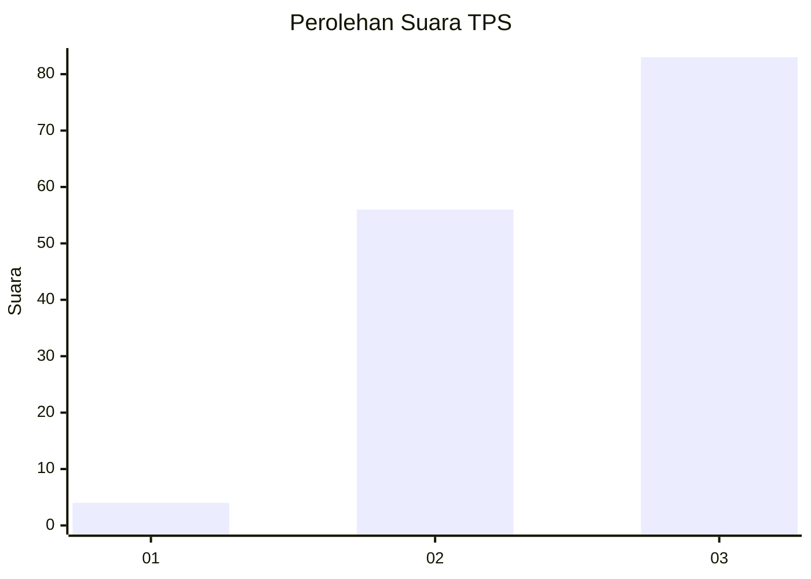
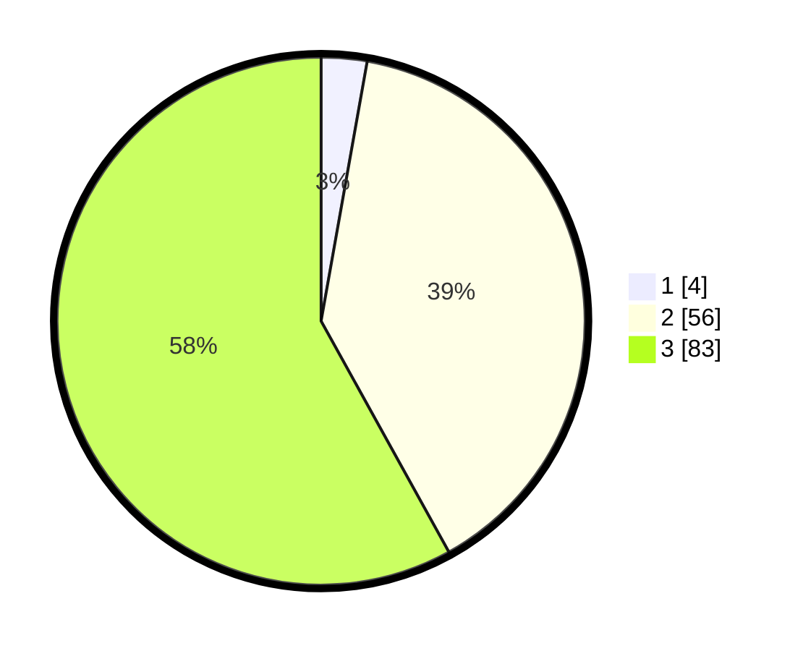

# Hasil

## Grafik

## Tabel

| No. | Nama Paslon    | Suara | Suara (raw) | Persentase |
|:--- |:-------------- | -----:| -----------:| ----------:|
| 1   | ANIES MUHAIMIN | 4     | [4][p-1]    | 2,80       |
| 2   | PRABOWO GIBRAN | 56    | [56][p-2]   | 39,16      |
| 3   | GANJAR MAHFUD  | 83    | [83][p-3]   | 58,04      |

[p-1]: https://github.com/gigit-pemilu/pemilu-2024-33-jawa-tengah/blob/main/pilpres/hitung-suara/sub/33-jawa-tengah/sub/15-grobogan/sub/05-geyer/sub/2011-ledokdawan/sub/018-tps/sub/paslon-1.txt
[p-2]: https://github.com/gigit-pemilu/pemilu-2024-33-jawa-tengah/blob/main/pilpres/hitung-suara/sub/33-jawa-tengah/sub/15-grobogan/sub/05-geyer/sub/2011-ledokdawan/sub/018-tps/sub/paslon-2.txt
[p-3]: https://github.com/gigit-pemilu/pemilu-2024-33-jawa-tengah/blob/main/pilpres/hitung-suara/sub/33-jawa-tengah/sub/15-grobogan/sub/05-geyer/sub/2011-ledokdawan/sub/018-tps/sub/paslon-3.txt

## Foto C Plano

https://sirekap-obj-formc.kpu.go.id/f664/pemilu/ppwp/33/15/05/20/11/3315052011018-20240214-232402--45ccd4b0-291e-458e-a274-5c6c0e66ee80.jpg

https://sirekap-obj-formc.kpu.go.id/f664/pemilu/ppwp/33/15/05/20/11/3315052011018-20240214-232436--e2e80ca5-b6ea-4e39-9599-91557fa47819.jpg

https://sirekap-obj-formc.kpu.go.id/f664/pemilu/ppwp/33/15/05/20/11/3315052011018-20240214-232553--e05bd631-0a67-4112-b1c6-c3c2fe4650d7.jpg

## Metadata

| Key        | Value               |
| ---------- | ------------------- |
| Time Stamp | 2024-02-16 01:00:27 |

