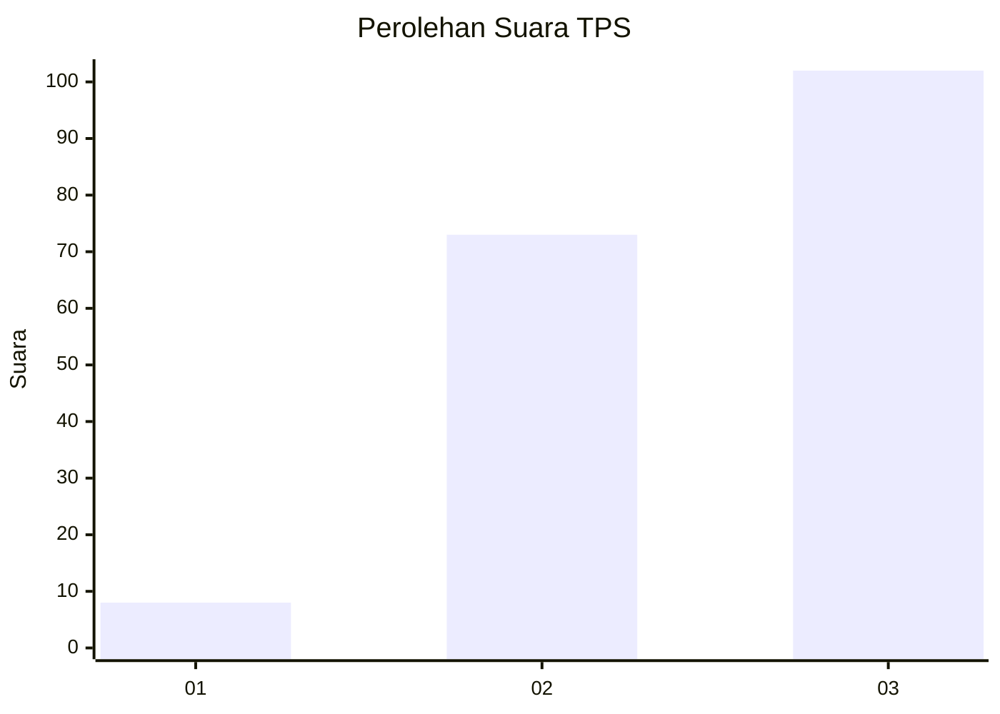
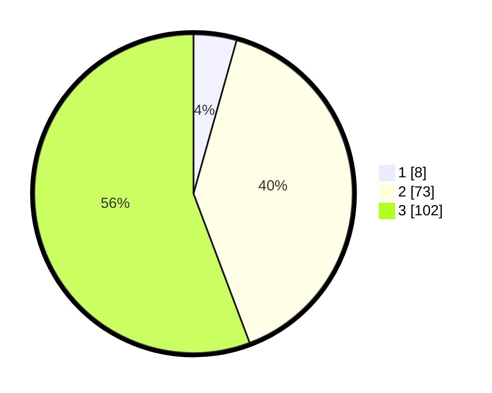

# Hasil

## Grafik

## Tabel

| No. | Nama Paslon    | Suara | Suara (raw) | Persentase |
|:--- |:-------------- | -----:| -----------:| ----------:|
| 1   | ANIES MUHAIMIN | 8     | [8][p-1]    | 4,37       |
| 2   | PRABOWO GIBRAN | 73    | [73][p-2]   | 39,89      |
| 3   | GANJAR MAHFUD  | 102   | [102][p-3]  | 55,74      |

[p-1]: https://github.com/gigit-pemilu/pemilu-2024/blob/main/pilpres/hitung-suara/sub/33-jawa-tengah/sub/15-grobogan/sub/05-geyer/sub/2013-suru/sub/006-tps/sub/paslon-1.txt
[p-2]: https://github.com/gigit-pemilu/pemilu-2024/blob/main/pilpres/hitung-suara/sub/33-jawa-tengah/sub/15-grobogan/sub/05-geyer/sub/2013-suru/sub/006-tps/sub/paslon-2.txt
[p-3]: https://github.com/gigit-pemilu/pemilu-2024/blob/main/pilpres/hitung-suara/sub/33-jawa-tengah/sub/15-grobogan/sub/05-geyer/sub/2013-suru/sub/006-tps/sub/paslon-3.txt

## Foto C Plano

https://sirekap-obj-formc.kpu.go.id/b9e9/pemilu/ppwp/33/15/05/20/13/3315052013006-20240215-004234--b28978c0-a43f-4bea-a43f-2baf4062d24d.jpg

https://sirekap-obj-formc.kpu.go.id/b9e9/pemilu/ppwp/33/15/05/20/13/3315052013006-20240215-004431--76dd82ac-bcdd-42c3-b2b8-a00f6a3be73b.jpg

https://sirekap-obj-formc.kpu.go.id/b9e9/pemilu/ppwp/33/15/05/20/13/3315052013006-20240215-004546--70198315-7bc9-4e5e-8a30-2f8341b75235.jpg

## Metadata

| Key        | Value               |
| ---------- | ------------------- |
| Time Stamp | 2024-02-16 01:00:27 |

