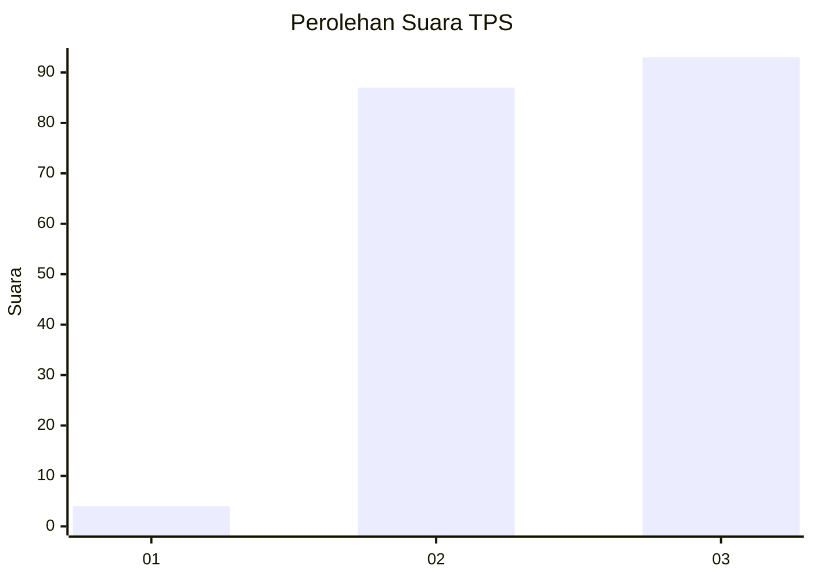
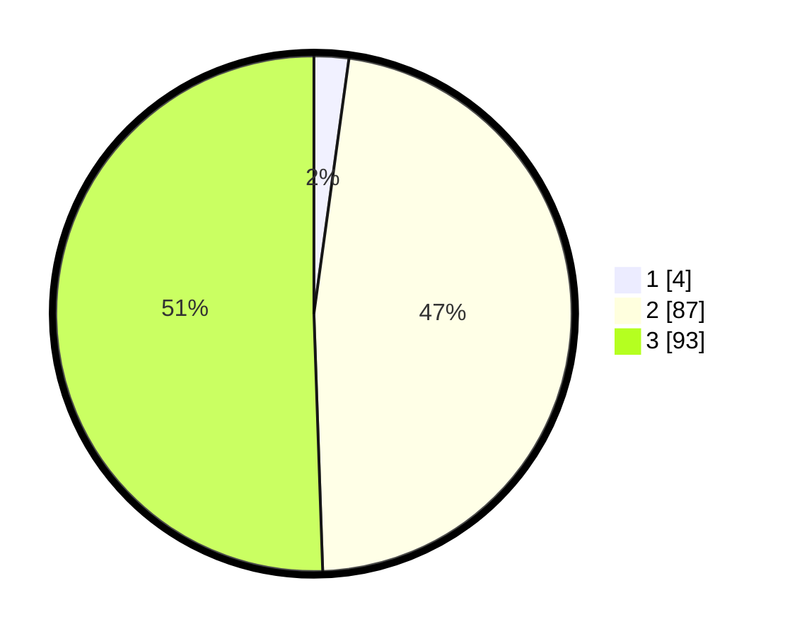

# Hasil

## Grafik

## Tabel

| No. | Nama Paslon    | Suara | Suara (raw) | Persentase |
|:--- |:-------------- | -----:| -----------:| ----------:|
| 1   | ANIES MUHAIMIN | 4     | [4][p-1]    | 2,17       |
| 2   | PRABOWO GIBRAN | 87    | [87][p-2]   | 47,28      |
| 3   | GANJAR MAHFUD  | 93    | [93][p-3]   | 50,54      |

[p-1]: https://github.com/gigit-pemilu/pemilu-2024-33-jawa-tengah/blob/main/pilpres/hitung-suara/sub/33-jawa-tengah/sub/15-grobogan/sub/06-pulokulon/sub/2001-randurejo/sub/001-tps/sub/paslon-1.txt
[p-2]: https://github.com/gigit-pemilu/pemilu-2024-33-jawa-tengah/blob/main/pilpres/hitung-suara/sub/33-jawa-tengah/sub/15-grobogan/sub/06-pulokulon/sub/2001-randurejo/sub/001-tps/sub/paslon-2.txt
[p-3]: https://github.com/gigit-pemilu/pemilu-2024-33-jawa-tengah/blob/main/pilpres/hitung-suara/sub/33-jawa-tengah/sub/15-grobogan/sub/06-pulokulon/sub/2001-randurejo/sub/001-tps/sub/paslon-3.txt

## Foto C Plano

https://sirekap-obj-formc.kpu.go.id/76e8/pemilu/ppwp/33/15/06/20/01/3315062001001-20240217-081823--10137654-d2a3-4850-bc0b-97fd64e9a421.jpg

https://sirekap-obj-formc.kpu.go.id/76e8/pemilu/ppwp/33/15/06/20/01/3315062001001-20240217-081905--93a38b3b-4e2e-4e28-a1ab-01af02625c2c.jpg

https://sirekap-obj-formc.kpu.go.id/76e8/pemilu/ppwp/33/15/06/20/01/3315062001001-20240217-081939--8ed71bfe-66f1-4eb3-a4c3-305193f82b8d.jpg

## Metadata

| Key        | Value               |
| ---------- | ------------------- |
| Time Stamp | 2024-02-17 14:45:18 |

