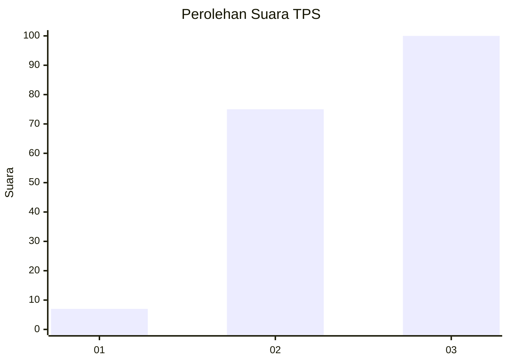
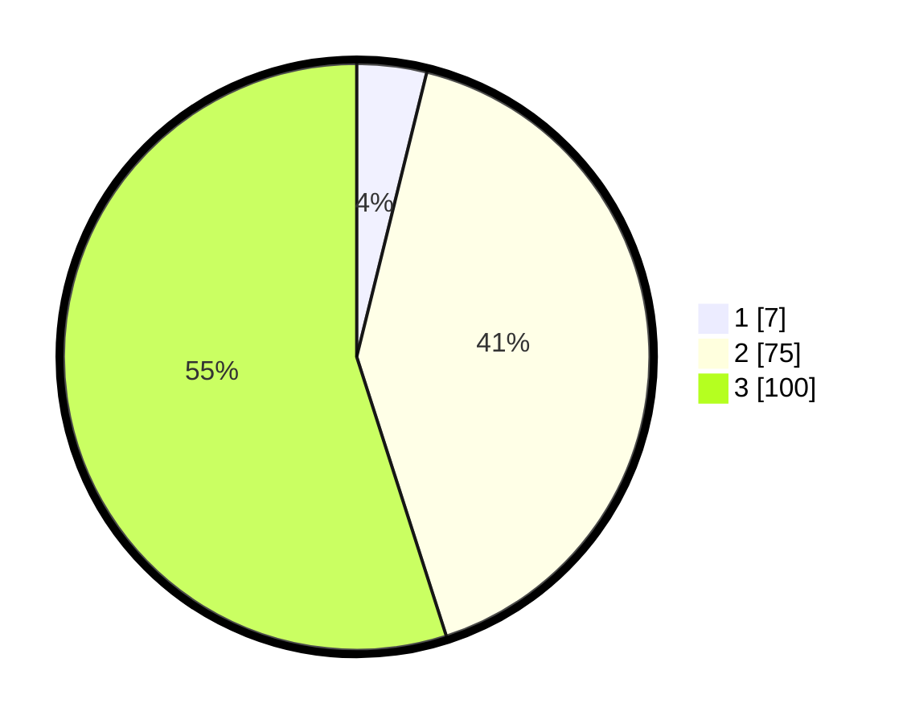

# Hasil

## Grafik

## Tabel

| No. | Nama Paslon    | Suara | Suara (raw) | Persentase |
|:--- |:-------------- | -----:| -----------:| ----------:|
| 1   | ANIES MUHAIMIN | 7     | [7][p-1]    | 3,85       |
| 2   | PRABOWO GIBRAN | 75    | [75][p-2]   | 41,21      |
| 3   | GANJAR MAHFUD  | 100   | [100][p-3]  | 54,95      |

[p-1]: https://github.com/gigit-pemilu/pemilu-2024-33-jawa-tengah/blob/main/pilpres/hitung-suara/sub/33-jawa-tengah/sub/15-grobogan/sub/06-pulokulon/sub/2001-randurejo/sub/003-tps/sub/paslon-1.txt
[p-2]: https://github.com/gigit-pemilu/pemilu-2024-33-jawa-tengah/blob/main/pilpres/hitung-suara/sub/33-jawa-tengah/sub/15-grobogan/sub/06-pulokulon/sub/2001-randurejo/sub/003-tps/sub/paslon-2.txt
[p-3]: https://github.com/gigit-pemilu/pemilu-2024-33-jawa-tengah/blob/main/pilpres/hitung-suara/sub/33-jawa-tengah/sub/15-grobogan/sub/06-pulokulon/sub/2001-randurejo/sub/003-tps/sub/paslon-3.txt

## Foto C Plano

https://sirekap-obj-formc.kpu.go.id/69f4/pemilu/ppwp/33/15/06/20/01/3315062001003-20240215-010156--87e49f51-2405-437f-9510-cf411a0fe2a4.jpg

https://sirekap-obj-formc.kpu.go.id/69f4/pemilu/ppwp/33/15/06/20/01/3315062001003-20240215-010346--96e354a5-5ced-4229-afda-497382545bbf.jpg

https://sirekap-obj-formc.kpu.go.id/69f4/pemilu/ppwp/33/15/06/20/01/3315062001003-20240215-010545--9e837752-2c7e-4d83-9a03-7cdfd886d67b.jpg

## Metadata

| Key        | Value               |
| ---------- | ------------------- |
| Time Stamp | 2024-02-15 12:00:28 |

