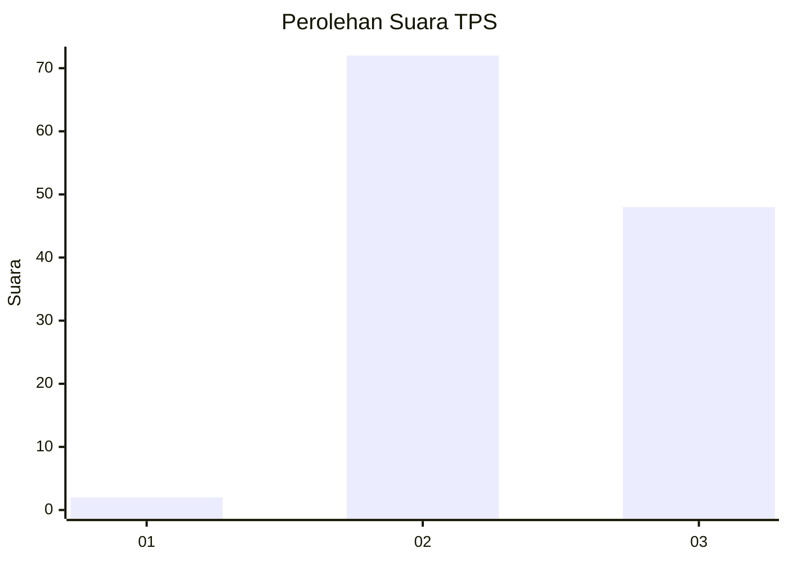
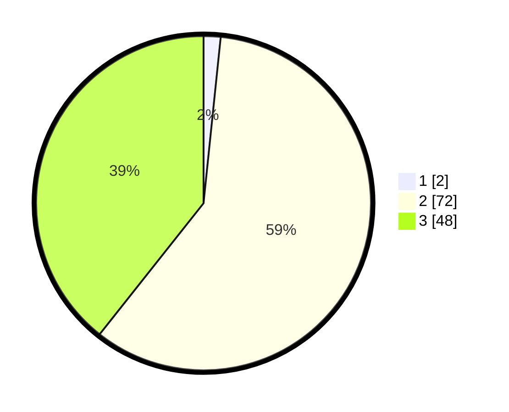

# Hasil

## Grafik

## Tabel

| No. | Nama Paslon    | Suara | Suara (raw) | Persentase |
|:--- |:-------------- | -----:| -----------:| ----------:|
| 1   | ANIES MUHAIMIN | 2     | [2][p-1]    | 1,64       |
| 2   | PRABOWO GIBRAN | 72    | [72][p-2]   | 59,02      |
| 3   | GANJAR MAHFUD  | 48    | [48][p-3]   | 39,34      |

[p-1]: https://github.com/gigit-pemilu/pemilu-2024-33-jawa-tengah/blob/main/pilpres/hitung-suara/sub/33-jawa-tengah/sub/15-grobogan/sub/06-pulokulon/sub/2002-mlowokarangtalun/sub/011-tps/sub/paslon-1.txt
[p-2]: https://github.com/gigit-pemilu/pemilu-2024-33-jawa-tengah/blob/main/pilpres/hitung-suara/sub/33-jawa-tengah/sub/15-grobogan/sub/06-pulokulon/sub/2002-mlowokarangtalun/sub/011-tps/sub/paslon-2.txt
[p-3]: https://github.com/gigit-pemilu/pemilu-2024-33-jawa-tengah/blob/main/pilpres/hitung-suara/sub/33-jawa-tengah/sub/15-grobogan/sub/06-pulokulon/sub/2002-mlowokarangtalun/sub/011-tps/sub/paslon-3.txt

## Foto C Plano

https://sirekap-obj-formc.kpu.go.id/8cb3/pemilu/ppwp/33/15/06/20/02/3315062002011-20240217-115140--78ece75a-6b07-4770-ad30-f2579403f4d3.jpg

https://sirekap-obj-formc.kpu.go.id/8cb3/pemilu/ppwp/33/15/06/20/02/3315062002011-20240217-115155--8d336c64-742a-4520-a610-e2670729b51d.jpg

https://sirekap-obj-formc.kpu.go.id/8cb3/pemilu/ppwp/33/15/06/20/02/3315062002011-20240217-115210--f7e91b7a-f74d-4878-9349-95394b97ad27.jpg

## Metadata

| Key        | Value               |
| ---------- | ------------------- |
| Time Stamp | 2024-02-17 14:45:18 |

