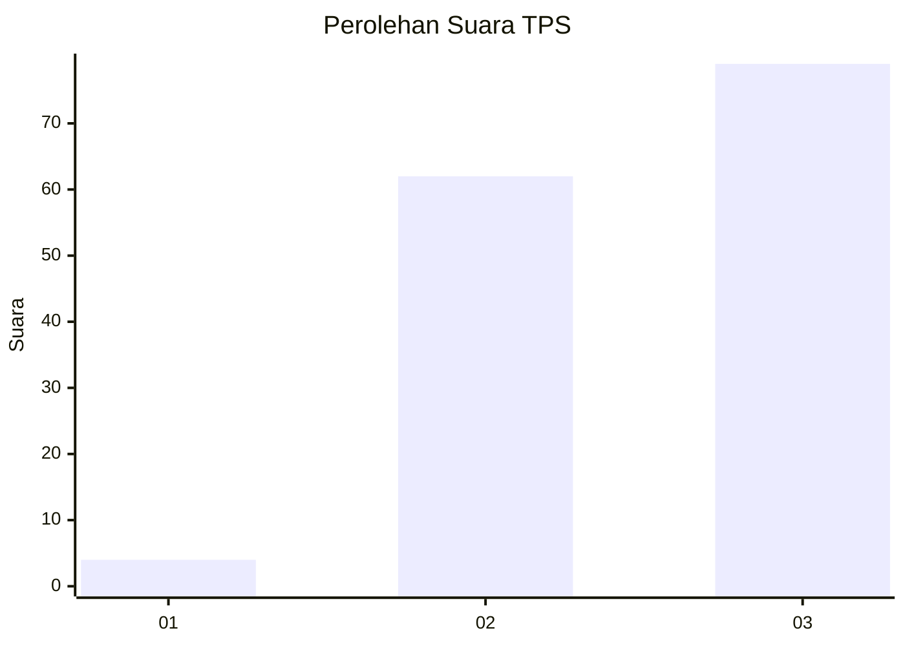
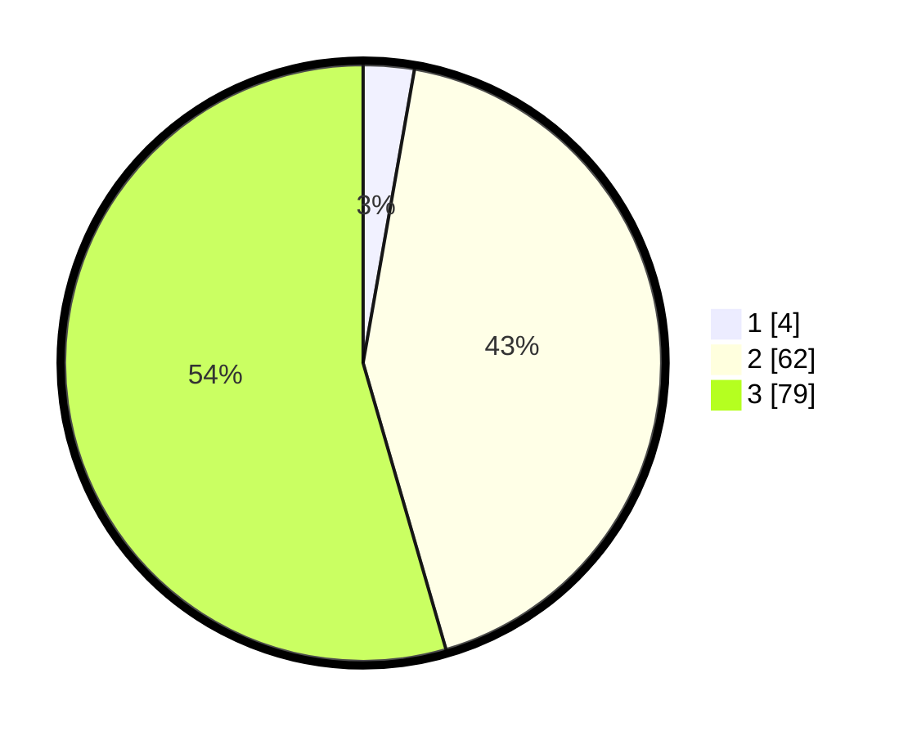

# Hasil

## Grafik

## Tabel

| No. | Nama Paslon    | Suara | Suara (raw) | Persentase |
|:--- |:-------------- | -----:| -----------:| ----------:|
| 1   | ANIES MUHAIMIN | 4     | [4][p-1]    | 2,76       |
| 2   | PRABOWO GIBRAN | 62    | [62][p-2]   | 42,76      |
| 3   | GANJAR MAHFUD  | 79    | [79][p-3]   | 54,48      |

[p-1]: https://github.com/gigit-pemilu/pemilu-2024-33-jawa-tengah/blob/main/pilpres/hitung-suara/sub/33-jawa-tengah/sub/15-grobogan/sub/06-pulokulon/sub/2005-sidorejo/sub/015-tps/sub/paslon-1.txt
[p-2]: https://github.com/gigit-pemilu/pemilu-2024-33-jawa-tengah/blob/main/pilpres/hitung-suara/sub/33-jawa-tengah/sub/15-grobogan/sub/06-pulokulon/sub/2005-sidorejo/sub/015-tps/sub/paslon-2.txt
[p-3]: https://github.com/gigit-pemilu/pemilu-2024-33-jawa-tengah/blob/main/pilpres/hitung-suara/sub/33-jawa-tengah/sub/15-grobogan/sub/06-pulokulon/sub/2005-sidorejo/sub/015-tps/sub/paslon-3.txt

## Foto C Plano

https://sirekap-obj-formc.kpu.go.id/b555/pemilu/ppwp/33/15/06/20/05/3315062005015-20240217-090613--ce81f679-7dc9-4de6-98af-6fd79f9b65ce.jpg

https://sirekap-obj-formc.kpu.go.id/b555/pemilu/ppwp/33/15/06/20/05/3315062005015-20240217-090328--6f6f5e61-3c13-4eff-96fa-539a27530e40.jpg

https://sirekap-obj-formc.kpu.go.id/b555/pemilu/ppwp/33/15/06/20/05/3315062005015-20240216-214005--062a3d55-ec61-46b6-adb2-daff8322519f.jpg

## Metadata

| Key        | Value               |
| ---------- | ------------------- |
| Time Stamp | 2024-02-17 19:00:04 |

